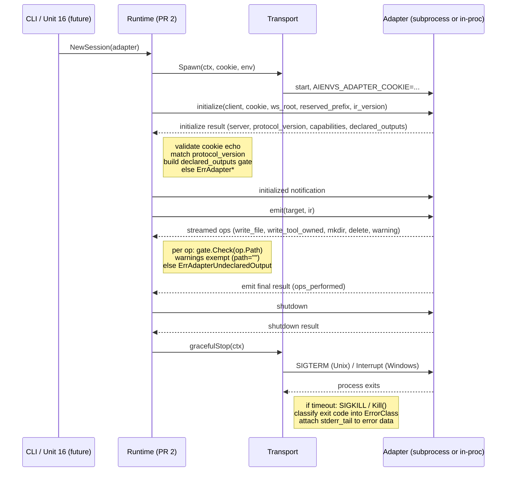

# feat: Unit 8 PR 2 — adapter runtime

## Overview

PR 2 of a 3-PR carving for Unit 8 of the aienvs workspace CLI plan.
Builds the runtime that turns the wire types from PR 1 (merged in
`4fe9fa5`) into actually-runnable adapters: subprocess process
management, in-process shim for bundled adapters, `adapter.yaml`
manifest parsing, PATH-based discovery, and the lifecycle orchestrator
that drives `initialize → initialized → emit → shutdown` per session.

This PR ships **runtime, not policy**. The conformance harness, public
SDK, and authoritative spec doc all land in PR 3. PR 2 is judged
ready when:

- a synthetic in-process adapter completes a full session through the
  orchestrator;
- a real subprocess adapter (a tiny Go binary in `testdata/`) completes
  the same session under `-race` on every CI platform;
- the declared-outputs integrity gate rejects undeclared writes;
- shutdown is bounded and survives an adapter that ignores SIGTERM.

## Problem Frame

The wire types in `internal/adapter/contract` are correct but currently
inert — no consumer outside the package's own tests. Without a runtime,
no adapter can ever be invoked: the CLI cannot synchronize anything,
PR 3 cannot ship a conformance harness because it has nothing to
test against, and the parent plan's Units 9 / 10 / 11 / 11.5 (the
claude / cursor / codex / pi adapters) cannot be built.

PR 2 is also the first place where genuinely cross-platform code lands
in this repo. PR 1 was pure byte parsing. PR 2 spawns processes,
handles signals (Unix `SIGTERM` vs Windows `os.Interrupt`), pipes
stderr, and enforces timeouts — every one of those is a place where
Windows and Unix diverge.

(see origin: `docs/plans/2026-04-21-001-feat-aienvs-workspace-cli-plan.md`
Unit 8, lines 599–672)

## Requirements Trace

- **R1.** `adapter.yaml` manifest parsing with `name`, `version`,
  `contract_version` (must equal `aienvs/v1`), `command` (argv slice),
  optional `reserved_prefix` override — origin Unit 8 file list line
  616.
- **R2.** Adapter discovery: explicit `adapters:` block in the
  workspace manifest, PATH lookup for `aienvs-adapter-<name>`, bundled
  in-process registry. Refuses to register two adapters with nested
  reserved prefixes (R10 invariant from origin Unit 8 "Startup
  validation" subsection at line 651).
- **R3.** Subprocess runner: magic-cookie env var
  `AIENVS_ADAPTER_COOKIE` per spawn, stdio pipes, stderr ring buffer
  (64 KiB), default timeouts (handshake 5s / per-emit 30s / shutdown
  5s), SIGTERM-then-SIGKILL bounded by timeout, crash classifier —
  origin Unit 8 file list line 614 + "Lifecycle" + "Errors" subsections.
- **R4.** In-process shim speaking the identical wire format over
  `io.Pipe` — origin Unit 8 file list line 615.
- **R5.** Lifecycle orchestrator enforcing
  `initialize → initialized → emit → shutdown` ordering, magic-cookie
  echo validation, protocol-version match, declared-outputs integrity
  gate, capability-lied detection — origin Unit 8 "Lifecycle" + "Op
  set" + "`declared_outputs` as integrity gate" subsections.
- **R6.** Every I/O function takes `context.Context` first per
  CLAUDE.md. PR 2 is fully in scope for this rule (PR 1 was the
  debatable case).
- **R7.** Cross-platform CI: full matrix (linux/amd64, linux/arm64,
  darwin/amd64, darwin/arm64, windows/amd64) green under `-race` —
  per `docs/solutions/best-practices/go-windows-cross-platform-pitfalls-2026-04-24.md`.
- **R8.** Address ce-review residual findings from PR 1 that PR 2 owns:
  `IDCorrelator` eviction API (ADV-006), declared-outputs gate
  special-cases warnings with empty path (AC-002), per-adapter loop
  handles stream desync after error (ADV-003), defensive base64
  pre-cap via tightened `FrameReader` `maxBytes` (ADV-004).

## Scope Boundaries

- **No conformance harness.** Discovery + lifecycle yes, formal
  byte-stable replay no.
- **No public SDK.** `pkg/adapterkit/` is PR 3.
- **No authoritative spec doc.** `docs/spec/adapter-protocol-v1.md`
  is PR 3 — the wire form is already frozen by what PR 1 + PR 2 ship,
  but the doc that codifies it lands with the conformance harness.
- **No real adapter implementations.** No claude / cursor / codex / pi
  adapters here — those are Units 9–11.5. PR 2 ships only the testdata
  echo binary needed for integration tests.
- **No CLI command surface.** No `aienvs adapter run` or similar; PR 2
  exposes a Go API. CLI integration is Unit 16.
- **No magic-cookie generation strategy beyond per-spawn random.**
  Pre-shared cookie sources, key rotation, etc. are out of scope.

### Deferred to Separate Tasks

- **PR 3 (Unit 8 conformance + SDK):** golden-corpus harness, `echo`
  Go reference adapter (separate from the testdata echo here),
  `pkg/adapterkit/`, `docs/spec/adapter-protocol-v1.md`,
  `aienvs adapter conformance-test` CLI subcommand.
- **Unit 8b (post-v1):** version counter-proposal (extend `initialize`
  result to carry adapter's preferred version), `cancel` notification,
  `$/progress` tokens, per-method timeout overrides in `adapter.yaml`,
  LSP error-code extensions (`-32800`/`-32801`/`-32803`), Python
  reference adapter.
- **Unit 16 (CLI):** wiring the runtime into the user-facing CLI.
- **Future PR (post-merge):** `IDCorrelator.SetMaxPending(n)` ceiling
  if PR 2's context-cancellation eviction proves insufficient. PR 2
  ships only the eviction APIs the runtime actually uses; a generic
  ceiling can wait for a real consumer asking for it.

## Context & Research

### Relevant Code and Patterns

- `internal/adapter/contract` (PR 1) — types this PR consumes
  (`Request`, `Response`, `Notification`, `Error`, `ErrorClass`,
  `IDCorrelator`, `FrameReader`, `MethodInitialize`, etc.). Stays
  un-imported by anything else in the repo until this PR.
- `internal/manifest` — `Load` + comment-preserving writer; the
  schema needs an `adapters:` field added (consumed by this PR's
  discovery layer).
- `internal/git` — pattern for I/O code that takes `context.Context`
  as first parameter; `helpers_test.go` test-helpers convention.
- `internal/cache` and `internal/workspace` — examples of code that
  navigates real OS paths cross-platform. Use `filepath.Join` for
  on-disk paths; `embed.FS` paths stay forward-slash.
- `internal/trust` — pattern for two-tier durable + ephemeral state;
  not directly applicable here, but the file-locking pattern in
  `internal/locks/filelock.go` (planned for Unit 12) is conceptually
  adjacent — adapter sessions also serialize per-target work.
- `cmd/aienvs/main.go` — composition root. PR 2's runtime is exposed
  for future wiring (Unit 16); no `cmd/` change in PR 2 itself.

### Institutional Learnings

- **`docs/solutions/best-practices/go-windows-cross-platform-pitfalls-2026-04-24.md`**
  — Direct hits for this PR:
  - Build-tag discipline (`//go:build !windows`, `//go:build windows`)
    is mandatory for any file that imports `syscall` or `os/signal`
    package symbols not available on the other OS. `runtime.GOOS`
    runtime checks alone do not protect compile-time symbol
    resolution.
  - Use `filepath.Join` for OS paths; never hard-coded `/`.
  - The framing layer's CRLF byte handling is fine on Windows because
    it operates on `[]byte`, not text-mode-translated strings — but
    any test that reads `os.Stderr` from a child process must use
    binary mode (the default for `exec.Cmd.StderrPipe()` is binary,
    so this is automatic — confirm in tests).
- **`docs/solutions/workflow-issues/spec-impl-drift-at-pr-review-2026-04-25.md`**
  — Hand-rolled parity tests catch contract drift. PR 2's runtime
  surfaces — `Adapter`, `AdapterSession`, `RuntimeError` — should have
  similarly explicit stable-value tests for any wire-adjacent strings
  (`ErrorClass` mappings, manifest field names).

### External References

- LSP base protocol lifecycle (used in PR 1; same shape applies to
  PR 2's orchestrator).
- MCP 2025-11-25 lifecycle — `_meta` and `capabilities{}` are the
  additive extension points.
- Terraform plugin protocol — pattern for "CLI spawns plugin, plugin
  echoes a magic cookie" handshake. `hashicorp/go-plugin`'s magic
  cookie is the same shape this PR adopts.
- Bazel `declare_file` — pattern for "the action declares its outputs
  before doing work; the system rejects writes outside the declared
  set." This PR's `declared_outputs` integrity gate is identical in
  spirit.
- Go `os/exec` documentation — `Cmd.SysProcAttr` is OS-specific;
  `cmd.Process.Signal` is not portable; `cmd.Cancel` (Go 1.20+) is
  the modern way to bound process lifetime to a context.

### Carried-Forward Residuals From PR 1's ce-review Run

These were tracked as residual gated_auto / manual in
`.context/compound-engineering/ce-review/20260425-032742-85562cea/findings.md`
(local artifact, gitignored — repeating the load-bearing notes here
so the plan stays self-contained).

- **ADV-006 (P2):** `IDCorrelator` lacks pending-map cleanup. PR 2's
  runtime is the first real consumer; design the eviction API now
  with the runtime's actual usage shape. Decision below.
- **AC-002 (P1):** `OpWarning.OpPath()` returns `""`. PR 2's
  declared-outputs gate must special-case warnings: empty path is
  intentional, not a violation. Test it.
- **ADV-003 (advisory):** A FrameReader stream may desync after a
  partial-read error. PR 2's per-adapter loop must detect this and
  treat the adapter as broken (terminate the session) rather than
  attempting to recover.
- **ADV-004 (P2):** Defensive — when constructing the per-session
  `FrameReader`, pass a `maxBytes` tightened for the adapter's
  declared payload caps. Reduces the window between frame-arrival
  and op-decode where a hostile peer could allocate.
- **ADV-009 / ADV-010 / ADV-011:** Low priority, tracked as advisory.
  The runtime can apply `json.Decoder.DisallowUnknownFields()` on
  inbound parsing if a strict-mode flag is desired later — not in PR 2.
  Mode-bits validation (`ADV-010`) lands in the file system layer
  (Unit 13's atomic-staging code), not the runtime.

## Key Technical Decisions

- **`IDCorrelator` eviction API.** Add two methods to the existing
  type in `internal/adapter/contract`:
  - `Cancel(id ID)` — removes a pending entry without reporting "ok".
    Called by the runtime when an emit's context cancels.
  - `Pending() int` — observability accessor; lets the runtime log
    pending counts on shutdown and lets tests assert no leaks.
  Defer `SetMaxPending(n)` to a future PR — until the runtime is
  shown to leak under realistic load, the ceiling adds API surface
  without proving it's needed. The runtime's per-emit context
  cancellation path is the primary defense.
- **Cross-platform graceful stop via build-tagged source files.**
  `subprocess.go` exposes a `gracefulStop(ctx) error` method on the
  subprocess type. Implementation lives in `subprocess_unix.go`
  (sends `syscall.SIGTERM`, then `Kill()` after timeout) and
  `subprocess_windows.go` (sends `os.Interrupt` if supported,
  otherwise immediate `Kill()` — Windows console-attach semantics
  are messy and the timeout-then-kill pattern survives even when
  graceful-signal delivery fails). Both files have `//go:build`
  tags. Tests run on every CI matrix platform.
- **Magic cookie is 32 hex chars from `crypto/rand`.** No UUID
  dependency — the format is opaque to peers. The cookie generated
  per spawn is the same value the adapter must echo in
  `InitializeParams.Cookie`. Mismatch → `ErrAdapterCookieMissing` /
  `ErrAdapterCookieMismatch`.
- **Adapter is a struct wrapping a `transport` interface.** The
  transport handles the bytes (subprocess pipes, in-process
  `io.Pipe`); the `Adapter` struct handles the lifecycle on top.
  Single orchestrator code path, two transport implementations,
  identical observable behavior.
- **Discovery precedence: explicit > PATH > bundled.** The workspace
  manifest's `adapters:` block always wins. PATH lookup
  (`aienvs-adapter-<name>`) is the fallback. Bundled (compiled-in)
  adapters fill the gap when the binary is run in a hermetic
  environment without PATH access.
- **`adapter.yaml` lives next to the binary.** When the runtime
  finds `aienvs-adapter-foo` on PATH, it looks for `adapter.yaml`
  in the same directory. If present, it overlays the manifest;
  if absent, the runtime synthesizes a minimal manifest from the
  filename. (`name = "foo"`, `command = ["aienvs-adapter-foo"]`,
  `contract_version = "aienvs/v1"`).
- **Reserved-prefix nesting check is set-based.** When discovery
  finishes, the runtime sorts all declared `reserved_prefix` strings
  and rejects when one is a path-prefix of another. O(n log n).
- **Stderr ring buffer is fixed-size, in-memory, byte-bounded.**
  64 KiB. The buffer is constructed per-session and drained into
  the crash report's `data.stderr_tail` field on abnormal
  termination. No disk persistence; no rotation; no streaming
  log infrastructure.
- **`Adapter` and `AdapterSession` lifetimes are explicit.** An
  `Adapter` is registry metadata (name, manifest, transport
  factory) — long-lived, shared across sessions. An
  `AdapterSession` is one `initialize → … → shutdown` lifecycle —
  short-lived, per-target. The runtime constructs a session from
  an adapter and drives it through the four-phase lifecycle.
  After `shutdown`, the session is finalized; new work needs a new
  session.
- **No goroutines own state in the orchestrator.** The orchestrator
  is single-goroutine per session. The transport may use background
  goroutines for stderr capture (subprocess only), but those
  goroutines own their own ring buffer and do not race with the
  main session goroutine. Fewer goroutines = simpler reasoning,
  cheaper -race testing.
- **Workspace manifest schema gains `adapters:` field.** The
  `internal/manifest` schema adds an `Adapters []AdapterRef` field;
  each `AdapterRef` is `{name, command, version, reserved_prefix}`.
  Loaders pre-existing in `internal/manifest` already validate the
  YAML; PR 2 only adds the new field type and minimal validation.
- **Test binary lives at `internal/adapter/testdata/echo/main.go`.**
  Built by the test harness before integration tests run; cached at
  `$TMPDIR/aienvs-test-echo`. The echo binary is intentionally
  minimal — it is not a reference implementation and not
  conformance fodder. PR 3 ships a separate, complete `echo`
  reference adapter for those purposes.
- **Per-session `FrameReader` `maxBytes` is tightened.** Default
  16 MiB ceiling from PR 1 stays as the absolute cap; the runtime
  passes `maxBytes = min(default, 2 * adapter.declared_max_payload)`
  on a per-session basis (in PR 2, this is just the default, since
  no adapter declares a larger cap yet — but the API is in place
  for Unit 8b).

## Open Questions

### Resolved During Planning

- **Should `IDCorrelator` get `SetMaxPending` now?** No. Context
  cancellation handles the realistic case; ceiling-based eviction
  needs a real consumer to shape the API.
- **Should the runtime own the IR encoding?** Yes. The runtime
  receives a typed `[]ir.Node` and serializes it into
  `EmitParams.IR` as `json.RawMessage`. The contract package
  intentionally does not import `internal/ir`.
- **Does PR 2 ship a generic `Run(ctx, adapter, ir)` API or
  per-method primitives?** Per-method primitives:
  `session.Initialize(ctx)`, `session.Emit(ctx, target, ir)`,
  `session.Shutdown(ctx)`. The Unit 16 CLI composes them; future
  CI/automation can use them differently.
- **Is the Cancel API on `IDCorrelator` part of the wire contract?**
  No. `IDCorrelator` is internal to the CLI; the wire form sees
  only the IDs, not the bookkeeping.
- **Does the workspace manifest schema change require a manifest
  version bump?** No. New optional field; old manifests stay valid
  (default empty `adapters:` slice). The decision matches the
  parent plan's "additive extension" pattern.

### Deferred to Implementation

- The exact name and field-set of the manifest's `AdapterRef`
  struct — settle when extending `internal/manifest/schema.go`.
- Whether the orchestrator emits its own slog spans for
  `initialize` / `emit` / `shutdown`. Probably yes; the platform
  layer pattern from `internal/platform` (per CLAUDE.md) applies,
  but the exact spans wait until logging/telemetry is actually
  wired in this PR.
- Whether subprocess `gracefulStop` retries SIGTERM more than once
  before SIGKILL. Probably no (single send, wait timeout, escalate);
  decide while writing the test.

## Output Structure

```
internal/adapter/
├── contract/                       # PR 1 (already merged); two new exported methods on IDCorrelator
├── adapter.go                      # PR 2 unit 6 — Adapter + AdapterSession types
├── manifest.go                     # PR 2 unit 1 — adapter.yaml parser
├── manifest_test.go                # PR 2 unit 1
├── discover.go                     # PR 2 unit 2 — PATH + explicit + bundled discovery
├── discover_test.go                # PR 2 unit 2
├── transport.go                    # PR 2 unit 4/5 — transport interface
├── subprocess.go                   # PR 2 unit 4 — cross-platform shared logic
├── subprocess_unix.go              # PR 2 unit 4 — //go:build !windows
├── subprocess_windows.go           # PR 2 unit 4 — //go:build windows
├── subprocess_test.go              # PR 2 unit 4 — integration via testdata
├── inproc.go                       # PR 2 unit 5 — io.Pipe shim
├── inproc_test.go                  # PR 2 unit 5
├── runtime.go                      # PR 2 unit 6 — lifecycle orchestrator
├── runtime_test.go                 # PR 2 unit 6 — synthetic in-process tests
├── errors.go                       # PR 2 unit 6 — RuntimeError sentinels + classifier
└── testdata/
    └── echo/
        └── main.go                 # PR 2 unit 7 — minimal protocol-speaking test binary
internal/manifest/
├── schema.go                       # PR 2 unit 2 — extend with Adapters field
└── schema_test.go                  # PR 2 unit 2 — Adapters round-trip tests
```

## High-Level Technical Design

> *This illustrates the intended approach and is directional guidance for review, not implementation specification. The implementing agent should treat it as context, not code to reproduce.*



## Implementation Units

- [ ] **Unit 1: `adapter.yaml` manifest schema and parser**

**Goal:** Land `AdapterManifest` struct and YAML loader with strict validation. The manifest is what an adapter binary ships alongside itself to declare its capabilities.

**Requirements:** R1.

**Dependencies:** None (uses existing `goccy/go-yaml`).

**Files:**
- Create: `internal/adapter/manifest.go`
- Test: `internal/adapter/manifest_test.go`

**Approach:**
- `AdapterManifest{Name, Version, ContractVersion, Command, ReservedPrefix, _meta}`. Required: `name`, `command`, `contract_version`. Optional: everything else.
- `LoadAdapterManifest(path)` reads and decodes. Strict YAML — unknown fields are warnings, not errors (consistent with the additive-extension rule from the wire contract).
- Validates `contract_version` equals `aienvs/v1`; otherwise returns `ErrAdapterContractVersionUnsupported` (new sentinel).
- Synthesizes a minimal manifest when an `aienvs-adapter-<name>` binary is found on PATH without a sibling `adapter.yaml`. Used by discovery in Unit 2.

**Patterns to follow:**
- `internal/manifest/schema.go` for YAML struct tags + strict mode.
- `internal/ir/types.go` for the sentinel-error block and package doc comment style.

**Test scenarios:**
- Happy path: minimal manifest (`name`, `command`, `contract_version`) round-trips.
- Happy path: full manifest with all optional fields round-trips.
- Happy path: synthesized manifest from a binary name has correct defaults.
- Edge case: `command` is empty array → `ErrAdapterManifestEmptyCommand`.
- Edge case: `contract_version` is empty → `ErrAdapterManifestMissingContractVersion`.
- Error path: `contract_version: aienvs/v0` → `ErrAdapterContractVersionUnsupported`.
- Error path: malformed YAML → wraps the YAML parser error.
- Error path: `name` contains path separators or shell metacharacters → `ErrAdapterManifestInvalidName`.
- Edge case: `reserved_prefix` ending in `/` is normalized; unspecified leaves the field empty.

**Verification:**
- `go test -race ./internal/adapter/... -run TestAdapterManifest` green.
- `golangci-lint run ./internal/adapter/...` clean for the new file.

---

- [ ] **Unit 2: Discovery + workspace-manifest `adapters:` field + nesting invariant**

**Goal:** Find adapters from three sources (explicit workspace manifest, PATH, bundled) and reject configurations that violate the nested-reserved-prefix invariant.

**Requirements:** R2.

**Dependencies:** Unit 1.

**Files:**
- Create: `internal/adapter/discover.go`
- Test: `internal/adapter/discover_test.go`
- Modify: `internal/manifest/schema.go` — add `Adapters []AdapterRef` field.
- Modify: `internal/manifest/schema_test.go` — round-trip the new field.

**Approach:**
- `Registry` struct holds the resolved adapter set after discovery. Keyed by `name`. Construction is deterministic (sorted by name); discovery has no side effects on the file system.
- `DiscoverAdapters(ctx, opts)` walks: (1) workspace manifest `Adapters` slice (highest precedence), (2) `os.Getenv("PATH")` looking for `aienvs-adapter-<name>(.exe)` (Windows binary suffix handled), (3) the bundled registry (Unit 5 wires bundled adapters in via a package-level `RegisterBundled` mechanism).
- `internal/manifest/schema.go` gains `Adapters []AdapterRef` with `AdapterRef{Name, Command, Version, ReservedPrefix}`. Loader validates each ref's name + command shape using the same rules as `LoadAdapterManifest`.
- After discovery, `validateNoNestedPrefixes(registry)` sorts declared `reserved_prefix` strings and asserts no entry is a path-prefix of another. Rejects with `ErrAdapterPrefixNested` (new sentinel) referencing both offending names.
- Discovery is idempotent and goroutine-safe — produces a fresh `Registry` per call; no global state.

**Patterns to follow:**
- `internal/workspace/discover.go` for path-walking patterns.
- `internal/git/url.go` (in Unit 4 / cache work) for canonicalization helpers if path normalization gets hairy.

**Test scenarios:**
- Happy path: workspace manifest declares one adapter; discovery returns it.
- Happy path: PATH contains `aienvs-adapter-foo`; discovery synthesizes manifest and registers.
- Happy path: bundled adapter is registered; discovery includes it.
- Edge case: same adapter name in workspace + PATH → workspace wins (precedence test).
- Edge case: PATH contains `aienvs-adapter-foo.exe` on Windows; Unix path matching ignores `.exe`.
- Edge case: directory on PATH doesn't exist — silently skipped.
- Error path: nested reserved prefixes (`.claude/` and `.claude/skills/`) → `ErrAdapterPrefixNested` with both names in the error.
- Error path: workspace manifest references an adapter with no command → `ErrAdapterManifestEmptyCommand` (re-used).
- Error path: `aienvs-adapter-` (empty name suffix) on PATH is ignored, not registered.
- Cross-platform: `filepath.Join` used for all OS-path construction; PATH separator detection uses `os.PathListSeparator`.

**Verification:**
- `go test -race ./internal/adapter/... -run TestDiscover` green on every CI platform.
- `internal/manifest` schema parity test (existing in Unit 2 of the parent plan) covers the new `Adapters` field.

---

- [ ] **Unit 3: `IDCorrelator` runtime extensions (`Cancel`, `Pending`)**

**Goal:** Address ce-review residual ADV-006 by giving the runtime a way to evict pending entries when its context cancels and observability for in-flight count.

**Requirements:** R8 (residuals).

**Dependencies:** None — additive to the existing type.

**Files:**
- Modify: `internal/adapter/contract/jsonrpc.go` — add `Cancel`, `Pending` methods.
- Modify: `internal/adapter/contract/jsonrpc_test.go` — new test cases.

**Approach:**
- `(c *IDCorrelator) Cancel(id ID)` — removes the entry under the same mutex as `MarkPending`. Idempotent; no error.
- `(c *IDCorrelator) Pending() int` — returns `len(c.pending)` under the mutex. Read-only.
- These two methods alone close the realistic leak path (runtime cancels context → eviction). `SetMaxPending(n)` deferred per "Key Technical Decisions" rationale.
- Doc comment on the type updated to reference the runtime's eviction contract.

**Execution note:** Test-first. The Cancel + Pending methods need to be wired into the runtime in Unit 6, so they ship with their tests in this small unit and the runtime depends on them.

**Patterns to follow:**
- The existing `MarkPending` / `Resolve` methods — Cancel mirrors them.
- `internal/ir/types.go` for sentinel-error patterns (none new here, but the doc style applies).

**Test scenarios:**
- Happy path: `Cancel(id)` after `MarkPending(id, "x")` → subsequent `Resolve(id)` returns `("", false)`.
- Happy path: `Pending()` returns the live count across `MarkPending` / `Resolve` / `Cancel`.
- Edge case: `Cancel(id)` for an id that was never marked → no error, no panic.
- Edge case: `Cancel(id)` for a non-int id (string ID) — no-op (mirrors the existing string-ID handling in `MarkPending`).
- Concurrency: 200 concurrent `MarkPending` + 200 concurrent `Cancel` under `-race` produce a consistent final `Pending()` count (zero, since every Mark is paired with a Cancel).

**Verification:**
- `go test -race ./internal/adapter/contract/...` stays green; new tests pass.

---

- [ ] **Unit 4: Subprocess transport (cross-platform)**

**Goal:** Spawn an adapter binary, plumb stdio, capture stderr, run a graceful-stop sequence that respects timeouts on both Unix and Windows.

**Requirements:** R3, R6, R7.

**Dependencies:** Unit 1, Unit 3.

**Files:**
- Create: `internal/adapter/transport.go` — `transport` interface and shared types.
- Create: `internal/adapter/subprocess.go` — cross-platform shared logic.
- Create: `internal/adapter/subprocess_unix.go` — `//go:build !windows`. SIGTERM-then-SIGKILL.
- Create: `internal/adapter/subprocess_windows.go` — `//go:build windows`. `os.Interrupt`-then-`Kill`.
- Test: `internal/adapter/subprocess_test.go` — integration with the testdata echo binary (Unit 7 builds it).

**Approach:**
- `transport` interface: `Send(ctx, payload []byte) error`, `Recv(ctx) ([]byte, error)`, `Close(ctx) error`. Both subprocess and inproc implement this.
- `subprocess{cmd *exec.Cmd, stdin io.WriteCloser, stdout *bufio.Reader, stderrRing *ringBuffer, fr *contract.FrameReader}`.
- `Spawn(ctx, manifest, cookie)` constructs `exec.Cmd` with `cmd.Env = append(os.Environ(), "AIENVS_ADAPTER_COOKIE="+cookie)`. Sets `cmd.Stdin`, `cmd.Stdout`, `cmd.Stderr` to pipes the runtime owns.
- A goroutine drains stderr into a 64 KiB ring buffer; the goroutine exits when the pipe closes.
- `Send` writes a frame via `contract.WriteFrame(stdin, payload)`; `Recv` reads a frame via `fr.Read(maxBytes)`. Both honor `ctx`: on cancel, `Close(ctx)` runs `gracefulStop` to tear the process down.
- `gracefulStop(ctx)` is OS-specific (build-tagged files). Unix: `cmd.Process.Signal(syscall.SIGTERM)`, then wait up to shutdown timeout (`5s` default), then `cmd.Process.Kill()`. Windows: same shape, signal is `os.Interrupt`, fallback is `cmd.Process.Kill()`.
- Crash classifier: post-`Wait()`, examine `*exec.ExitError`. Negative exit codes / OS-level signals map: SIGKILL → `ErrorClassAdapterPanic` (treating OOM-kill as an adapter-side fault), SIGTERM-after-shutdown → not an error, anything else → `ErrorClassAdapterPanic` with `data.exit_code` and `data.stderr_tail` populated.

**Execution note:** Integration test first. The synthetic in-process tests in Unit 6 cover the orchestrator logic; the subprocess tests prove the bytes-and-signals layer.

**Patterns to follow:**
- `os/exec.Cmd` — set up with `cmd.WaitDelay` (Go 1.20+) and `cmd.Cancel` for context-bound shutdown where possible.
- `bufio.NewReader` wrapping stdout per `contract.NewFrameReader`.
- `internal/git`'s test patterns for cross-platform integration testing.

**Test scenarios:**
- Happy path: spawn the testdata echo binary, complete a full session (lifecycle covered in Unit 6 — this unit's tests stop at "byte round-trip works").
- Happy path: stderr emitted by the child process is captured into the ring buffer.
- Edge case: child writes more stderr than 64 KiB — older bytes drop, newest 64 KiB retained.
- Edge case: child closes stdout cleanly mid-session — `Recv` returns `io.EOF`.
- Error path: child binary doesn't exist — `Spawn` returns an error wrapping `*exec.Error`.
- Error path: missing `AIENVS_ADAPTER_COOKIE` (manually constructed without setting env) — adapter would fail at handshake; this is more an orchestrator concern but the subprocess test confirms the env is set.
- Error path: child exits 137 (mid-emit forced kill, simulated by sending SIGKILL from the test) — classifier returns `ErrorClassAdapterPanic` with non-empty `stderr_tail`.
- Error path: child ignores SIGTERM — `gracefulStop` escalates to `Kill()` after the timeout. Test on Unix and Windows.
- Cross-platform: every subprocess test runs on linux/amd64, linux/arm64, darwin/amd64, darwin/arm64, windows/amd64. Build tags must keep `subprocess_unix.go` and `subprocess_windows.go` mutually exclusive.
- Concurrency: two subprocesses spawned in parallel from one test — independent stdin/stdout, no cross-talk.

**Verification:**
- `go test -race ./internal/adapter/... -run TestSubprocess` green on every CI platform.
- `go vet ./internal/adapter/...` clean (catches stray `syscall.SIGTERM` on Windows builds).

---

- [ ] **Unit 5: In-process transport (`io.Pipe` shim)**

**Goal:** Bundle an adapter that runs in the CLI's own process while speaking the identical wire format.

**Requirements:** R4.

**Dependencies:** Unit 4 (transport interface).

**Files:**
- Create: `internal/adapter/inproc.go`
- Test: `internal/adapter/inproc_test.go`

**Approach:**
- `inprocTransport` implements `transport`. Two `io.Pipe` pairs: one for the runtime → adapter direction (stdin equivalent), one for adapter → runtime (stdout equivalent).
- A bundled adapter is an interface a Go package can implement: `BundledAdapter{Manifest() AdapterManifest; Run(ctx, transport) error}`. The runtime spawns it as a goroutine that reads frames from one pipe end and writes responses to the other.
- `Close(ctx)` closes the pipes; the bundled adapter's `Run` should return when its frame reader sees EOF.
- No stderr capture — bundled adapters log via the CLI's own logger.
- `RegisterBundled(adapter BundledAdapter)` is the package-level registration hook used by discovery (Unit 2).

**Execution note:** A small synthetic bundled adapter inside `inproc_test.go` proves the round-trip without needing the testdata echo binary.

**Patterns to follow:**
- `io.Pipe` semantics — close on the writer side propagates EOF to the reader side.
- The same `contract.FrameReader` and `contract.WriteFrame` as the subprocess transport.

**Test scenarios:**
- Happy path: bundled adapter completes one round of `Send` / `Recv` over `io.Pipe`.
- Happy path: bundled adapter's `Run` exits cleanly when the runtime calls `Close`.
- Edge case: bundled adapter panics inside `Run` — surfaces as a runtime-side error (the goroutine's panic is recovered by the runtime).
- Edge case: bundled adapter writes more bytes than expected — `Recv` returns the next frame normally; the trailing bytes wait for the next `Recv`.
- Concurrency: two bundled adapters run side-by-side in their own goroutines without interfering.

**Verification:**
- `go test -race ./internal/adapter/... -run TestInproc` green.

---

- [ ] **Unit 6: Lifecycle orchestrator + Adapter / AdapterSession types + RuntimeError**

**Goal:** Drive the four-phase lifecycle, enforce the magic-cookie echo, validate the protocol version, build and enforce the declared-outputs integrity gate, detect capability-lied violations.

**Requirements:** R5, R6, R8 (residuals AC-002, ADV-003, ADV-004).

**Dependencies:** Units 3, 4, 5.

**Files:**
- Create: `internal/adapter/adapter.go` — `Adapter` and `AdapterSession` types.
- Create: `internal/adapter/runtime.go` — orchestrator core.
- Create: `internal/adapter/errors.go` — `RuntimeError` + sentinels + classification helpers.
- Test: `internal/adapter/runtime_test.go` — synthetic in-process scenarios.

**Approach:**
- `Adapter{Manifest, transportFactory func() transport}` is constructed by discovery and held by the registry.
- `AdapterSession` is created via `Adapter.NewSession(ctx)` — spawns the transport, generates the magic cookie. Exposes:
  - `Initialize(ctx, params) (InitializeResult, error)` — sends `initialize`, validates the cookie echo, validates `protocol_version`, captures the declared-outputs set + capabilities.
  - `Initialized(ctx)` — sends the notification.
  - `Emit(ctx, target, ir) (EmitResult, error)` — sends `emit`, streams ops through the integrity gate, applies `gate.Check(op.OpPath())` for every op (warnings exempt because `OpPath() == ""` for warnings — special-case at the gate).
  - `Shutdown(ctx) error` — sends `shutdown`, drives `transport.Close`, returns the classified error if abnormal.
- `RuntimeError` carries an `ErrorClass` (from `internal/adapter/contract`), the contract-level `Error` (when known), the adapter's stderr tail, and the exit code.
- Sentinels (declared in `errors.go`):
  - `ErrAdapterCookieMismatch`
  - `ErrAdapterProtocolMismatch`
  - `ErrAdapterUndeclaredOutput`
  - `ErrAdapterProtocolOrderViolation` (e.g., adapter sends ops before `initialized` was acknowledged on the runtime side)
  - `ErrAdapterCapabilityLied`
  - `ErrAdapterContractVersionUnsupported`
- Capability-lied detection: after `Emit` returns, runtime checks `EmitResult.OpsPerformed` against the adapter's declared capabilities. If a kind is declared `supported` but no matching op was emitted for IR nodes of that kind, return `ErrAdapterCapabilityLied`.
- ADV-003 (stream desync): on any `Recv` error mid-emit, the orchestrator cancels the in-flight pending IDs (`IDCorrelator.Cancel`), tears down the session, and returns the wrapped error. No retry, no resume — the next session starts fresh.
- ADV-004 (base64 pre-cap): the orchestrator constructs the `FrameReader` with `maxBytes = min(DefaultMaxFrameBytes, 2 * declared_max_payload)` per session. With current PR 2 defaults, both values are equal — but the API is in place for Unit 8b.
- AC-002 (warnings exempt from declared-outputs): the gate's `Check(path)` returns nil when `path == ""` and the op kind is `warning`. Test it explicitly.

**Execution note:** Synthetic in-process tests using Unit 5's `inprocTransport` make this orchestrator fully unit-testable without needing a real subprocess. The subprocess tests in Unit 4 + the testdata binary in Unit 7 cover the integration end of the spectrum.

**Patterns to follow:**
- `internal/ir/decode.go` for orchestrator-style code that emits typed errors at every failure.
- `internal/git`'s context propagation for I/O calls.

**Test scenarios:**
- Happy path: in-process synthetic adapter completes `initialize → initialized → emit → shutdown` against an in-memory IR; `EmitResult.OpsPerformed` matches expectations.
- Happy path: declared-outputs gate accepts ops within the declared subtree; rejects ops outside it.
- Happy path: `OpWarning` with `path == ""` passes the gate (AC-002).
- Edge case: adapter emits zero ops; `EmitResult.OpsPerformed` is empty; not an error.
- Edge case: `_meta` field carries arbitrary bytes through the entire lifecycle without parsing.
- Error path: adapter echoes the wrong cookie → `ErrAdapterCookieMismatch`.
- Error path: adapter responds with `protocol_version: aienvs/v0` → `ErrAdapterProtocolMismatch`.
- Error path: adapter emits a `write_file` to a path outside `declared_outputs` → `ErrAdapterUndeclaredOutput`; session marked failed.
- Error path: adapter emits a real op before responding to `initialize` → `ErrAdapterProtocolOrderViolation`.
- Error path: adapter declares `rule: supported` but emits no ops for rule nodes in the IR → `ErrAdapterCapabilityLied`.
- Error path: stream desync — adapter writes a malformed frame mid-emit → orchestrator surfaces the framing error, cancels pending IDs, tears down (ADV-003).
- Error path: adapter ignores `shutdown` → orchestrator escalates to `Kill()` after timeout (Unit 4 owns the actual escalation; this test verifies the orchestrator's path).
- Error path: emit context cancels mid-stream → `IDCorrelator.Pending()` returns 0 after teardown.
- Concurrency: two sessions for two different adapters complete in parallel; their outputs don't interleave.

**Verification:**
- `go test -race ./internal/adapter/... -run TestRuntime` green on every CI platform.
- After every test, `IDCorrelator.Pending()` is 0 (no leaked entries).
- `go vet ./...` and `golangci-lint run ./...` clean.

---

- [ ] **Unit 7: testdata echo binary + integration tests**

**Goal:** Build a tiny Go binary that speaks the protocol, used by Unit 4's subprocess tests as the spawned counterpart. Not a reference adapter — just enough to exercise real subprocess paths.

**Requirements:** R3, R7.

**Dependencies:** Units 4, 6 (uses the same wire types).

**Files:**
- Create: `internal/adapter/testdata/echo/main.go` — minimal stdin-reading, stdout-writing protocol speaker.
- Modify: `internal/adapter/subprocess_test.go` — build the binary in `TestMain`, cache, run the integration tests.

**Approach:**
- The echo binary reads frames from stdin via `contract.NewFrameReader`, classifies each via `contract.ParseMessage`, and responds:
  - `initialize` → returns a fixed result with one declared output `.echo/` and capabilities `{rule: supported}`.
  - `initialized` notification → ignored (no response).
  - `emit` → for each IR node, emits one `write_file` op under `.echo/<id>` and returns an `EmitResult`.
  - `shutdown` → returns empty result, exits 0.
- Reads `AIENVS_ADAPTER_COOKIE` and echoes it on `initialize`. Exits with code 7 if missing (lets a test prove the runtime sets the env).
- `TestMain` builds the binary into `$TMPDIR/aienvs-test-echo-<hash>` once per test run; cleanup via `t.Cleanup` registered in `TestMain`.
- Tests exercise the full session through the subprocess transport against the real binary, asserting byte-for-byte agreement with the synthetic in-process tests in Unit 6.

**Execution note:** Cache the build output keyed on the hash of `testdata/echo/main.go` + Go version. Avoids 30+ second `go build` invocations on every test run.

**Patterns to follow:**
- `internal/git/helpers_test.go` (referenced by repo's auto-memory) — pattern for test-only helpers compiled at test time.
- `os/exec.Command` to invoke `go build` from `TestMain`.

**Test scenarios:**
- Happy path: full session through the real subprocess produces the same `EmitResult` as the synthetic in-process session in Unit 6.
- Happy path: stderr from the echo binary (intentional logs to stderr) is captured into the ring buffer.
- Edge case: invoke the echo binary with no `AIENVS_ADAPTER_COOKIE` env (test-only path that bypasses the runtime's auto-set) — binary exits with code 7; runtime's classifier reports it.
- Cross-platform: the binary builds and runs on every CI platform; integration tests pass under `-race`.

**Verification:**
- `go test -race ./internal/adapter/... -run TestSubprocessIntegration` green on every CI platform.
- The build cache prevents repeated `go build` calls within one test run.

## System-Wide Impact

- **Interaction graph:** `internal/manifest` gains a new optional `Adapters` field. Existing manifest consumers see no change unless they read that field. `internal/adapter/contract.IDCorrelator` gains two new methods; existing callers (none outside `internal/adapter` itself yet) are unaffected.
- **Error propagation:** Runtime errors are typed as `RuntimeError` with an `ErrorClass`. The Unit 16 CLI will map these to exit codes / human-readable messages.
- **State lifecycle risks:** Session goroutines (subprocess transport's stderr drainer; bundled adapter's `Run`) must terminate when `Close` is called. Tests assert no goroutine leaks via `goleak`-style sentinel counts at `t.Cleanup`.
- **API surface parity:** None — `internal/` packages have no external consumers. PR 3 carves out the public surface in `pkg/adapterkit/`.
- **Integration coverage:** Unit 6's synthetic tests + Unit 7's subprocess integration tests are the two halves of the coverage story. Mocks are not used at the transport layer (the inproc transport IS the in-memory implementation; the subprocess transport is exercised against a real binary). The contract package's `IDCorrelator.Pending()` accessor lets every test assert no leaked IDs at `t.Cleanup`.
- **Unchanged invariants:** PR 1's wire types are not modified except to add two methods to `IDCorrelator`. `internal/manifest`'s loader behavior is unchanged for existing fields. The IR types in `internal/ir` are untouched.

## Risks & Dependencies

| Risk | Mitigation |
|------|------------|
| Cross-platform process management is fragile — Windows console-attach semantics, Unix signal delivery races. | Build-tagged source files keep platform code mutually exclusive; CI matrix runs every test on every OS; `cmd.WaitDelay` (Go 1.20+) bounds the wait phase. |
| Tests that spawn real subprocesses are slow. | Cache the testdata binary build keyed on source hash + Go version; only rebuild on change. Per-test setup cost stays under 100ms after first build. |
| Goroutine leaks in stderr drainer or bundled adapter `Run`. | Every test asserts no leaked goroutines at `t.Cleanup`. The transport's `Close` joins the drainer goroutine before returning. |
| Magic cookie validation is the only handshake gate; weak randomness would make it spoofable by a sibling process. | Use `crypto/rand` (already standard library); 32 hex chars = 128 bits of entropy. |
| Capability-lied detection is heuristic — an adapter that legitimately has no nodes of a kind to emit will look indistinguishable from one that lied. | Detection only fires when the IR contained nodes of the declared kind that the adapter didn't acknowledge. Empty IRs of a kind do not trigger. Documented in the runtime's doc comment. |
| Stuck darwin/amd64 GitHub runner (occurred on PR 1) could block PR 2 too. | The PR-1 fallback applies — squash-merge with 5/6 platform checks green is allowed under the repo's free-tier no-branch-protection setup. |
| The new `manifest.Adapters` field could conflict with future Unit 16 CLI flags for adapter selection. | The field carries adapter declarations, not selection state. Unit 16 will add a separate flag for "run only these adapters"; no schema change needed. |

## Documentation / Operational Notes

- No user-facing documentation changes in PR 2. The authoritative spec ships in PR 3.
- `AGENTS.md` does not need an update; the new file structure follows existing `internal/` conventions.
- CI: no workflow changes needed. The existing matrix (linux/amd64, linux/arm64, darwin/amd64, darwin/arm64, windows/amd64) already covers PR 2's platform surface.
- Run-artifact location for any ce-review on this PR: `.context/compound-engineering/ce-review/<run-id>/` (gitignored).

## Sources & References

- **Parent plan:** [docs/plans/2026-04-21-001-feat-aienvs-workspace-cli-plan.md](2026-04-21-001-feat-aienvs-workspace-cli-plan.md), Unit 8 starting at line 599.
- **PR 1 plan (merged):** [docs/plans/2026-04-25-001-feat-unit-8-pr1-wire-protocol-plan.md](2026-04-25-001-feat-unit-8-pr1-wire-protocol-plan.md).
- **PR 1 merge commit:** `4fe9fa5` on main.
- **Branch:** `feat/unit-8-pr2-runtime` (already created off main).
- **Cross-platform learnings:** [docs/solutions/best-practices/go-windows-cross-platform-pitfalls-2026-04-24.md](../solutions/best-practices/go-windows-cross-platform-pitfalls-2026-04-24.md).
- **Spec-vs-impl drift learnings:** [docs/solutions/workflow-issues/spec-impl-drift-at-pr-review-2026-04-25.md](../solutions/workflow-issues/spec-impl-drift-at-pr-review-2026-04-25.md).
- **External references:**
  - LSP 3.17 base protocol: <https://microsoft.github.io/language-server-protocol/specifications/lsp/3.17/specification/>
  - MCP 2025-11-25 lifecycle: <https://modelcontextprotocol.io/specification/latest/basic/lifecycle>
  - Terraform plugin protocol: <https://developer.hashicorp.com/terraform/plugin/terraform-plugin-protocol>
  - Bazel `declare_file`: <https://bazel.build/rules/lib/builtins/ctx#declare_file>
  - hashicorp/go-plugin magic cookie: <https://github.com/hashicorp/go-plugin>
  - Go `os/exec` documentation: <https://pkg.go.dev/os/exec>
