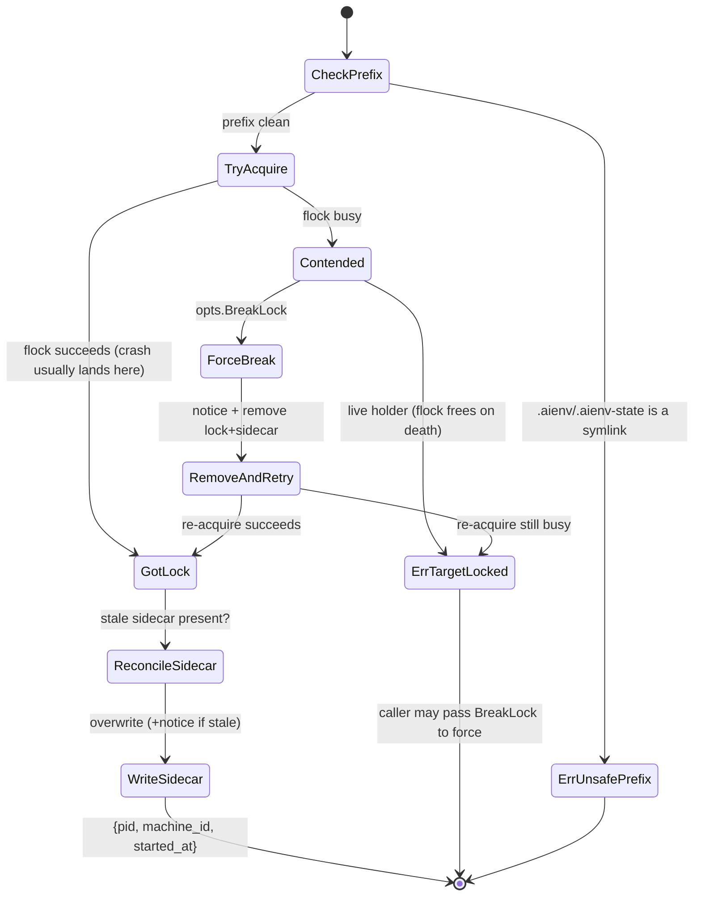
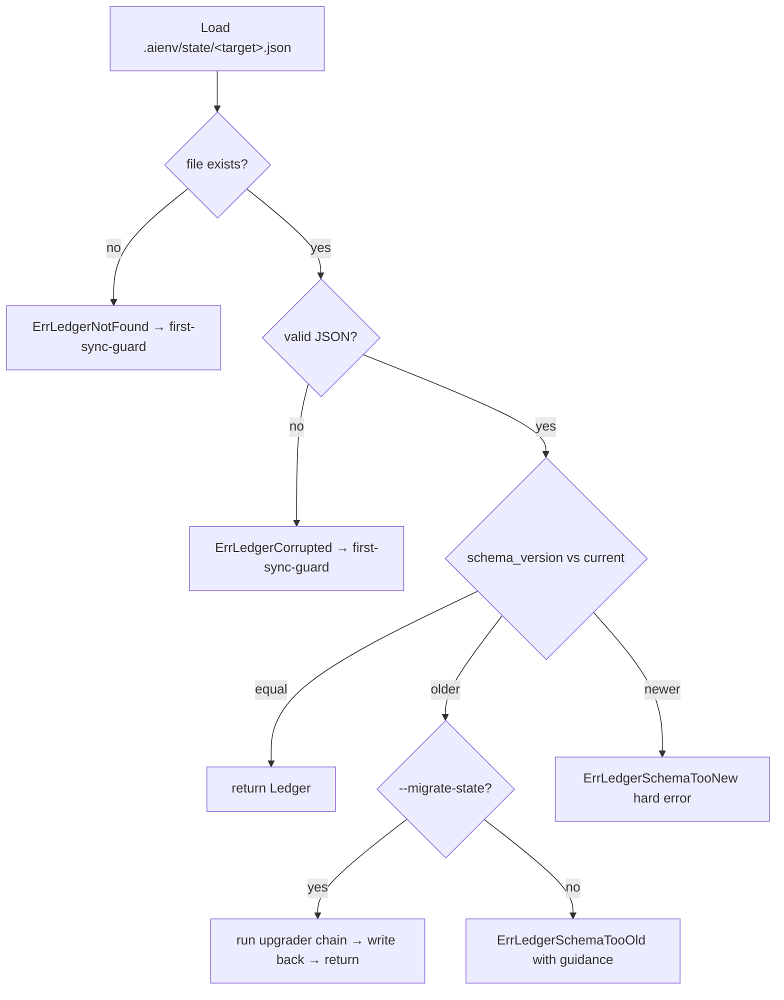

# Unit 12 — Ledger + per-target lock + per-external-file flock

## Overview

Ship the two state-and-concurrency primitives the sync engine
(Units 13, 14) and the tool-owned-file merge (Unit 12a) are built on:

1. A **per-target ledger** at `.aienv/state/<target>.json` recording
   every path aienvs emitted for that target, each with a SHA-256
   content hash, size, and emission timestamp, under an explicit
   schema version. The ledger is what lets a later sync know what it
   previously wrote (so it can detect drift, remove orphans, and merge
   tool-owned slices surgically) without re-deriving ownership from
   the filesystem.
2. Two **flock-backed locks**: a per-target lock that one whole sync
   holds end-to-end (so two `aienvs sync` runs can't clobber each
   other's target), and a per-external-file lock registry that
   serializes the read-merge-write of shared tool-owned files
   (workspace-root `AGENTS.md` written by both `cursor` and `codex`,
   `.mcp.json`, etc.) across adapters and processes.

This unit ships **primitives only** — types, load/write/migrate, and
the lock APIs — plus their tests. It does not wire them into a sync
flow: Unit 13 drives the ledger through the swap pipeline, Unit 12a
calls the per-external-file lock around its merges, and Unit 14
consumes the ledger for orphan deletion. "Done" means the ledger
round-trips and survives corruption/version-skew safely, and the
locks correctly serialize, detect stale holders, and time out — all
proven by tests, with no caller yet.

## Problem Frame

Every robustness property the MVP promises — atomic sync, crash
recovery, orphan adoption-safety, no-clobber concurrency — bottoms out
in two questions the codebase currently can't answer:

- **"What did aienvs write here last time?"** Without a ledger, a sync
  can only guess at ownership from path conventions, which is exactly
  the data-loss surface the tool-owned-file merge (Unit 12a) must
  avoid. The ledger is the durable record of `{path → content-hash}`
  per target.
- **"Is another sync (or another adapter) touching this right now?"**
  Without locks, two concurrent `aienvs sync` invocations race on the
  same target directory, and two adapters race on the same shared
  `AGENTS.md`. Both produce torn writes.

This unit is the foundation Phase D (the sync engine) stands on, so
its correctness bar is high: a corrupted ledger must fail safe (route
to first-sync-guard, never silently treat unknown files as
aienvs-owned), and a crashed lock holder must be detectable and
breakable without a footgun.

## Requirements Trace

This unit advances **R10** only. R9 (optional automation — Git hooks +
watch) maps to Unit 19, not this unit (master plan requirement→unit
map: `R9 → Unit 19`, `R10 → Units 12, 12a, 13, 14`).

- **R10 — reserved-subdirectory ownership + ledger (the Units 12–14
  half).** Durable per-target state recording emitted paths + content
  hashes under an explicit, migratable schema version; crash-safe,
  concurrency-safe writes — atomic ledger writes via `fsroot`,
  per-target locking with stale-holder detection, and per-external-
  file locking for shared tool-owned files. (The orphan/adopt and
  merge halves of R10 are Units 14 and 12a.)
- **Master plan decision #13** — first-sync-guard: a missing or
  corrupted ledger means the reserved prefix is treated as user
  content needing adoption, never silently overwritten.

## Scope Boundaries

- **In scope:** ledger types, load, atomic write, schema migration
  (behind `--migrate-state`); the per-target flock with PID+host
  sidecar and stale-PID detection; the per-external-file flock
  registry; the cross-platform process-liveness check; all unit/
  concurrency tests.
- **Out of scope (explicit non-goals):**
  - The sync flow that *populates* the ledger and *holds* the target
    lock for a whole sync — Unit 13.
  - The tool-owned-file merge that *calls* the per-external-file lock
    around its read-merge-write — Unit 12a (this unit ships the lock
    primitive; 12a is its first caller).
  - Orphan deletion that *reads* the ledger to find removable entries
    — Unit 14.
  - The `--migrate-state` and `--break-lock` CLI flag *wiring* — Unit
    16. This unit exposes the migration and lock-break as library
    functions/options; the cobra flags that toggle them land with the
    CLI.

### Deferred to Follow-Up Work

- **Ledger compaction / vacuuming.** Not needed at MVP scale (one
  ledger per target, bounded by emitted-path count). Revisit if
  ledgers grow unwieldy.
- **Cross-host lock coordination beyond PID+host sidecar.** The
  sidecar records `host` so a stale-lock heuristic doesn't break a
  lock held by a live process on another machine sharing the
  workspace (NFS); but true distributed locking is out of scope.

## Context & Research

### Relevant Code and Patterns

- **`internal/fsroot/safewrite.go`** — `(*Root).StagedWrite(relPath,
  data, mode)` is the atomic write primitive (temp + fsync + rename,
  parent fsync). The ledger's `write.go` uses this exclusively; it
  never opens its own file handles for the ledger JSON.
- **`internal/fsroot/root.go`** — `OpenWorkspaceRoot`, `Path()`,
  `Inner() *os.Root`, `ValidateRelPath`. The ledger is addressed as a
  workspace-relative path (`.aienv/state/<target>.json`) through the
  `Root`.
- **`internal/trust/pending.go` + `store.go`** — the closest existing
  store pattern: a path-bound store struct with `Append`/`List`/
  `rewrite`, JSON(L) marshal helpers, validation, and `Path()`.
  Mirror its shape (constructor takes a path; methods are
  thin; validation is a named helper) for `ledger.Store`.
- **`internal/fsroot/samefs_unix.go` / `samefs_windows.go`** — the
  established `//go:build unix` / `//go:build windows` split for
  syscall-using code. The process-liveness check follows this exact
  pattern.
- **`go.mod`** — `github.com/gofrs/flock v0.13.0` is already a
  dependency; no new third-party deps for this unit.

### Institutional Learnings

- **`docs/solutions/best-practices/go-windows-cross-platform-pitfalls-2026-04-24.md`**
  - Rule 1: any file importing `syscall` or platform packages gets a
    `//go:build unix` / `//go:build windows` tag and a same-package
    sibling, **not** a runtime `runtime.GOOS` skip. The process-
    liveness check (`signal-0` vs `OpenProcess`) is split this way.
  - Rule 3: build lock-file and ledger paths with forward-slash
    workspace-relative segments for the `fsroot` API; only convert to
    OS-native absolute paths at the `gofrs/flock` boundary (flock
    needs a real OS path/FD — see KTD 5).
- **`docs/solutions/workflow-issues/spec-impl-drift-at-pr-review-2026-04-25.md`**
  — keep any schema docs and the code in the same PR; the ledger's
  `SchemaVersion` constant and its on-disk JSON shape must not drift.

### External References

- **Terraform state-lock semantics** (named in the master plan) — the
  `{ID, Operation, Who, Version, Created, Path}` lock-info sidecar and
  the "force-unlock" escape hatch are the model for our `.lock.pid`
  sidecar + `--break-lock`.
- **`gofrs/flock`** — `TryLockContext(ctx, retryDelay)` for bounded
  acquisition; `Flock.Path()`; advisory OS-level locks (`flock(2)` /
  `LockFileEx`). Already vendored.

## Key Technical Decisions

1. **Ledger is one JSON file per target, schema-versioned from day
   one.** Shape: `{schema_version: 1, target: "<name>", entries:
   [{path, sha256, size, emitted_at}]}`. `SchemaVersion` is an
   explicit field (not implied) so Unit 13+ has a migration seam. The
   ledger lives at `.aienv/state/<target>.json`, written atomically
   through `fsroot.StagedWrite`.

2. **Content hash is captured at emission time, never re-hashed on
   read.** Each entry's `sha256` is the hash of the exact bytes
   written for that path. Load does not re-open or re-hash the
   emitted files — the ledger is the source of truth for "what we
   wrote", and `validate` (a later unit) compares on-disk bytes
   against this stored hash to detect hand-edits. Storing the hash at
   write time is what makes drift detection possible without a full
   re-scan.

   **Ownership invariant the ledger entries carry (pinned here for the
   downstream consumers in 13/14, even though they ship later).** A
   ledger entry is *advisory for ownership* — it is never on its own
   sufficient to authorize a destructive action when the on-disk bytes
   diverge from the stored hash. Decision #13's fail-safe direction
   extends past whole-ledger corruption to *entry-level staleness*
   (the realistic partial-crash case: aienvs wrote the file, crashed
   before the ledger write landed, or the file was hand-edited): on a
   hash mismatch for a ledger-listed path, the consumer treats it as
   **user content needing adoption** — it does **not** overwrite or
   delete without an explicit adopt step. "Listed in the ledger" alone
   never licenses clobbering bytes that no longer match what we
   recorded. This is the contract Unit 14 (orphan deletion) and Unit
   13 (swap) must honor; stating it now keeps the data-loss-prevention
   rule from being re-invented per consumer.

3. **Missing vs. corrupted are distinct sentinels, both route to
   first-sync-guard.** `Load` returns `ErrLedgerNotFound` when the
   file is absent (normal first sync) and `ErrLedgerCorrupted` (wrapping
   the JSON error with the path) when the file exists but doesn't
   parse or has an unknown/zero schema version with no migration
   path. The caller (Unit 13) treats **both** as "no trustworthy
   prior state" and routes to the first-sync-guard (decision #13):
   the reserved prefix is treated as user content needing adoption,
   never silently overwritten. Distinguishing them lets the caller log
   differently (silent first sync vs. loud "your ledger is corrupted,
   here's the recovery path").

4. **Schema migration is explicit and gated.** `Load` of a ledger
   whose `schema_version` is older than the current constant returns
   `ErrLedgerSchemaTooOld` unless migration is requested. A separate
   `Migrate(raw, opts)` (callable when the CLI passes `--migrate-state`)
   upgrades old→current via a registered chain of per-version
   upgraders and writes the result back atomically. A version *newer*
   than the current constant is always a hard error (`ErrLedgerSchemaTooNew`)
   — a downgrade is never safe to guess.

5. **Locks need real OS file descriptors, so they resolve to absolute
   paths at the flock boundary — a justified, contained deviation from
   the fsroot-only rule.** `gofrs/flock` requires a real OS path/FD;
   `os.Root` cannot provide one. The lock files live at fixed,
   non-user-supplied segments under the workspace
   (`.aienv/state/<target>.lock` for the target lock; a hashed lock
   file under `.aienv/state/filelocks/` for per-external-file locks),
   resolved to absolute paths by joining the **validated** workspace
   root (`fsroot.Root.Path()`) with a **constant** segment — never a
   user-supplied relative path.
   - **This is not a novel deviation:** `internal/trust/store.go` and
     `internal/trust/pending.go` already flock on absolute sibling
     paths outside `os.Root`. The project `CLAUDE.md` "single
     enforcement point" rule is about *user-path mutation*, and the
     lock files are aienvs-owned state, not user content — but the
     deviation is real and now has two call sites, so the
     containment-check logic below must be shared, not reinvented.
   - **Symlinked-prefix guard (load-bearing).** `Path()` is
     informational; joining it and calling `open()` bypasses
     `os.Root`'s reparse-point checks. If `.aienv/` or `.aienv/state/`
     is itself a symlink (hostile or odd setup), the lock `open()`/
     `mkdir` resolves *through* it and lands the lock file outside the
     workspace — the exact escape `internal/fsroot/containment.go`
     refuses. So before opening any lock FD or creating the state dir,
     `Lstat` each segment of `.aienv` and `.aienv/state` **through the
     fsroot `Root`** (it already detects reparse points) and refuse
     with a named error if any segment is a symlink/reparse point.
     Only after that check passes do we resolve to absolute for flock.
     The constant-segment argument guards the leaf name; this guard
     covers the prefix.

6. **Per-target lock = flock + sidecar + bounded acquire, with
   orphan reconciliation on the *success* path (not just the contended
   path).** The lock is `.aienv/state/<target>.lock` held via
   `TryLockContext(ctx, retryDelay)` with a 2-minute default deadline.
   On acquire, write a sidecar `.aienv/state/<target>.lock.pid` =
   `{pid, machine_id, started_at}`.

   **Key correction (from review): `flock(2)`/`LockFileEx` auto-release
   when the holding process dies, so a crashed holder almost always
   leaves an *orphaned sidecar with the lock already free* — there is
   usually no held lock to "break".** The design therefore has two
   distinct paths:
   - **Successful acquire with a pre-existing sidecar (the common
     crash case):** the lock was free (we got it), but a stale sidecar
     is present. Reconcile: if the sidecar's `machine_id` ≠ ours, or
     its PID is alive on our machine, this is suspicious (someone may
     hold a *different* fd) — but since flock already granted us the
     lock, we proceed and overwrite the sidecar, emitting a one-line
     stale-sidecar notice. (We hold the real lock; the sidecar is
     advisory.)
   - **Contended acquire (flock busy):** because `flock`/`LockFileEx`
     release on holder death, a *busy* lock means a **live** holder —
     the dead-PID case never reaches here (it lands on the success
     path above, since the OS already freed the lock). So there is no
     safe automatic contended break: `Acquire` returns `ErrTargetLocked`
     naming the holder, and an explicit `BreakLock` option
     (`--break-lock`, Unit 16) is the only forced override (best-effort:
     remove the lock file + sidecar and re-acquire). **Implementation
     note (divergence from the original draft):** an earlier draft
     described a contended auto-break gated on `machine_id == ours AND
     PID dead AND age > floor`; implementation showed that combination
     is unreachable with advisory flock (dead holder ⇒ lock already
     free ⇒ success path), so the contended path never auto-breaks. The
     PID/machine/age heuristic is retained — it classifies the orphan
     sidecar on the **success** path to decide whether to emit the
     stale-sidecar notice.

   **Machine identity is a stable UUID, not `os.Hostname()`.**
   `os.Hostname()` collides across containers, cloned VMs, and default
   `localhost` on shared filesystems, which would let a break on one
   machine destroy a live sync's lock on another. Instead, mint a
   random UUID once at `.aienv/state/machine-id` (create-if-absent)
   and use it as `machine_id`. A differing `machine_id` (another
   machine on a shared workspace) **never** auto-breaks and never
   probes the foreign process table.

   **Staleness uses a fixed floor cross-checked against mtime, not the
   caller's acquire timeout.** The age threshold is
   `max(2 × DefaultTimeout, StaleFloor)` with `StaleFloor` = a fixed
   constant (e.g. 4 min), so a short test/override timeout doesn't make
   breaks fire eagerly. Age is computed from **both** the sidecar's
   `started_at` and the lock file's filesystem mtime (take the newer);
   this cross-check blunts a single skewed wall clock (NTP step, VM
   resume).

7. **Process-liveness is a build-tag-split primitive.**
   `processAlive(pid int) bool` lives in `flock_unix.go`
   (`//go:build unix`, `syscall.Kill(pid, 0)` → ESRCH means dead) and
   `flock_windows.go` (`//go:build windows`, `OpenProcess` +
   `GetExitCodeProcess`/`STILL_ACTIVE` = 259, defined locally as
   `golang.org/x/sys/windows` does not export it). Same package, same
   signature. The cross-machine case short-circuits before this is
   called (a different `machine_id` in the sidecar is never probed — we
   can't see another machine's process table). `golang.org/x/sys/windows`
   is already vendored (indirect); the windows sibling promotes it to a
   direct require on `go mod tidy` — not a new dependency.

8. **Per-external-file lock registry keys on a *deterministically*
   canonicalized path, locks a dedicated sidecar.** The serialization
   key is the lock's whole point, so canonicalization must converge two
   spellings of the same file — and a naive "resolve symlinks where
   possible" fails exactly when it matters (the first emission, when
   the target file doesn't exist yet, so `EvalSymlinks` errors and
   falls back to a different key → two adapters get two locks → torn
   write on the highest-data-loss file). One shared
   `canonicalize(abs) string` helper, used by every caller (no
   per-call-site variation):
   - `filepath.Abs` + `filepath.Clean`; strip any trailing separator.
   - Resolve symlinks on the **longest existing prefix** via
     `EvalSymlinks`, then re-append the non-existent remainder, so a
     not-yet-created `AGENTS.md` under a symlinked workspace dir still
     converges on the resolved parent.
   - Case policy: on case-insensitive volumes (macOS APFS, Windows),
     fold case for the hash key; preserve the verbatim path for the
     error message. State this explicitly rather than leaving it
     implicit.
   - SHA-256 the canonical key, hex-encode, to
     `.aienv/state/filelocks/<hash>.lock`.

   `FileLockRegistry.Acquire(ctx, absPath, holder)` flocks that sidecar
   — **not the target file itself** — so the merge's own temp+rename in
   Unit 12a isn't fighting the lock. The registry also guards an
   **in-process** map (mutex) so two goroutines in one process don't
   both think they hold it. Acquire returns a `release` handle; on
   bounded-timeout it returns `ErrFileLockTimeout` naming the (verbatim)
   path and the recorded `holder` (in-process registry knows the
   holder; cross-process it reports "another process"). `holder` is the
   adapter name, threaded so the Unit 12a merge can say "AGENTS.md is
   held by cursor".

9. **All lock acquisition is context-bounded; no unbounded blocking.**
   Every `Acquire`/lock call takes a `context.Context` and a deadline
   (default 2 min, caller-overridable). This keeps a stuck lock from
   hanging a sync forever and makes the timeout test deterministic
   (pass a short-deadline context).

## High-Level Technical Design

### Per-target lock acquisition state machine



*Directional — the prose in KTD 5/6/7 is authoritative on the exact
predicates. Note the common crash path is `GotLock → ReconcileSidecar`
(flock auto-released on holder death), not the `Contended` break.*

### Ledger load decision flow



## Output Structure

```
internal/ledger/
  types.go          # Entry, Ledger, SchemaVersion const, sentinel errors
  load.go           # Load(root, target) -> (Ledger, error); NotFound/Corrupted
  write.go          # Store.Write(root, ledger) via fsroot.StagedWrite
  migrate.go        # Migrate(raw, opts); per-version upgrader chain
  types_test.go
  roundtrip_test.go
  migrate_test.go

internal/locks/
  flock.go          # TargetLock: Acquire/Release, sidecar, prefix-guard, reconcile/break
  flock_unix.go     # //go:build unix  — processAlive via signal-0
  flock_windows.go  # //go:build windows — processAlive via OpenProcess
  machineid.go      # stable per-machine UUID at .aienv/state/machine-id
  filelock.go       # FileLockRegistry: canonicalize + Acquire(ctx, absPath, holder) -> release
  errors.go         # ErrTargetLocked, ErrFileLockTimeout, ErrUnsafeStatePrefix (no ErrStaleLockBroken -- see KTD 6)
  flock_test.go
  filelock_test.go
```

The per-unit `**Files:**` sections are authoritative; the implementer
may adjust the split (e.g., fold `errors.go` into `flock.go`) if it
reads better.

## Implementation Units

### U1. Ledger types + atomic load/write round-trip

**Goal:** Define the ledger data model and its atomic persistence:
types, the current schema-version constant, sentinel errors, `Load`
(with NotFound/Corrupted distinction), and `Write` (atomic via
`fsroot.StagedWrite`).

**Requirements:** R10, decision #13.

**Dependencies:** Unit 1 (`fsroot`). No dependency on other U-IDs here.

**Files:**
- Create: `internal/ledger/types.go`
- Create: `internal/ledger/load.go`
- Create: `internal/ledger/write.go`
- Test: `internal/ledger/types_test.go`
- Test: `internal/ledger/roundtrip_test.go`

**Approach:**
- `Entry{Path string; SHA256 string; Size int64; EmittedAt time.Time}`
  with JSON tags; `Ledger{SchemaVersion int; Target string; Entries
  []Entry}`. `SchemaVersionCurrent = 1` constant.
- `Load(root *fsroot.Root, target string) (Ledger, error)` reads
  `.aienv/state/<target>.json` through the root. Absent file →
  `ErrLedgerNotFound`. Present-but-unparseable → `ErrLedgerCorrupted`
  wrapping the decode error and the path. `UseNumber`-style strict
  decode is not required here (the ledger is aienvs-authored), but
  reject unknown top-level fields defensively.
- `Write` marshals with stable key order (struct field order) +
  trailing newline and calls `fsroot.StagedWrite(".aienv/state/<target>.json",
  data, 0o644)`. Entries are sorted by `Path` before marshal so
  output is deterministic across runs (golden-comparable).
- **Ensure `.aienv/state/` exists first (load-bearing for first sync).**
  `fsroot.StagedWrite` does **not** create missing parent directories
  (its doc comment is explicit), and nothing in the codebase currently
  creates `.aienv/state/`. On a first sync the dir is absent, so
  `Write` must `MkdirAll`-equivalent `.aienv/state/` **through the
  fsroot `Root`** (`root.Inner()` `os.Root` mkdir, preserving
  containment) before the `StagedWrite`. Create lazily on first
  `Write`. The U1 happy-path test must start from a workspace with **no**
  `.aienv/` so this gap is actually exercised (a test that pre-creates
  the dir would mask the first-run failure). The lock primitives (U3,
  U4) ensure the same dir / `filelocks/` subdir exists before their
  first flock — but via the KTD 5 symlinked-prefix-guarded path, since
  they resolve to absolute.
- Validate `target` against the adapter-name grammar before building
  the path (defense in depth; the caller passes a known adapter name).

**Patterns to follow:** `internal/trust/pending.go` (store shape,
marshal helpers, validation); `internal/fsroot/safewrite.go`
(StagedWrite contract).

**Test scenarios:**
- Happy path: write a ledger with 3 entries, read it back; the
  returned `Ledger` equals the written one field-for-field, entries in
  sorted-by-path order.
- Happy path (determinism): writing the same ledger twice produces
  byte-identical files (stable sort + stable marshal).
- Edge case: `Load` of an absent file → `ErrLedgerNotFound` (via
  `errors.Is`); not `ErrLedgerCorrupted`.
- Error path: `Load` of a file containing `{not json` →
  `ErrLedgerCorrupted` (via `errors.Is`), message names the path.
- Error path: `Load` of valid JSON with an unknown top-level field →
  `ErrLedgerCorrupted` (defensive strict decode).
- Error path: `Load` of otherwise-valid JSON with `schema_version: 0`
  or a missing `schema_version` → `ErrLedgerCorrupted` (zero/missing
  version is corruption, never a migratable v0 — KTD 3).
- Edge case: empty `entries` array round-trips as `[]`, not `null`.
- Edge case: a `target` violating the adapter-name grammar →
  `Write`/`Load` returns an invalid-target error without touching disk.

**Verification:** `go test -race ./internal/ledger/...` passes;
round-trip is bit-for-bit; NotFound and Corrupted are distinct,
`errors.Is`-matchable sentinels.

### U2. Ledger schema migration (gated)

**Goal:** Make schema evolution safe: detect version skew on load and
provide a gated `Migrate` that upgrades old ledgers through a
registered upgrader chain, refusing newer-than-current outright.

**Requirements:** R10, decision #13.

**Dependencies:** U1.

**Files:**
- Create: `internal/ledger/migrate.go`
- Test: `internal/ledger/migrate_test.go`
- Modify: `internal/ledger/load.go` (emit `ErrLedgerSchemaTooOld` /
  `ErrLedgerSchemaTooNew` on version skew)

**Approach:**
- `Load` compares the parsed `schema_version` to `SchemaVersionCurrent`:
  equal → return; older → `ErrLedgerSchemaTooOld` (names current
  version + that `--migrate-state` is required); newer →
  `ErrLedgerSchemaTooNew` (hard error, names both versions; downgrade
  is never guessed). Zero/missing version on an otherwise-valid file
  is treated as corrupted (U1), not as a migratable v0.
- `Migrate(raw []byte, opts MigrateOpts) (Ledger, error)` parses the
  version, then applies `upgraders[v], upgraders[v+1], …` until
  current. For v1 (the only version today) the chain is empty —
  `Migrate` of a v1 ledger is an identity that still validates shape.
  The chain is a `map[int]func(prev) (next, error)` so v1→v2 slots in
  without touching call sites.
- The caller (Unit 16 CLI, `--migrate-state`) reads the file, calls
  `Migrate`, then `Write`s the upgraded ledger atomically. This unit
  ships `Migrate` as a pure function over bytes (no I/O) so it's
  trivially testable; the read/write wrapping lives at the call site.

**Patterns to follow:** keep `Migrate` I/O-free and table-driven
(version → upgrader); mirror the registered-chain idiom rather than a
growing switch.

**Test scenarios:**
- Happy path: `Migrate` of a current-version ledger returns it
  unchanged (identity), shape validated.
- Edge case (forward-proofing): a recognized-but-older version (e.g.
  `schema_version: 1` once `SchemaVersionCurrent == 2`) → `Load`
  returns `ErrLedgerSchemaTooOld` without `--migrate-state`. Today
  `current == 1` so there is no real older recognized version; this is
  exercised via a synthetic `Migrate`-chain test (register a v1→v2
  upgrader in the test) plus a guard test asserting the chain wiring.
  **`schema_version: 0` / missing is corruption, not skew** — it is
  covered by U1's `ErrLedgerCorrupted` strict-decode test, never by
  `ErrLedgerSchemaTooOld` (consistent with KTD 3 and U2's Approach).
- Error path: `Load`/`Migrate` of a newer-than-current version →
  `ErrLedgerSchemaTooNew` (hard error, no upgrade attempted).
- Integration (forward-proofing): register a synthetic v1→v2 upgrader
  in the test, assert a v1 fixture upgrades to v2 shape and the
  unknown-field/added-field transformation is applied. This proves the
  chain mechanism works before a real v2 exists.

**Verification:** version skew is explicit and gated; migration is
pure-functional and table-driven; newer-version is a hard refusal.

### U3. Per-target lock with orphan-sidecar reconciliation + stale detection

**Goal:** Implement the whole-sync target lock: prefix-safety guard,
bounded flock acquire, `{pid, machine_id, started_at}` sidecar,
cross-platform process-liveness, orphan-sidecar reconciliation on the
success path, and the conservative contended-path auto-break.

**Requirements:** R10.

**Dependencies:** U1 is not required; depends on Unit 1 (`fsroot` for
the workspace root path + reparse-point detection) and `gofrs/flock`.

**Files:**
- Create: `internal/locks/flock.go`
- Create: `internal/locks/flock_unix.go` (`//go:build unix`)
- Create: `internal/locks/flock_windows.go` (`//go:build windows`)
- Create: `internal/locks/machineid.go` (stable per-machine UUID)
- Create: `internal/locks/errors.go`
- Test: `internal/locks/flock_test.go`

**Approach:**
- **Prefix-safety guard first (KTD 5):** before resolving the absolute
  lock path, `Lstat` `.aienv` and `.aienv/state` through the fsroot
  `Root`; if either is a symlink/reparse point, return
  `ErrUnsafeStatePrefix` and do not open any FD. `MkdirAll` the state
  dir through the `Root` (containment-preserving) if absent.
- `machineID(root)` reads-or-creates `.aienv/state/machine-id` (a
  random UUID, written once) and returns it. This is the stable
  machine identity that gates auto-break (KTD 6) — never
  `os.Hostname()`.
- `TargetLock` holds the resolved absolute lock path
  (`<workspace>/.aienv/state/<target>.lock`, see KTD 5) and a
  `*flock.Flock`. `Acquire(ctx, opts) (release func() error, err error)`
  calls `TryLockContext` with the bounded deadline.
- **Success path (flock granted) — reconcile any orphan sidecar:** a
  crashed prior holder usually left its sidecar but the OS already
  released the lock (so we got it). If a sidecar is present, overwrite
  it with our `{pid, machine_id, started_at}` and emit a one-line
  stale-sidecar notice when the old sidecar looked stale (different
  `machine_id`, or dead PID, or old age). Return a release that
  unlocks + removes the sidecar.
- **Contended path (flock busy = live holder):** return `ErrTargetLocked`
  naming pid/machine. **No automatic break** — with advisory flock a
  busy lock means a live holder (a dead holder's flock is already
  released, so it lands on the success path). `opts.BreakLock` clears a
  stale **sidecar** and retries the *same* flock handle (never unlinks +
  recreates, which would split into two inodes and let a live holder and
  the breaker both "hold" the lock); a genuinely live holder is therefore
  never stolen. (This supersedes an earlier draft that had a contended
  auto-break emitting `ErrStaleLockBroken` — that sentinel was dropped;
  see KTD 6's implementation note.)
- The stale-classification heuristic (`machine_id == ours` AND
  `!processAlive(pid)` AND age beyond `max(2*DefaultTimeout, StaleFloor)`,
  age = `max(now-started_at, now-lockfileMtime)`) runs on the **success**
  path to decide whether to emit the stale-sidecar notice.
- `processAlive` is the build-tag-split primitive (KTD 7); the
  cross-machine branch (`machine_id != ours`) never calls it.
- Every absolute-path lock leaf and the sidecar are symlink-guarded
  (`guardLeaf` Lstats through the fsroot Root) and the sidecar is written
  through `os.Root` so a symlinked `.aienv/state` prefix or lock leaf
  cannot redirect a write outside the workspace.

**Patterns to follow:** `internal/fsroot/samefs_{unix,windows}.go`
(build-tag split); `internal/fsroot/containment.go` (reparse-point
detection); Terraform force-unlock semantics (sidecar + explicit
break).

**Test scenarios:**
- Happy path: `Acquire` on a free target with no prior sidecar returns
  a release; sidecar exists with this process's pid/machine_id; release
  unlocks and removes the sidecar.
- Orphan-sidecar reconcile (the real crash case): pre-write a sidecar
  with a dead PID + old `started_at`, hold **no** real flock, then
  `Acquire` → flock is granted on the success path, the orphan sidecar
  is overwritten, and the stale-sidecar notice is emitted. (This is the
  scenario the old "break a held lock" framing got wrong: flock
  auto-releases on holder death, so there is no held lock — only a
  stale sidecar reconciled on success.)
- Concurrency (real contention): two `*flock.Flock` on the same path
  (second with a short-deadline context) — first wins and holds; second
  returns `ErrTargetLocked` within the deadline. Sidecar `pid =
  os.Getpid()` alive + recent → no break.
- Contended-break: simulate a live OS lock held by a second fd while
  the sidecar records a dead PID + old age + our `machine_id` → the
  contended path breaks with a notice and acquires. (Engineer the
  second fd to be releasable so the break can succeed.)
- Edge case (cross-machine): sidecar `machine_id = "<other-uuid>"` and
  a dead-looking pid → `Acquire` does **not** break (never probes a
  foreign machine's process table); `ErrTargetLocked`.
- Edge case (clock skew): sidecar `started_at` in the future / wildly
  old but lock-file mtime fresh → age uses the mtime cross-check and
  does **not** spuriously break.
- Edge case (short timeout): a 1s acquire timeout does **not** shrink
  the stale-age threshold below `StaleFloor` (a recently-acquired lock
  is never broken just because the caller passed a short deadline).
- Edge case (unsafe prefix): `.aienv/state` is a symlink →
  `ErrUnsafeStatePrefix`, no FD opened.
- Edge case (force): `opts.BreakLock = true` on an alive-PID lock →
  breaks and acquires, emits the break notice.
- `processAlive` unit test: `processAlive(os.Getpid())` true;
  `processAlive(<unused pid>)` false (both build-tag siblings).

**Verification:** `go test -race ./internal/locks/...` passes on the
host platform; the auto-break heuristic never fires for a live PID or
a foreign host; the build-tag split compiles on both
`GOOS=linux`/`darwin` and `GOOS=windows` (`go vet` cross-compile
check in verification).

### U4. Per-external-file flock registry

**Goal:** Implement the per-shared-file lock that Unit 12a's merge
acquires around each tool-owned file's read-merge-write, serializing
concurrent adapters/processes on the same canonical path.

**Requirements:** R10.

**Dependencies:** U3 (shares the flock + liveness machinery and
`errors.go`), Unit 1 (`fsroot` for the workspace root).

**Files:**
- Create: `internal/locks/filelock.go`
- Modify: `internal/locks/errors.go` (`ErrFileLockTimeout`)
- Test: `internal/locks/filelock_test.go`

**Approach:**
- `FileLockRegistry{root}` constructed from the workspace root.
  `Acquire(ctx, absPath, holder string) (release func() error, err
  error)`:
  1. Canonicalize `absPath` (`filepath.Clean` + resolve symlinks where
     possible) so two spellings of `AGENTS.md` collide.
  2. SHA-256 the canonical path → hex; lock file is
     `<workspace>/.aienv/state/filelocks/<hash>.lock` (KTD 5,
     `0o755` dir).
  3. Take the in-process mutex-guarded map entry first (so two
     goroutines in one process serialize without fighting the OS
     lock), then `TryLockContext` the sidecar with the bounded
     deadline.
  4. On success record `holder` in the in-process entry and return a
     release that unlocks + clears the map entry.
  5. On timeout return `ErrFileLockTimeout` naming the **original**
     `absPath` and the `holder` (in-process holder when known; "another
     process" cross-process).
- The registry never locks the target file itself — only its hashed
  sidecar — so Unit 12a's temp+rename of the real file isn't blocked by
  the lock it holds.

**Patterns to follow:** U3's flock acquire/release shape;
`gofrs/flock` `TryLockContext`.

**Test scenarios:**
- Happy path: `Acquire` for `<ws>/AGENTS.md` returns a release; the
  hashed sidecar exists under `.aienv/state/filelocks/`; release
  unlocks.
- Concurrency (serialization): two adapters (`holder="cursor"`,
  `holder="codex"`) acquire the **same** `AGENTS.md` from two
  goroutines; the second blocks until the first releases, then
  proceeds — both acquisitions ultimately succeed, never concurrently.
  Assert ordering via a shared counter/timestamp.
- Path-identity (the cases that actually break collision): same-file
  inputs must hash identically across — `./AGENTS.md` vs absolute;
  a **nonexistent** leaf under a symlinked workspace dir vs the
  resolved-parent spelling (the first-emission case `EvalSymlinks`
  alone fails on); a trailing-slash variant; and, on a case-insensitive
  volume, a case-variant spelling. Each asserts one sidecar, one lock,
  serialized access.
- Different files don't contend: `AGENTS.md` and `.mcp.json` acquire
  concurrently without blocking.
- Error path (timeout): hold the lock in one goroutine, `Acquire` from
  another with a short-deadline context → `ErrFileLockTimeout` naming
  the path and the holding adapter (`cursor`).
- Integration: a real second OS process (or second registry instance
  over the same lock dir) holding the sidecar → cross-process
  `Acquire` times out with `ErrFileLockTimeout` reporting "another
  process".

**Verification:** `go test -race ./internal/locks/...` passes; same-
file acquisitions serialize, different-file acquisitions don't block;
timeout error names path + holder; no torn state (the lock is on a
sidecar, never the target file).

## System-Wide Impact

- **Interaction graph:** Nothing imports `internal/ledger` or
  `internal/locks` yet. Unit 12a imports the file-lock registry; Unit
  13 imports the ledger + target lock; Unit 14 imports the ledger.
  This unit adds two leaf packages with no inbound edges in this PR —
  proven only by their own tests.
- **Error propagation:** All sentinels (`ErrLedgerNotFound`,
  `ErrLedgerCorrupted`, `ErrLedgerSchemaTooOld/TooNew`, `ErrInvalidTarget`,
  `ErrTargetLocked`, `ErrFileLockTimeout`, `ErrUnsafeStatePrefix`) are
  `errors.Is`-matchable so callers route on them. (`ErrStaleLockBroken`
  was dropped — stale handling became a stderr notice on the success
  path, not a sentinel; see KTD 6.) No panics across the package
  boundary.
- **State lifecycle:** The ledger is the durable record consumed by
  the sync engine; this unit's correctness (atomic write, fail-safe
  load) is what later units' crash-safety rests on. Locks hold OS
  resources — every `Acquire` returns a `release` the caller must
  defer; tests assert release actually unlocks.
- **Cross-platform:** `processAlive` is the only platform-split
  surface; everything else is portable. Verification cross-compiles
  for `windows` to catch build-tag mistakes (per the cross-platform
  learning).
- **Unchanged invariants:** `fsroot` is the sole path for the ledger
  JSON write (atomic). Locking resolves absolute paths outside `fsroot`
  (KTD 5) — joining `internal/trust`'s existing precedent, not a novel
  hole — justified because `flock` needs a real FD; contained to fixed
  `.aienv/state/` segments joined to the validated workspace root and
  guarded by the symlinked-prefix `Lstat` check.

- **Cross-unit contract invariants (pinned now; consumers ship later).**
  Because this unit ships primitives with no caller, its tests are
  in-isolation and could validate the API against the same mental model
  that wrote it. To de-risk the seams the sync engine depends on, these
  contracts are stated as invariants and exercised by an in-package
  consumer-ordering test:
  1. **Ledger `Write` happens while the target lock is held.** Unit 13
     must `Acquire` the target lock, then `Write` the ledger, then
     release — the ledger is only mutated under the lock. A U3 test
     simulates this ordering (acquire → write a ledger via U1 → release)
     and asserts no error and a clean final state.
  2. **A file-lock `release` is crash-safe.** An `Acquire` followed by
     an abort (no release called, holder "dies") must leave the lock
     reclaimable — a later `Acquire` succeeds via orphan reconciliation
     (target lock) or because flock auto-released (file lock). A test
     asserts Acquire-then-abandon leaves the next Acquire able to
     proceed.
  3. **Hash-mismatch never authorizes destruction** (KTD 2) — restated
     so Unit 14's orphan deletion treats a drifted ledger-listed path
     as user content needing adoption.

## Risks & Dependencies

| Risk | Mitigation |
|------|------------|
| Stale-lock auto-break removes a lock held by a live process | flock auto-releases on holder death, so the real crash case is reconciled on the *success* path (no held lock); the rare contended-break is triple-gated on **machine-UUID** == self AND dead PID AND age > fixed floor; live PID or foreign machine never auto-breaks; `--break-lock` is the only override (KTD 6) |
| PID reuse: a dead holder's PID recycled by an unrelated process | machine-UUID gate + fixed-floor age gate narrows the window; a recycled-live PID yields a false "another sync running" that `--break-lock` resolves — fail-safe (never breaks a maybe-live lock) |
| Hostname collision on shared FS breaks a remote live sync's lock | Identity is a per-machine random UUID at `.aienv/state/machine-id`, **not** `os.Hostname()`; a differing UUID never auto-breaks and never probes the foreign process table (KTD 6) |
| Clock skew (NTP step / VM resume) shrinks the stale-age gate | Age = `max(now-started_at, now-lockfile-mtime)` cross-checked, against a fixed `StaleFloor` independent of the (possibly short) acquire timeout (KTD 6) |
| Locking steps outside `fsroot` (KTD 5) — and a symlinked `.aienv/` could escape containment | Symlinked-prefix `Lstat` guard via the fsroot `Root` before opening any lock FD (`ErrUnsafeStatePrefix`); contained to fixed `.aienv/state/` segments; shared with the existing `internal/trust` flock precedent so the check lives in one helper |
| Canonicalization fails to converge two spellings → two locks → torn write on `AGENTS.md` | Single shared `canonicalize` helper: Clean + resolve longest existing prefix + re-append remainder + explicit case policy; tested on nonexistent-leaf, symlink, case-variant, trailing-slash (KTD 8) |
| Stale ledger (parseable but entry-level stale after partial crash) causes a consumer to overwrite a hand-edited file | Hash-mismatch is fail-safe: a drifted ledger-listed path is treated as user content needing adoption, never clobbered (KTD 2 invariant, pinned for Units 13/14) |
| flock semantics differ on Windows (`LockFileEx`) vs unix (`flock(2)`) | `gofrs/flock` abstracts both; `-race` on host platform + cross-compile-check for windows |
| Ledger corruption silently treated as valid | `ErrLedgerCorrupted` routes to first-sync-guard (adoption), never silent overwrite (decision #13); strict decode rejects unknown fields and zero/missing version |
| Per-file lock on the target file itself would block 12a's rename | Lock a hashed **sidecar**, never the target file (KTD 8) |
| flock advisory semantics unreliable on NFS/SMB across hosts | Documented limitation; cross-host coordination is out of scope (deferred); the machine-UUID gate prevents the *destructive* failure mode even where mutual-exclusion is weak |

## Documentation / Operational Notes

- No new third-party dependency (`gofrs/flock` already vendored).
- The on-disk ledger JSON shape and the lock sidecar shape are
  authored here; if a `docs/spec/` schema doc is later wanted, it
  ships with the first consumer that needs a stable external contract
  (Unit 15's `--output=json`), not this unit.
- `--migrate-state` and `--break-lock` are exposed as a library
  `MigrateOpts`/`AcquireOpts` here; the cobra flags wire in Unit 16.
- No CHANGELOG entry yet (changelog is Unit 21).

## Sources & References

- **Origin / parent plan:** [docs/plans/2026-04-21-001-feat-aienvs-workspace-cli-plan.md](2026-04-21-001-feat-aienvs-workspace-cli-plan.md) (Unit 12 section, lines 878-915)
- **Atomic write primitive:** `internal/fsroot/safewrite.go`
- **Store pattern to mirror:** `internal/trust/pending.go`, `internal/trust/store.go`
- **Build-tag split precedent:** `internal/fsroot/samefs_unix.go`, `internal/fsroot/samefs_windows.go`
- **Cross-platform learning:** `docs/solutions/best-practices/go-windows-cross-platform-pitfalls-2026-04-24.md`
- **Lock dependency:** `github.com/gofrs/flock` v0.13.0 (already in go.mod)
- **Lock-semantics model:** Terraform state lock / force-unlock
