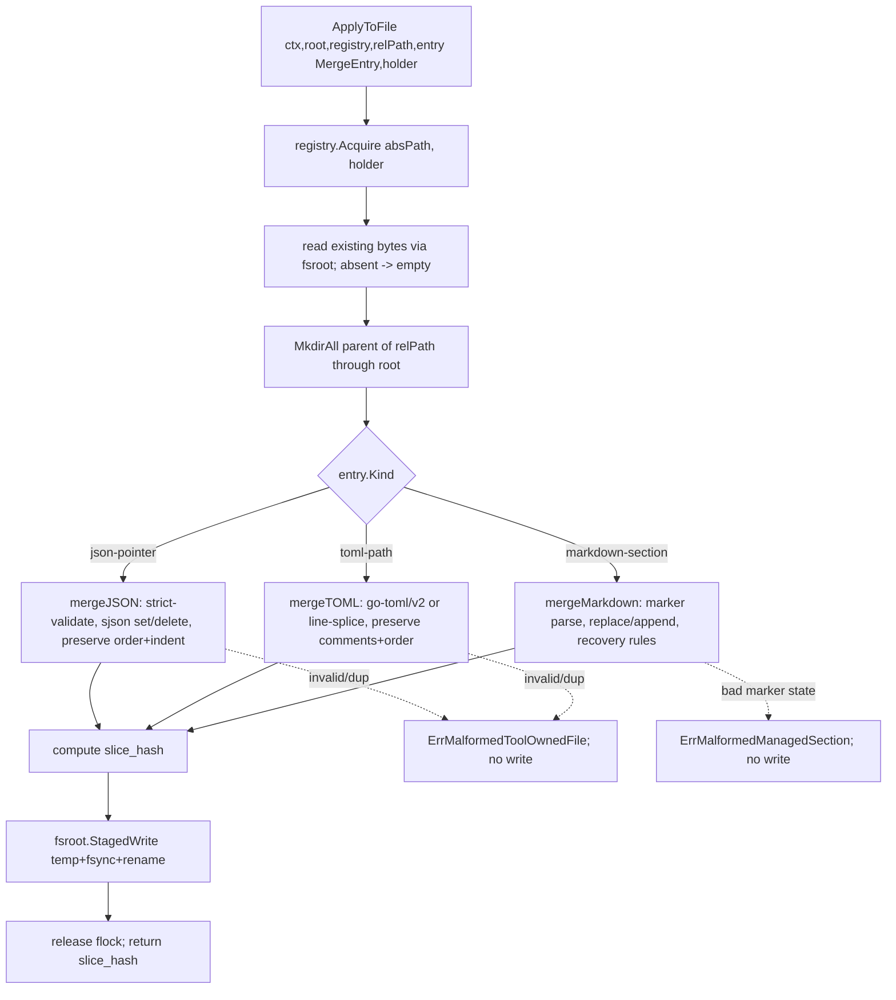
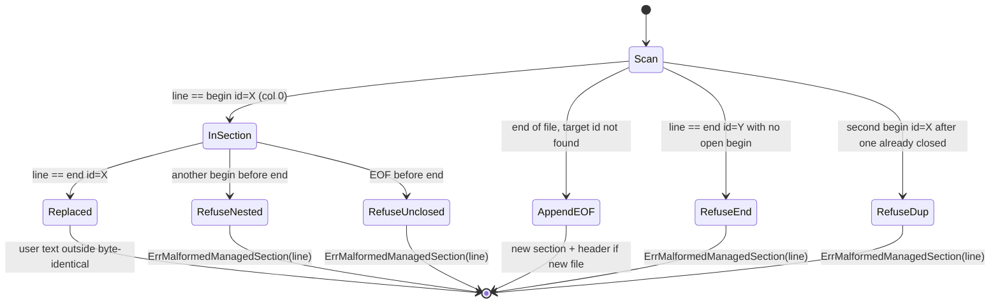

# Unit 12a — Tool-owned-file merge

## Overview

Provide the merge primitives that the `write_tool_owned` op depends on:
insert / update / remove aienvs-managed entries inside **user-owned**
files — `.mcp.json` (workspace root), `.cursor/mcp.json`,
`.codex/config.toml`, workspace-root `AGENTS.md`, and the `CLAUDE.md`
overlay — without corrupting user-authored content. This is the plan's
**highest data-loss surface**: a botched merge silently destroys an
MCP server config a user hand-wrote, or eats a paragraph of their
`AGENTS.md`. It gets its own unit (instead of being smeared across the
adapters) precisely so the round-trip contract, library choices, and
recovery rules are decided and tested in one place.

Three format engines, each surgical:

- **JSON** (`.mcp.json`, `.cursor/mcp.json`) — set/delete an
  `aienvs_<id>` key under a JSON-pointer parent via `tidwall/sjson`,
  with `encoding/json` (`UseNumber`) strict parse-validation before
  any write. User keys never move; key order preserved.
- **TOML** (`.codex/config.toml`) — append/remove
  `[mcp_servers.aienvs_<id>]` tables via `pelletier/go-toml/v2`,
  preserving user comments and table order.
- **Markdown** (`AGENTS.md`, `CLAUDE.md`) — replace the content
  between `<!-- aienvs:begin id=<id> -->` / `<!-- aienvs:end id=<id> -->`
  markers, with explicit refuse-don't-guess recovery rules for
  malformed marker states.

The merge functions are **pure** (bytes + entry → bytes, or a named
error). A thin `ApplyToFile` orchestrator wraps them with the Unit 12
per-external-file flock and `fsroot`'s atomic temp+fsync+rename. This
unit ships the engines + the orchestrator + the authoritative spec +
golden/mutation/fuzz fixtures. The sync engine (Unit 13) wires adapter
`write_tool_owned` ops to `ApplyToFile`.

## Problem Frame

The bundled adapters (Units 9, 10) already emit `write_tool_owned`
ops carrying a locator (`json-pointer` / `toml-path` /
`markdown-section`) and content, but **nothing consumes them** — there
is no code that can surgically edit a user's `.mcp.json` or `AGENTS.md`
to insert the aienvs slice while leaving everything else byte-identical.
Without that, the only options are "overwrite the whole file" (destroys
user content) or "don't touch tool-owned files at all" (the adapters'
MCP and AGENTS.md outputs go nowhere). Unit 12a is the surgical-edit
engine that makes tool-owned emission safe, and it is the single place
the data-loss-prevention contract is specified and enforced.

## Requirements Trace

- **R10.** Reserved-subdirectory ownership + tool-owned-file merge —
  the merge half of R10 (orphan/adopt is Unit 14, ledger/locks were
  Unit 12). Aienvs-owned slices are surgically inserted/removed;
  user-authored content is never mutated.
- **R11.** v1 IR concept set — `mcp-server-entry` (JSON/TOML) and
  `agents-md` (markdown-section) are the kinds whose output lands in
  tool-owned files.
- **R12.** Per-tool ownership model — tool-owned-file mode with
  per-entry ledger locators.
- **Master plan decision #25** — encoded per-format merge contract in
  `docs/spec/tool-owned-merge-v1.md`.

## Scope Boundaries

- **In scope:** locator types + validation; the three pure merge
  engines (JSON, TOML, markdown) with insert/update/remove; the
  `ApplyToFile` orchestrator (flock + atomic write); the authoritative
  `tool-owned-merge-v1.md` spec; golden round-trip, mutation
  (byte-identical user region), and fuzz fixtures; the two error
  sentinels.
- **Out of scope (explicit non-goals):**
  - Wiring adapter `write_tool_owned` ops to `ApplyToFile` — Unit 13
    (the sync engine) maps an op + ledger entry to a merge call.
  - Orphan removal *policy* (deciding *which* `aienvs_<id>` entries are
    stale) — Unit 14. This unit ships the *mechanism* (remove a named
    entry); 14 decides when to call it.
  - Ledger reads/writes — Unit 12 owns the ledger; this unit *returns*
    the per-entry `{locator_kind, locator_value, slice_hash}` the
    caller records, but does not itself read/write `.aienv/state/`.
  - The `.codex` adapter (Unit 11) and `pi` adapter (Unit 11.5) — they
    are v0.2; this unit's TOML engine is built and tested against
    fixtures, ready for them.

### Deferred to Follow-Up Work

- **Marker-ownership reconciliation with the adapters' pre-wrapping.**
  Units 9/10's `emitAgentsMD` currently pre-wraps the body in
  `<!-- aienvs:begin/end -->` markers inside the op `Content`. This
  unit's markdown engine owns marker management itself (KTD 5). The
  reconciliation — whether Unit 13 passes the inner body or strips the
  adapter's wrapper before calling the merge — is a Unit 13 wiring
  decision, recorded here so it is not lost.

## Context & Research

### Relevant Code and Patterns

- **`pkg/adapterkit/types.go`** — `ToolOwnedKind` ∈ {`json-pointer`,
  `toml-path`, `markdown-section`}; `OpWriteToolOwned{Path, Kind,
  Locator, Content}`. These are the locator kinds this unit's engines
  dispatch on.
- **`internal/adapter/bundled/claude/emit_tool_owned.go` +
  `cursor/emit_tool_owned.go`** — the producers. `mcp-server-entry`
  emits `Locator: "/mcpServers/aienvs_<id>"` (json-pointer) with the
  raw server-object JSON as content; `agents-md` emits
  `Locator: "aienvs:<id>"` (markdown-section) with the body wrapped in
  begin/end markers. **The adapters emit `<!-- aienvs:begin id=<id> -->`
  (id only, no `source=`)** — the merge parser must accept that grammar
  (see KTD 5). The marker-injection guard (`markerOpenBytes`) already
  rejects bodies containing `<!-- aienvs:` upstream.
- **`internal/locks/filelock.go`** — `FileLockRegistry.Acquire(ctx,
  absPath, holder, FileLockOpts)` (Unit 12, merged). `ApplyToFile`
  acquires this around the read-merge-write so two adapters writing the
  same `AGENTS.md` serialize.
- **`internal/fsroot/safewrite.go`** — `(*Root).StagedWrite(relPath,
  data, mode)` is the atomic temp+fsync+rename. `ApplyToFile` reads via
  `root.Inner().Open` (or `os.ReadFile` of the resolved path) and
  writes the merged bytes via `StagedWrite`. The `<file>.aienv-tmp`
  staging the master plan describes is exactly what `StagedWrite`
  already does internally; do not hand-roll a second temp scheme.
- **`internal/ledger/types.go`** — `Entry{Path, SHA256, Size,
  EmittedAt}`. This unit returns the locator + slice hash for the
  caller to fold into a ledger entry; it does not extend the Entry
  shape (that is a Unit 13 concern if needed).
- **`internal/ir/types.go`** — `IsValidID` (the `aienvs_<id>` suffix
  must satisfy the id grammar).

### Institutional Learnings

- **`docs/solutions/best-practices/go-windows-cross-platform-pitfalls-2026-04-24.md`**
  — markdown line-ending handling must tolerate both `\n` and `\r\n`
  (a Windows-authored `AGENTS.md`); the marker parser is line-based and
  must not assume `\n`. Preserve the file's existing newline style on
  write.
- **`docs/solutions/workflow-issues/spec-impl-drift-at-pr-review-2026-04-25.md`**
  — ship `docs/spec/tool-owned-merge-v1.md` in the same PR as the code;
  the spec's round-trip/recovery contract and the implementation must
  not drift (the spec is the authority the adapters and Unit 13 read).

### External References

- **`github.com/tidwall/sjson`** + **`tidwall/gjson`** — surgical
  JSON set/delete by path; `sjson` preserves existing key order on
  update and appends new keys at the end of the parent object. Not yet
  in `go.mod` (added in U2).
- **`github.com/pelletier/go-toml/v2`** — TOML decode/encode that
  preserves user comments on untouched tables. Not yet in `go.mod`
  (added in U3). **Library-capability caveat:** go-toml/v2's
  marshaller is not a full comment-preserving *document* round-tripper
  the way some TOML libs are; U3 must verify (via a round-trip fixture)
  exactly what it preserves and, if comment-on-untouched-table
  preservation is weaker than assumed, fall back to a line-anchored
  splice (append aienvs tables to the raw byte tail) rather than a
  full re-encode. This is the highest library-risk decision in the
  unit — resolve it with a spike fixture in U3 before committing to the
  re-encode approach.

## Key Technical Decisions

1. **Merge engines are pure functions; I/O is a thin separate
   orchestrator.** Each engine is `merge(existing []byte, entry
   MergeEntry) (result []byte, sliceHash string, err error)` — no file
   access, no locks. This makes the data-loss-critical logic
   exhaustively testable with byte-in/byte-out golden + mutation +
   fuzz fixtures. `ApplyToFile` is the only function that touches the
   filesystem and the flock; it is deliberately thin so the risk lives
   in the pure, fuzzed core.

2. **JSON: `sjson` for the edit, `encoding/json`+`UseNumber` for the
   guard.** Parse-validate the *existing* file with a strict decoder
   first; invalid JSON is a hard `ErrMalformedToolOwnedFile` (never
   auto-fix — we will not rewrite a file we cannot parse). Then
   `sjson.SetRawBytes` / `sjson.DeleteBytes` at the pointer. Probe the
   existing file's indentation (first whitespace run after the
   outermost `{`; default two-space for a new file) and re-apply it.
   Aienvs entries are identified by the `aienvs_<id>` key-name prefix;
   a duplicate `aienvs_<id>` under the same parent is
   `ErrMalformedToolOwnedFile` (ledger drift). Trailing newline
   preserved iff present in input.

3. **TOML: go-toml/v2 with a verified preservation contract (or a
   line-anchored fallback).** Append aienvs-owned tables
   (`[mcp_servers.aienvs_<id>]`) at end; user tables keep their
   position and comments. Invalid TOML is a hard
   `ErrMalformedToolOwnedFile`; duplicate aienvs tables are rejected.
   Because go-toml/v2's comment preservation on a full re-encode is
   uncertain (see External References caveat), U3 first proves the
   preservation behavior with a round-trip fixture; if re-encode drops
   user comments, switch to appending the rendered aienvs table to the
   raw byte tail (a splice, not a re-encode) and removing by locating
   the table's line span. The spec records whichever contract ships.

4. **Markdown: line-based marker parser with refuse-don't-guess
   recovery.** Replace content between a well-formed
   `begin id=<id>` / `end id=<id>` pair; user text outside is
   byte-identical. Malformed states **refuse** with
   `ErrMalformedManagedSection` naming the line — `begin` without `end`,
   `end` without `begin`, nested `begin`, duplicate `id`. An *indented*
   marker (inside a blockquote/list) is treated as user content, not a
   marker, and a new section is appended at EOF with a warning. New
   file: emit a top-of-file managed header
   ("Partially managed by aienvs — edit outside the markers") then the
   section. Tolerate `\n` and `\r\n`; preserve the file's newline style.

5. **The markdown engine owns the markers; it is given the inner body +
   id + optional source.** Signature carries `(id, body, source)`; the
   engine writes `<!-- aienvs:begin id=<id>[ source=<source>] -->\n<body>\n<!-- aienvs:end id=<id> -->`.
   The parser **accepts both** the id-only grammar the adapters emit
   today (`<!-- aienvs:begin id=foo -->`) and the
   `source=`-bearing grammar the master plan specifies — `source` is
   optional metadata keyed off `id`. This resolves the cross-unit
   mismatch (Units 9/10 emit id-only; the master plan's 12a grammar has
   `source=`): the parser is liberal in what it accepts, strict in what
   it writes.
   - **The engine takes the INNER body and rejects a body already
     containing a marker.** Units 9/10 emit *pre-wrapped* content
     (`wrapManagedSection`), so the likeliest Unit 13 wiring mistake is
     passing that wrapped content as the engine's `body`, which would
     double-wrap and brick the section (nested-begin) on the next sync.
     To turn that latent corruption into a loud failure caught by 12a's
     own tests, the engine **rejects** a `body` containing
     `<!-- aienvs:` with a programmer/contract error (mirroring the
     adapter's `markerOpenBytes` guard, at the merge boundary). The spec
     pins: the engine owns markers; callers pass inner body only.
   - **User-prose marker collision is fail-safe, never a silent
     overwrite.** A bare parsed `begin id=foo` at column 0 is **not**
     sufficient to authorize replacing the content it bounds (a user
     could paste real-looking marker syntax into their own prose). An
     uncorroborated section is refused (`ErrMalformedManagedSection`),
     not replaced. Provenance corroboration (matching the section's
     `slice_hash` / `source=` token aienvs recorded) is the caller's
     (Unit 13's) responsibility; 12a's contract is "refuse on ambiguity,
     never eat user prose," which keeps 12a out of the ledger (scope)
     while keeping the failure mode safe.

6. **`ApplyToFile` dispatches by locator kind, holds the per-file flock
   across the whole read-merge-write, and writes atomically via
   `fsroot`.** `ApplyToFile(ctx, root, registry, relPath, entry
   MergeEntry, holder)` (bundled `MergeEntry` — consistent with the
   pure engines in KTD 1): acquire `registry.Acquire(absPath, holder)`;
   read existing (absent → empty for the new-file path); **MkdirAll the
   parent dir of `relPath` through `root.Inner()` before writing** —
   `fsroot.StagedWrite` does **not** create parents, so a first sync of
   a nested target (`.cursor/mcp.json`, `.codex/config.toml`) would
   otherwise fail after the engine already produced correct bytes;
   dispatch to the JSON/TOML/markdown engine by `entry.Kind`;
   `StagedWrite` the result. The flock is released on return. The
   merged file's `slice_hash` is returned for the caller's ledger
   entry.

7. **Two sentinels, both `errors.Is`-matchable.**
   `ErrMalformedToolOwnedFile` (JSON/TOML parse failure, with line/col
   where the library provides it; duplicate aienvs key/table) and
   `ErrMalformedManagedSection` (markdown marker-state failure, with
   line number). Both are fail-closed: on either, **no write is
   attempted** — the file is left byte-identical.

## High-Level Technical Design

### Merge dispatch + atomic write



### Markdown marker recovery state machine



## Output Structure

```
internal/merge/
  locator.go        # MergeEntry, locator kinds, validation/normalization
  json.go           # mergeJSON: sjson set/delete + strict validate
  toml.go           # mergeTOML: go-toml/v2 (or line-splice) + preservation
  markdown.go       # mergeMarkdown: marker parser + recovery rules
  apply.go          # ApplyToFile: flock + fsroot atomic write + dispatch
  errors.go         # ErrMalformedToolOwnedFile, ErrMalformedManagedSection
  locator_test.go
  json_test.go
  toml_test.go
  markdown_test.go
  apply_test.go
  fuzz_test.go      # FuzzMergeMarkdown / FuzzMergeJSON / FuzzMergeTOML (user-content fuzz)

internal/merge/testdata/
  json/mcp/{before,patch,expected}.json
  json/cursor-mcp/{before,patch,expected}.json
  json/remove/{before,expected}.json
  toml/codex-config/{before,patch,expected}.toml
  markdown/agents-md/{before,patch,expected}.md
  markdown/multi-adapter/{before,expected}.md
  markdown/malformed/{begin-no-end,end-no-begin,nested,duplicate-id,indented}.md

docs/spec/
  tool-owned-merge-v1.md   # authoritative round-trip + recovery contract
```

The per-unit `**Files:**` sections are authoritative; the implementer
may adjust the split (e.g., fold `ApplyToFile` into a caller package)
if implementation reveals a better layout.

## Implementation Units

### U1. Locator types + validation

**Goal:** Define the merge entry shape and the locator kinds, with
parse/validate/normalize for each (JSON pointer, TOML path, markdown
section id), shared by the three engines and `ApplyToFile`.

**Requirements:** R10, R11, R12.

**Dependencies:** Unit 7 (`ir.IsValidID`).

**Files:**
- Create: `internal/merge/locator.go`
- Create: `internal/merge/errors.go`
- Test: `internal/merge/locator_test.go`

**Approach:**
- `MergeEntry{Kind ToolOwnedKind; Locator string; Content []byte;
  Source string; Remove bool}` (Source optional, markdown-only).
  **`Remove` is an explicit boolean, not inferred from empty `Content`**
  (decided per review): for markdown a legitimately-empty managed
  section is byte-distinct from a removal, so overloading content-
  emptiness is ambiguous. `Remove=false` = upsert; `Remove=true` =
  delete the entry/table/section. The spec (U6) records this.
- Validate per kind: json-pointer must start `/` and its final segment
  must be `aienvs_<id>`; toml-path must be `mcp_servers.aienvs_<id>`;
  markdown locator is `aienvs:<id>`. **Extract the id by
  `strings.TrimPrefix(seg, "aienvs_")` (NOT by splitting on the last
  `_`) then `ir.IsValidID` on the remainder** — the id grammar allows
  underscores/hyphens (`aienvs_foo_bar` → id `foo_bar`), and the
  adapter builds the key as `"/mcpServers/aienvs_" + node.ID`, so only
  exact-prefix strip round-trips. Reject anything else with a clear
  error (not the data-loss sentinels — these are programmer/contract
  errors).
- Sentinels in `errors.go`: `ErrMalformedToolOwnedFile`,
  `ErrMalformedManagedSection` (defined here, used by the engines).

**Test scenarios:**
- Happy path: each locator kind parses and yields the expected id.
- Edge: json-pointer without leading `/`, toml-path with wrong table
  prefix, markdown locator without `aienvs:` → validation error.
- Edge: locator whose id violates `ir.IsValidID` → rejected.
- Edge: `Remove=true` vs `Remove=false` classify as delete vs upsert
  (independent of whether `Content` is empty).
- Edge: an id containing an underscore (`aienvs_foo_bar`) extracts to
  id `foo_bar` via exact-prefix strip (pins the round-trip with the
  adapter's key construction).

**Verification:** `go test ./internal/merge/...` passes; locators
round-trip to the id the engines key on.

### U2. JSON merge engine

**Goal:** Surgically upsert/remove `aienvs_<id>` under a JSON-pointer
parent with `sjson`, guarded by strict `encoding/json` validation,
preserving user key order, indentation, and trailing newline.

**Requirements:** R10, R11, R12.

**Dependencies:** U1. Adds `tidwall/sjson` (+ `tidwall/gjson`) to
`go.mod`.

**Files:**
- Create: `internal/merge/json.go`
- Test: `internal/merge/json_test.go`
- Create: `internal/merge/testdata/json/mcp/{before,patch,expected}.json`
- Create: `internal/merge/testdata/json/cursor-mcp/{before,patch,expected}.json`
- Create: `internal/merge/testdata/json/remove/{before,expected}.json`

**Approach:**
- `mergeJSON(existing, entry) (result, sliceHash, err)`: if `existing`
  is non-empty, strict-decode with `json.Decoder` + `UseNumber` +
  `DisallowUnknownFields:false` (we don't own the schema) — a decode
  error is `ErrMalformedToolOwnedFile` wrapping the offset. Reject a
  pre-existing duplicate `aienvs_<id>` under the parent (scan via
  `gjson`).
- Upsert: `sjson.SetRawBytesOptions` at the pointer with the entry
  content (validated as a JSON value first). Remove: `sjson.DeleteBytes`.
- Indentation: probe existing; default two-space for new file. Trailing
  newline preserved iff present.
- `sliceHash` = SHA-256 of the rendered aienvs slice (the value at the
  pointer) for the ledger.

**Test scenarios:**
- Happy path (mcp): merge `mcpServers.aienvs_foo` into a file with 3
  user-authored servers → user servers byte-identical, new entry
  appended, indentation + trailing newline preserved.
- Happy path (cursor-mcp): same against `.cursor/mcp.json` shape.
- Happy path (remove): a subsequent merge without the entry deletes
  `aienvs_foo`; user entries unchanged; no dangling comma.
- Happy path (new file): empty existing → minimal `{"mcpServers":{"aienvs_foo":...}}`
  with default indent.
- Error: invalid JSON input → `ErrMalformedToolOwnedFile` with offset;
  no result bytes.
- Error: duplicate `aienvs_foo` under the parent → `ErrMalformedToolOwnedFile`.
- Edge: entry content that is not a valid JSON value → rejected before
  any write.
- Error: `mcpServers` that is an array or scalar (non-object parent) →
  `ErrMalformedToolOwnedFile` (won't set a key under a non-object).
- No-op upsert: a file already containing `aienvs_foo`, upsert
  byte-identical content → the **whole file** is byte-for-byte
  unchanged (proves the engine doesn't silently reformat user regions —
  whitespace, nested key order, number formatting; the single-byte
  mutation fixture alone cannot prove this).
- Edge (minified input): a compact no-whitespace `before.json` → user
  regions are NOT re-indented (the probe must not impose 2-space on a
  minified user file).
- Edge (empty parent after remove): remove the sole `aienvs_foo` from a
  file with no user servers → **decision: keep `"mcpServers": {}`** (do
  not prune; pruning needs provenance and is deferred). Pinned in U6;
  fixture asserts the byte-exact outcome.
- Mutation: single-byte corruption in a user-server region of `before`
  → after merge that region is byte-identical (the engine never
  rewrites user slices).

### U3. TOML merge engine

**Goal:** Append/remove `[mcp_servers.aienvs_<id>]` tables preserving
user comments and table order, with a verified library-preservation
contract or a line-splice fallback.

**Requirements:** R10, R11, R12.

**Dependencies:** U1. Adds `pelletier/go-toml/v2` to `go.mod`.

**Files:**
- Create: `internal/merge/toml.go`
- Test: `internal/merge/toml_test.go`
- Create: `internal/merge/testdata/toml/codex-config/{before,patch,expected}.toml`

**Approach:**
- **First, a preservation spike (in the test):** round-trip a
  `before.toml` with a user `[general]` table + comments through
  go-toml/v2 decode→encode and assert what survives. If comments on
  untouched tables survive, use the Document-AST re-encode path. If
  not, use a **line-splice**: render only the aienvs table(s) via
  go-toml/v2 encode and append/replace their span on the raw byte tail.
  **The span locator MUST be string-aware** — a naive scan for
  `[mcp_servers.aienvs_<id>]`-shaped lines will mis-detect a
  header-shaped line inside a user's multiline string (`"""..."""` /
  `'''...'''`) and splice across a table/string boundary, eating user
  bytes. Either track multiline-string state while scanning, OR
  (preferred) locate aienvs table spans via go-toml/v2's position
  metadata (decode to AST, read each table's source byte range) rather
  than re-scanning raw bytes. Done right the line-splice never touches
  user bytes — the safer default if re-encode preservation is uncertain.
- Invalid TOML → `ErrMalformedToolOwnedFile`; duplicate aienvs table →
  rejected. Aienvs tables get the managed-file header comment on emit.
- `sliceHash` = SHA-256 of the rendered aienvs table span.

**Test scenarios:**
- Spike: decode→encode of a commented `[general]` table — assert
  exactly which bytes/comments survive (this decides re-encode vs
  splice; the chosen path is recorded in the spec).
- Happy path: merge `[mcp_servers.aienvs_foo]` into a file with user
  `[general]` + comments → comments preserved, aienvs table appended,
  user table position unchanged.
- Happy path (remove): subsequent merge without the entry drops the
  aienvs table; user content unchanged.
- Error: invalid TOML → `ErrMalformedToolOwnedFile`; no write.
- Error: duplicate `[mcp_servers.aienvs_foo]` → rejected.
- Edge: user manually reordered keys inside the aienvs table → next
  merge resets it (aienvs slice is authoritative); user tables
  untouched.
- Edge (string-aware locator): a user table containing a multiline
  string whose body includes a line reading `[mcp_servers.aienvs_x]` →
  upsert/remove of a real aienvs table leaves the user table
  byte-identical (the locator must not mistake the in-string line for a
  table header).
- No-op upsert: a file already containing `[mcp_servers.aienvs_foo]`,
  upsert byte-identical content → the **whole file** is byte-for-byte
  unchanged (proves no formatting normalization of user regions).
- Mutation: single-byte corruption in the user `[general]` region →
  byte-identical post-merge.
- Fuzz (`FuzzMergeTOML`): randomized user TOML (incl. multiline strings)
  preceding/following the aienvs table never corrupts user bytes or
  panics.

### U4. Markdown merge engine

**Goal:** Replace the content between aienvs section markers with
refuse-don't-guess recovery for malformed marker states, preserving
user content byte-for-byte and the file's newline style.

**Requirements:** R10, R11, R12.

**Dependencies:** U1.

**Files:**
- Create: `internal/merge/markdown.go`
- Test: `internal/merge/markdown_test.go`
- Create: `internal/merge/testdata/markdown/agents-md/{before,patch,expected}.md`
- Create: `internal/merge/testdata/markdown/multi-adapter/{before,expected}.md`
- Create: `internal/merge/testdata/markdown/malformed/{begin-no-end,end-no-begin,nested,duplicate-id,indented}.md`

**Approach:**
- Line-based scan (tolerate `\n` and `\r\n`, detect and preserve the
  file's dominant newline). A marker is recognized only at column 0
  (no leading whitespace). Parse `<!-- aienvs:begin id=<id>[ source=<...>] -->`
  and `<!-- aienvs:end id=<id> -->`.
- Upsert: if a well-formed pair for `id` exists, replace the inner
  content (refresh the begin marker's `source=` if provided); else
  append a new section at EOF (preceded by the top-of-file managed
  header when the file is new/empty).
- Recovery (all → `ErrMalformedManagedSection` naming the line, no
  write): begin without end, end without begin, nested begin inside an
  open section, duplicate id (two pairs same id).
- Indented marker → treated as user content (a new section is appended
  at EOF, warning surfaced as a `Warning` value, indented line
  preserved verbatim) — **except** when the indented marker's id
  matches the id currently being managed: that signals a user/formatter
  re-indented a real managed section, and silently appending a second
  copy would grow a stale duplicate every sync. In that case **refuse**
  (`ErrMalformedManagedSection` naming the line) so a human resolves it,
  rather than accumulating duplicates.
- Reject an input `body` that itself contains `<!-- aienvs:` (the
  engine owns markers; a marker in the body means a caller passed
  pre-wrapped content — KTD 5; loud programmer error, not silent
  double-wrap).
- `sliceHash` = SHA-256 of the managed section (markers + inner body).

**Test scenarios:**
- Happy path: replace a managed section in a file with user content
  before and after → user content byte-identical, managed content
  replaced.
- Happy path (multi-adapter): cursor and codex sections with distinct
  ids both present after sequential merges; ids stable; order stable.
- Happy path (new file): empty input → top-of-file header + section.
- Happy path (id-only grammar): a `before.md` with the adapters'
  `<!-- aienvs:begin id=foo -->` (no `source=`) is parsed and replaced
  correctly (KTD 5 liberal-accept).
- Error: begin-no-end / end-no-begin / nested / duplicate-id fixtures →
  `ErrMalformedManagedSection` with the offending line; file untouched.
- Edge: indented `begin` inside a blockquote → parser ignores it as
  user content; new section appended at EOF; warning returned; the
  blockquoted line preserved.
- Edge: CRLF file → newline style preserved on write.
- No-op upsert: a file already containing the managed section for `foo`,
  upsert byte-identical content → the **whole file** is byte-for-byte
  unchanged.
- Edge (indented copy of a managed id): file with a col-0 managed
  section for `foo` AND an indented `begin id=foo` elsewhere → refuse
  (`ErrMalformedManagedSection`), do not append a third copy.
- Error (body carries a marker): `body` containing `<!-- aienvs:` →
  programmer/contract error (prevents the Unit 13 double-wrap mistake).
- Mutation: single-byte corruption in user content outside the managed
  region → byte-identical post-merge.

### U5. ApplyToFile orchestrator (flock + atomic write)

**Goal:** The one filesystem-touching entry point: dispatch by locator
kind, hold the Unit 12 per-external-file flock across the read-merge-
write, and write atomically via `fsroot`.

**Requirements:** R10, R12.

**Dependencies:** U1, U2, U3, U4; Unit 12 (`locks.FileLockRegistry`),
Unit 1 (`fsroot`).

**Files:**
- Create: `internal/merge/apply.go`
- Test: `internal/merge/apply_test.go`

**Approach:**
- `ApplyToFile(ctx, root *fsroot.Root, reg *locks.FileLockRegistry,
  relPath string, entry MergeEntry, holder string) (sliceHash string,
  err error)`. Resolve `absPath = filepath.Join(root.Path(), relPath)`;
  `reg.Acquire(ctx, absPath, holder, FileLockOpts{})`; defer release.
  Read existing via `root.Inner().Open` (absent → empty). **`MkdirAll`
  the parent dir of `relPath` through `root.Inner()`** (StagedWrite
  does not create parents; nested targets need it on first sync).
  Dispatch to the engine by `entry.Kind`. On engine error, return it
  (no write). On success, `root.StagedWrite(relPath, merged, 0o644)`
  and return the hash.
- The flock is held for the entire read→merge→write so a concurrent
  adapter on the same file serializes (Unit 12's contract). `fsroot`'s
  temp+fsync+rename is the atomic swap — no separate `<file>.aienv-tmp`.

**Test scenarios:**
- Happy path: ApplyToFile on a real workspace file (each kind) writes
  the merged result; file content matches the engine's pure output.
- Concurrency: two goroutines ApplyToFile the same `AGENTS.md` with
  distinct ids via a shared registry → serialized by the flock; final
  file has both sections; no torn write.
- Error: engine returns `ErrMalformedToolOwnedFile` → no file write
  (on-disk bytes unchanged); flock released.
- Edge: new file (absent) → created atomically with the managed
  content.
- Edge (nested new target): `ApplyToFile` for `.cursor/mcp.json` when
  `.cursor/` does **not** exist → parent created, file written (proves
  the MkdirAll step; without it StagedWrite fails after the engine
  succeeds).
- Integration: the write goes through `fsroot.StagedWrite` (verify the
  file exists and a stray temp file does not remain).

### U6. `docs/spec/tool-owned-merge-v1.md`

**Goal:** The authoritative contract: what round-trips byte-identical,
what normalizes, what is rejected, per format — the document the
adapters and Unit 13 read.

**Requirements:** Master plan decision #25.

**Dependencies:** U1–U5 (so the spec matches shipped behavior).

**Files:**
- Create: `docs/spec/tool-owned-merge-v1.md`

**Approach:**
- Per-format sections (JSON / TOML / markdown): the locator grammar,
  what is preserved byte-identical (user keys/tables/text), what is
  normalized (indentation default, aienvs slice authoritative), and
  every rejection case with its error sentinel.
- Record the TOML re-encode-vs-line-splice decision from U3.
- Record the markdown marker grammar (liberal-accept id-only +
  `source=`; strict-write) and the full recovery table.
- The ledger fields this unit returns (`locator_kind`,
  `locator_value`, `slice_hash`) and the fail-closed invariant (on any
  error, no write).
- **`slice_hash` canonicalization** — pin the exact bytes hashed per
  format (the rendered aienvs slice/table/section as written) so the
  hash is deterministic across runs and the ledger does not see
  spurious drift; if a renderer is non-deterministic, hash a
  canonicalized form and say so.
- The explicit `Remove` flag (not empty-Content inference), the
  inner-body/own-the-markers contract + the body-contains-marker
  rejection, the user-prose marker-collision refuse-don't-replace rule
  (provenance corroboration is the caller's job), the empty-JSON-parent
  keep-`{}` decision, and the mixed-newline behavior (dominant newline
  detected and preserved; a mixed-ending file picks the dominant style).

**Test scenarios:**
- Test expectation: none — documentation-only unit. Drift is guarded by
  the golden/mutation fixtures in U2–U4 and a manual spec-vs-code diff
  at review.

**Verification:** the spec's per-format contract matches the engines'
behavior; every rejection case in the spec has a corresponding
fixture/test.

## System-Wide Impact

- **Interaction graph:** `internal/merge` imports `internal/locks`,
  `internal/fsroot`, `internal/ir`, and the new `sjson`/`go-toml`
  deps. Nothing imports `internal/merge` yet — Unit 13 (sync engine)
  will, mapping `write_tool_owned` ops to `ApplyToFile`. Proven by its
  own tests in this PR.
- **Data-loss invariant (the headline):** every engine is fail-closed
  — on any parse/marker error, **no bytes are written**. The mutation
  fixtures (single-byte corruption in a user region must survive
  byte-identical) and the fuzz tests are the enforcement, not just the
  prose.
- **Concurrency:** `ApplyToFile` relies on Unit 12's per-file flock for
  cross-adapter/cross-process serialization of the same tool-owned
  file; it adds no new locking.
- **New dependencies:** `tidwall/sjson` (+`gjson`) and
  `pelletier/go-toml/v2` — both widely used, permissively licensed;
  added in U2/U3 and tidied. The TOML preservation caveat (KTD 3) is
  the one real library risk, resolved by the U3 spike before the
  re-encode path is committed.
- **Unchanged invariants:** `fsroot.StagedWrite` remains the sole
  atomic-write path; the marker grammar stays compatible with what
  Units 9/10 already emit.

## Risks & Dependencies

| Risk | Mitigation |
|------|------------|
| **Data loss** — a merge eats user content (the whole reason this unit exists) | Pure engines + mutation fixtures (user region byte-identical) + fuzz tests; fail-closed on every error (no write); `fsroot` atomic temp+fsync+rename so a partial write is never visible |
| go-toml/v2 does not preserve comments on a full re-encode | U3 spike fixture decides re-encode vs line-splice *before* committing; line-splice (append/replace only the aienvs table span) never touches user bytes — the safe fallback |
| Marker-grammar mismatch: adapters emit id-only, master plan spec has `source=` | Parser is liberal-accept (both grammars), strict-write (KTD 5); a golden fixture pins the id-only adapter grammar |
| sjson moves or reformats user keys on update | sjson preserves order on update + appends new keys at end (documented); the mutation fixture asserts user keys are byte-identical |
| CRLF / Windows-authored markdown files mishandled | Line parser tolerates `\n`+`\r\n`, detects and preserves the dominant newline; a CRLF fixture asserts it |
| Adapter pre-wrapping double-wraps markers (Units 9/10 wrap; this engine also owns markers) | Deferred reconciliation recorded for Unit 13 wiring; the engine is liberal-accept so a pre-wrapped or inner body both parse |
| Invalid-but-parseable JSON (e.g. `mcpServers` is an array) corrupts the merge target | Strict structural validation of the parent before set; non-object parent under the pointer is `ErrMalformedToolOwnedFile` |

## Documentation / Operational Notes

- `docs/spec/tool-owned-merge-v1.md` ships in U6 (authoritative).
- Two new third-party deps (`tidwall/sjson`+`gjson`,
  `pelletier/go-toml/v2`); `go mod tidy` run in the same PR.
- No CLI impact yet (Unit 16 wires `sync`).
- No CHANGELOG entry yet (Unit 21).

## Sources & References

- **Origin / parent plan:** [docs/plans/2026-04-21-001-feat-aienvs-workspace-cli-plan.md](2026-04-21-001-feat-aienvs-workspace-cli-plan.md) (Unit 12a section, lines 916-982)
- **Lock dependency (merged):** `internal/locks/filelock.go` (Unit 12)
- **Atomic write:** `internal/fsroot/safewrite.go`
- **Op producers:** `internal/adapter/bundled/{claude,cursor}/emit_tool_owned.go`
- **Locator kinds:** `pkg/adapterkit/types.go` (`ToolOwnedKind`)
- **Cross-platform learning:** `docs/solutions/best-practices/go-windows-cross-platform-pitfalls-2026-04-24.md`
- **sjson:** https://github.com/tidwall/sjson
- **go-toml/v2:** https://github.com/pelletier/go-toml
