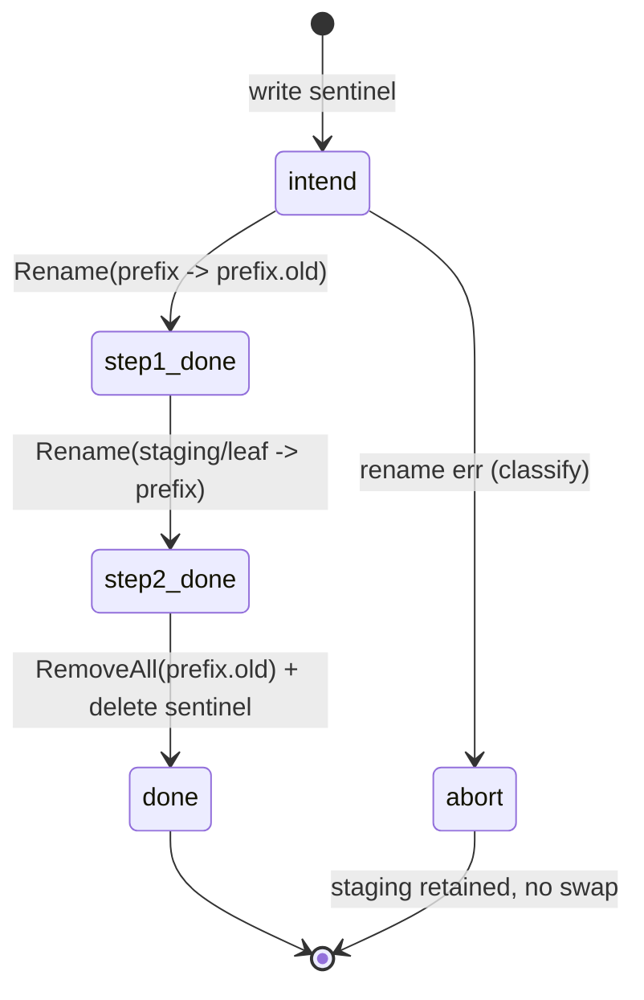
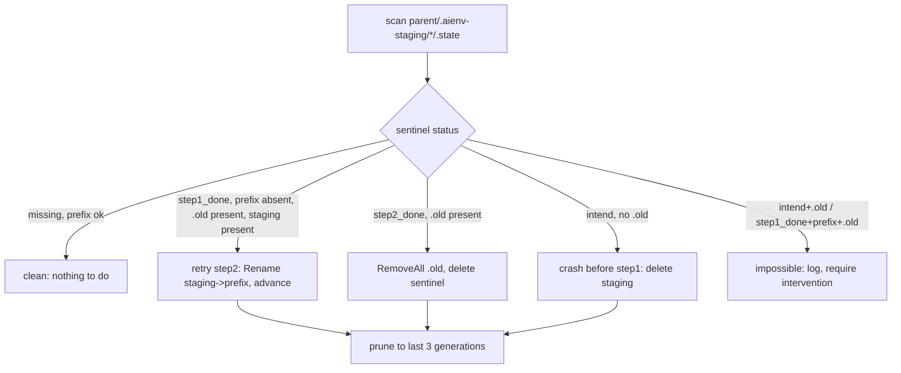

# Unit 13 — Atomic staging + swap + rollback

## Overview

The two-rename swap pipeline that makes a reserved-subdirectory target
(`<workspace>/<parent>/aienvs/…`, e.g. `.claude/rules/aienvs/`) update
**atomically**: a sync either fully lands its new generation or leaves
the previous one byte-intact — never a torn half-written tree. Built on
a per-parent `os.Root` (so both rename steps are scoped to one safe
root and cross-filesystem renames are impossible by construction), a
persisted sentinel state machine, and a startup recovery reconciler.

This is the highest-data-loss surface after the merge engines (Unit
12a): a crash mid-swap must always be recoverable to a clean
pre-sync-or-post-sync state.

## Scope

**In scope (this PR — the data-loss-critical core):**
- `internal/sync/staging.go` — per-target staging dir under the target's parent.
- `internal/sync/swap.go` — the two-rename algorithm inside one parent `os.Root`, with `os.Root` close/reopen lifecycle around the swap.
- `internal/sync/errors.go` — `ErrLocked`, `ErrCrossVolume`, `ErrStale`, `ErrPermission` sentinels + classification.
- `internal/sync/state_sentinel.go` — persisted `.state` file with `intend → step1_done → step2_done` transitions (atomic write via `fsroot`).
- `internal/sync/recover.go` — startup state-machine reconciler (`Recover`), retention pruning, `CleanScratch`.
- `internal/sync/swap_unix.go` / `swap_windows.go` — `classifyRenameError` build-tag split (`EXDEV` / `ERROR_NOT_SAME_DEVICE`, `ERROR_SHARING_VIOLATION`).
- `docs/operations/atomic-swap.md` — recovery states + troubleshooting + AV guidance.
- Tests: `swap_test.go`, `state_sentinel_test.go`, `recover_test.go`.

**Deferred (documented divergence from master plan Unit 13):**
- **`--diagnose` Windows Restart-Manager enumeration.** Ships as a
  build-tag-split hook (`diagnose_windows.go` / `diagnose_other.go`)
  returning "diagnosis unavailable" for now; the live RM API binding
  (`RmStartSession`/`RmGetList`) is a follow-up. Rationale: it is an
  opt-in diagnostic, not on the critical swap path, and a half-tested
  `x/sys/windows` RM binding with no local Windows runner is higher
  risk than a clear stub. The `ErrLocked` path still retries with
  backoff and reports the retry count/wall-clock.
- **Legacy `.cursorrules` detection.** A workspace-walk warning hook;
  belongs with the sync-orchestration wiring (a later unit) that
  actually walks targets. Recorded here so it is not lost.

## Requirements Trace

- **R10** — reserved-subdirectory ownership; atomic generation swap.
- **R16** — crash-safety / recovery of in-progress syncs.

## Key Technical Decisions

1. **Staging is co-located under the target's parent; renames are
   scoped to the workspace `os.Root`.** For a target prefix
   `<workspace>/<parent>/aienvs/`, stage at
   `<workspace>/<parent>/.aienv-staging/<iso-ts>-<short-sha>/<leaf>/`.
   Both rename operands are paths **relative to the single workspace
   `os.Root`** (already held via `fsroot`), which satisfies Go 1.25's
   no-cross-`Root`-rename constraint and keeps staging on the same
   filesystem as the live prefix by construction (both under the
   workspace). This is a deliberate simplification of the master plan's
   "open a fresh parent root" framing: one root for all operands is
   equivalent for the same-FS guarantee and avoids juggling extra root
   handles.

2. **Two-rename swap under the parent `os.Root`:**
   `intend` → `Rename(prefix, prefix.old)` → `step1_done` →
   `Rename(staging/leaf, prefix)` → `step2_done` →
   `RemoveAll(prefix.old)` (best-effort) → delete sentinel. Each
   sentinel transition is an atomic `fsroot.StagedWrite`.

3. **Cross-FS detection is syscall-truth, never a pre-flight.** Rely on
   the `Rename` return (`EXDEV` / `ERROR_NOT_SAME_DEVICE`) — bind
   mounts / btrfs subvols / overlayfs / macOS firmlinks all report
   matching device ids but still `EXDEV` at rename time. `statfs` only
   enriches the `ErrCrossVolume` message; it never gates the call.

4. **Error taxonomy (sentinel values, `errors.Is`-matchable):**
   `ErrLocked` (Windows sharing/access violation → bounded retry
   100ms/250ms/500ms/1s/2s ±20% jitter ≈4s, then surface with retry
   count), `ErrCrossVolume` (`EXDEV` → abort, name both paths),
   `ErrStale` (leftover `.old`/`.state` at startup → recovery, not
   retry), `ErrPermission` (ACL denial → abort).

5. **`os.Root` swap lifecycle.** On Windows an `os.Root` opened *on the
   prefix* blocks its own rename. The swap therefore holds **no
   per-prefix root** across the rename window — it uses only the
   workspace root (the workspace dir is never renamed). Any upstream
   per-prefix read-only root must be closed before the swap and
   reopened after. Identical path on Unix for consistency.

6. **Pre-flight refuses a stale half-sync.** If `prefix.old` or a
   `.state` at `intend|step1_done` exists and `--recover` wasn't just
   run → `ErrStale` with remediation `aienvs sync --recover`. Prevents a
   second sync stomping a half-completed one.

7. **Retention:** keep the last 3 completed/failed generations under
   `.aienv-staging/` per target for forensics; `CleanScratch`
   force-clears all.

## High-Level Technical Design

### Swap state machine

### Recovery reconciler (startup / --recover)

## Implementation Units

### U1. Error taxonomy + cross-platform rename classification

**Goal:** Sentinel errors and a `classifyRenameError(err)` that maps OS
errno to the taxonomy, split by build tag.

**Files:** `internal/sync/errors.go`, `internal/sync/swap_unix.go`,
`internal/sync/swap_windows.go`, test `internal/sync/errors_test.go`.

**Approach:** `ErrLocked`, `ErrCrossVolume`, `ErrStale`,
`ErrPermission` as `errors.New` sentinels. `classifyRenameError`
unwraps to `syscall.Errno` and maps: unix `EXDEV`→CrossVolume,
`EACCES`/`EPERM`→Permission; windows `ERROR_NOT_SAME_DEVICE(17)`→
CrossVolume, `ERROR_SHARING_VIOLATION(32)`/`ERROR_ACCESS_DENIED(5)`→
Locked. Unmapped → returned wrapped, untyped.

**Test scenarios:** each errno maps to the right sentinel (unix file
built with synthetic `*os.LinkError{Err: syscall.EXDEV}` etc.); nil →
nil; unmapped errno → not one of the sentinels.

### U2. Staging dir creation

**Goal:** `Stage(root, parentRel, leaf, sha)` creates
`<parent>/.aienv-staging/<ts>-<sha>/<leaf>/` through `fsroot` and
returns its rel path; the caller writes generation contents into it.

**Files:** `internal/sync/staging.go`, test `internal/sync/staging_test.go`.

**Approach:** timestamp is passed in (no `time.Now()` in a unit-tested
core — caller stamps) to keep tests deterministic; MkdirAll via
`root.Inner()`. Returns the staging leaf rel path.

**Test scenarios:** creates the nested dir; distinct (ts,sha) →
distinct dirs; path is under `.aienv-staging`.

### U3. Sentinel state file

**Goal:** Persisted `.state` JSON with `Status` ∈
{intend,step1_done,step2_done}, workspace/target/sha/started-at;
atomic write + strict read.

**Files:** `internal/sync/state_sentinel.go`, test
`internal/sync/state_sentinel_test.go`.

**Approach:** `writeSentinel(root, rel, s)` via `fsroot.StagedWrite`;
`readSentinel(root, rel)` strict-decodes; `ErrStale` semantics live in
the reconciler, not here. Status is a typed string.

**Test scenarios:** round-trip; unknown status → decode error; missing
file → not-exist.

### U4. Two-rename swap

**Goal:** `Swap(parentRoot, prefixRel, stagingLeafRel, sentinelRel,
meta)` performs the 7-step algorithm with sentinel transitions and
`classifyRenameError` on each rename; `os.Root` close/reopen contract
documented and exercised.

**Files:** `internal/sync/swap.go`, test `internal/sync/swap_test.go`.

**Approach:** pure of `time.Now()` (meta carries ts/sha). On step-1
rename error → classify, leave sentinel at `intend`, return. On step-2
error → classify, sentinel stays `step1_done` (recoverable), return.
Best-effort `RemoveAll(prefix.old)`; sentinel deleted last.

**Test scenarios (the data-loss core):**
- Happy path: prefix ends byte-identical to staged contents; sentinel
  gone; `.old` gone.
- New prefix (no prior generation): step 1 is a no-op rename (prefix
  absent) handled gracefully; staging becomes prefix.
- Step-2 failure injected → sentinel left at `step1_done`, prefix
  absent, `.old` present, staging present (recoverable shape).
- Multiple targets under distinct parents swap independently.
- On-disk state after an injected crash at each step is one of the
  recoverable shapes (never torn).

### U5. Recovery reconciler + retention + clean-scratch

**Goal:** `Recover(parentRoot, parentRel)` scans staging dirs and
drives each sentinel to a terminal clean state per the state table;
`Prune` keeps last 3; `CleanScratch` clears all.

**Files:** `internal/sync/recover.go`, test `internal/sync/recover_test.go`.

**Approach:** implement every row of the recovery table (KTD / HTD),
including the two "impossible" defensive states (log + skip, do not
guess). Roll forward newest valid sentinel; purge older. `Recover` is
idempotent (running twice is a no-op on a clean tree).

**Test scenarios:** each recovery-table row reaches the documented
terminal state; crash-between-step-1-and-2 → `Recover` completes the
swap to match a never-crashed run; crash-between-step-2-and-cleanup →
`.old` removed; idempotent re-run; 4th generation triggers oldest
prune; `CleanScratch` removes all staging.

### U6. Diagnose hook (stub) + ops doc

**Goal:** Build-tag-split `Diagnose(path)` hook returning an
"unavailable" result for now (live Windows RM enumeration deferred);
ops doc explaining recovery states + AV guidance.

**Files:** `internal/sync/diagnose_windows.go`,
`internal/sync/diagnose_other.go`, `docs/operations/atomic-swap.md`.

**Approach:** both return a typed `Diagnosis{Available:false,…}`; the
`ErrLocked` reporter includes it when present. Doc covers the state
machine, `--recover`, retention, and narrow AV-exclusion guidance
(`.aienv-staging/` only).

**Test scenarios:** none (stub + docs) — `Test expectation: none` until
the live RM binding lands.

## System-Wide Impact

- New package `internal/sync` depends on `internal/fsroot` only (no
  business logic, no other internal packages besides fsroot). It is the
  swap primitive layer; later units wire adapters→merge→swap.
- The data-loss invariant: a forced crash at any step leaves on-disk
  state byte-identical to either the pre-sync or post-sync tree. Tests
  inject crashes at each step and assert recoverability.
- No new third-party deps beyond `golang.org/x/sys` (already direct
  from Unit 12) for the windows errno constants.

## Risks & Dependencies

| Risk | Mitigation |
|------|------------|
| Torn tree on crash mid-swap | Sentinel + recovery reconciler covering every state-table row; crash-injection tests assert byte-identical recoverable shapes |
| Cross-FS rename surprise (bind mount inside workspace) | Staging-under-parent makes it unreachable in normal use; syscall-truth `EXDEV`→`ErrCrossVolume` if it ever surfaces |
| Windows `os.Root` holds prefix open, blocks own rename | Close per-prefix root before step 2, reopen after step2_done; parent root only across the window |
| Half-tested Windows RM binding | Deferred to a stub (documented divergence); not on the critical path |
| Second sync stomps a half-sync | Pre-flight `ErrStale` refuses until `--recover` |

## Dependencies

Units 1 (fsroot), 3 (workspace layout), 12 (state dir conventions).

## Sources & References

- Master plan Unit 13: `docs/plans/2026-04-21-001-feat-aienvs-workspace-cli-plan.md` (lines 984-1055)
- Go 1.25 `os.Root`: https://go.dev/blog/osroot ; no-cross-Root-rename: https://github.com/golang/go/issues/73041
- Cross-platform learning: `docs/solutions/best-practices/go-windows-cross-platform-pitfalls-2026-04-24.md`
- Prior art: home-manager generation swap; Capistrano `releases/current`; Git `index.lock` recovery
