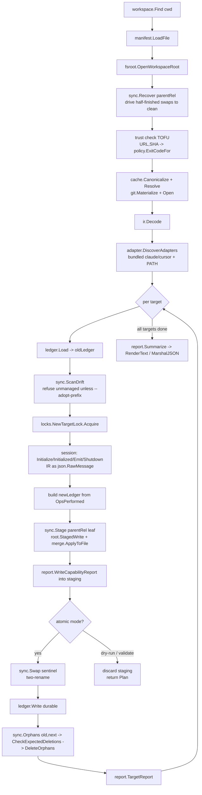
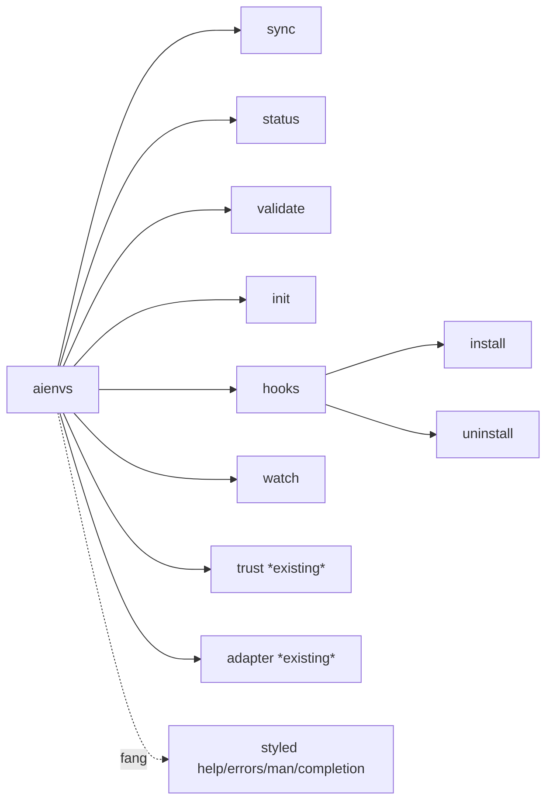
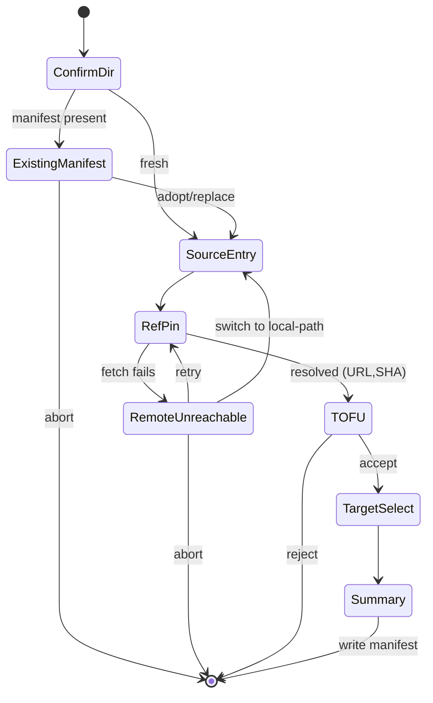

# feat: aienvs CLI — sync orchestration engine, command tree, and Bubble Tea wizards

## Summary

The aienvs primitives are built and merged (git layer, trust/TOFU, IR decoder,
adapter wire protocol + runtime, bundled claude/cursor adapters, ledger + locks,
tool-owned-file merge, atomic staging + two-rename swap + crash recovery, orphan
deletion + adopt, sync summary + capability report). What is missing is the
**wiring**: there is no top-level function that runs the full sync pipeline, no
cobra root command, and no interactive UX. `cmd/aienvs/main.go` is still a stub
that exits 2.

This plan delivers the user-facing product: a **sync orchestration engine** that
composes the existing primitives into one end-to-end pipeline, the **Cobra
command tree** (`sync`, `status`, `validate`, `init`, `hooks`, `watch`, plus the
already-built `trust`/`adapter` subtrees mounted under a real root), and the
**interactive wizards built on `charmbracelet/bubbletea` + `charmbracelet/bubbles`**
(the user-named libraries — replacing the `huh`-based approach sketched in the
master plan).

It realizes master-plan **Units 16–19** (Phase E). Units 20 (adapter SDK polish)
and 21 (docs/threat-model/release) are deferred to follow-up — the SDK already
largely exists (`pkg/adapterkit`, `conformance/echo`), and neither bears on the
user-named TUI libraries or on making aienvs work end-to-end.

---

## Problem Frame

A user with a Git-backed canonical config repo currently cannot do anything with
aienvs: the binary refuses to run. Every building block needed for a real
`init → sync → status` loop exists in `internal/`, but nothing calls them in
sequence, and there is no command surface or interactive onboarding.

The keystone is the orchestrator. The sync primitives in `internal/sync` are
pure, stateless free functions (`Stage`, `Swap`, `Recover`, `Orphans`,
`DeleteOrphans`, `ScanDrift`, `Backup`/`AdoptEntries`) that each take an
`*fsroot.Root`. They were deliberately built without a driver so the driver could
be designed once all the contracts settled. That time is now.

The second problem is onboarding. `init` must resolve a canonical source, pin it
to a SHA, run the TOFU trust flow, select targets, and write a manifest. In a TTY
this should be a guided wizard; non-interactively it must be fully flag-driven and
fail fast (AGENTS.md invariant #3). The user has directed that the interactive
layer be built on Bubble Tea + Bubbles.

---

## Requirements Trace

Traceability to origin requirements (see `origin`) and the master plan's
unit-level trace:

- **R1** (workspace definition, discovery, CLI + wizard surface) → U2, U6, U7
- **R4 / R5** (sync model, offline-strict, pinned-cached-succeeds) → U1, U3, U4
- **R9** (hooks + watch with explicit install) → U8, U9
- **R10** (reserved-subdir + tool-owned ownership, ledger, orphan/adopt flow) → U1
- **R13** (Go + **Bubble Tea**, fully spec'd wizards, flag parity) → U5, U6, U7
- **R14** (command surface + accessibility) → U2, U3, U4
- **R16** (atomic default, `--best-effort`, per-target summary, JSON contract) → U1, U3
- **R17** (TOFU trust store) → reused from Unit 6, exercised by U1/U3/U6

Master-plan unit mapping: U0 = an additive extension to Unit 8's emit protocol
(op-content channel, surfaced as a blocker during wiring); U1 = the missing
orchestration core of Units 11–15 + the engine half of Unit 16; U2–U4 = Unit 16;
U5–U7 = Unit 17; U4 also = Unit 18 (`validate`); U8–U9 = Unit 19.

Success criteria (origin): a fresh user reaches first successful sync in one
guided flow; `sync` is atomic by default; `--output=json` is stable; offline-strict
holds with the pinned-cached exception.

---

## Scope Boundaries

**In scope:**

- `internal/engine`: the end-to-end sync orchestrator (load → recover → trust →
  materialize → adapters → merge → stage → swap → ledger → orphans → report).
- Cobra root mounting all subcommands + Fang styling + slog + TTY/`NO_COLOR`
  accessibility + `--non-interactive` fail-fast.
- `sync`, `status`, `validate` commands.
- `init` command: Bubble Tea + Bubbles wizard (TTY) and full flag-parity
  non-interactive path.
- Read-only TUI views (target selection, capability/status) on Bubbles
  list/table/viewport.
- `hooks install/uninstall` and `watch` mode.

**Out of scope (deferred to follow-up work):**

- Master **Unit 20** — adapter SDK polish, `aienvs adapter conformance-test <bin>`
  CLI, reference external adapter, `adapter install owner/repo`. The SDK
  (`pkg/adapterkit`) and a reference echo adapter (`conformance/echo`) already
  exist; productizing the authoring surface is a separate task.
- Master **Unit 21** — docs site, threat model, capability-matrix generator,
  goreleaser packaging, cross-platform release CI.
- `rollback`/`unmanage` as full commands — surfaced minimally via `status`
  (generations listing) but the interactive promotion flow is deferred.
- Supported-tier `gemini` and experimental adapters (origin Deferred list).
- Any `--cascade` / ancestor-sync (origin: explicitly out of scope).
- A long-lived daemon — `watch` is a foreground, cancellable process only
  (CLAUDE.md overlay: no background daemons).

---

## Key Technical Decisions

**KTD-1: A new `internal/engine` package owns orchestration, not `internal/sync`.**
`internal/sync` stays a library of pure primitives. The engine is the stateful
driver that opens roots, acquires locks, runs adapters, and sequences the
primitives. This keeps the AGENTS.md invariant clean (primitives remain
unit-testable without a driver) and gives the CLI one seam to depend on. The
engine exposes `Sync(ctx, Request) (report.Summary, error)` and a
`Plan(ctx, Request) (Plan, error)` (dry-run, for `validate`) so `sync` and
`validate` share one code path up to the swap.

**KTD-2: Per-target `os.Root` scoping, driven by the engine.** Go 1.25 forbids
cross-root renames, and `Swap`/`Recover` operands are relative to a single
`os.Root` at each target's *parent* directory. The engine opens one workspace
root for discovery/ledger and a per-target-parent root for staging+swap, exactly
as the swap primitive's contract documents. (AGENTS.md invariant #6.)

**KTD-3: Pin to the v1 import paths the user named.** Use
`github.com/charmbracelet/bubbletea` (v1.3.x), `github.com/charmbracelet/bubbles`
(v1.0.0), `github.com/charmbracelet/lipgloss` (v1.1.x), and
`github.com/charmbracelet/fang` (v1.0.0). The user supplied the github.com URLs,
which are the v1 module paths. **Note:** context7's current docs render the *v2*
API (`charm.land/bubbletea/v2`, `tea.KeyPressMsg`, `tea.WindowSizeMsg`); v1 uses
`tea.KeyMsg` (`msg.String()`) and `tea.WindowSizeMsg`. Implement against v1. Exact
pin resolution (confirming `bubbles@v1.0.0` is compatible with the chosen
`bubbletea` v1 minor) is an execution-time `go get` + `go build` step — see
Risk-1.

**KTD-4: Bubble Tea models are thin; decisions live in plain structs.** Each
wizard screen is a `tea.Model`, but the resolved values (workspace dir, source
URL, ref, pin choice, selected targets, trust decision) accumulate in a plain
`InitConfig` struct that the non-interactive path *also* populates from flags.
Both paths converge on the same `InitConfig → manifest write` function. This
guarantees flag-parity (R13) structurally rather than by discipline, and lets the
manifest-write logic be tested without a TTY.

**KTD-5: TTY/non-interactive gating is centralized.** One `internal/cli/access`
helper resolves `(isTTY, noColor, accessible, outputFormat)` from
stdin/stdout/`NO_COLOR`/`FORCE_COLOR`/`TERM=dumb`/`AIENVS_ACCESSIBLE`/`--output`/
`--non-interactive`. The engine and every command read this one resolution.
Non-interactive + missing required value = fail fast with the exact flag named
(invariant #3). stdout-not-a-TTY auto-selects `--output=json` when unset.

**KTD-6: slog to stderr, data to stdout.** Construct one `*slog.Logger` at the
root: JSON handler when non-interactive, text handler on a TTY (AGENTS.md). Human
report text and JSON both go to stdout; logs and the report-on-stderr banner go to
stderr. The Bubble Tea program renders to stderr-or-the-tty, never stdout, so
piping `--output=json` stays clean even if a wizard is somehow reached.

**KTD-7: Watch is a foreground fsnotify loop, not a daemon.** `aienvs watch` runs
in the foreground, owns a `context.Context` cancelled by SIGINT, debounces events
(500ms default), and re-uses the same per-target locks as the engine. It yields to
manual syncs on lock contention. No forking, no PID files beyond the lock's own
sidecar, no persistence across exit. Failures write `.aienv/state/last-watch.failed`.

**KTD-8: Fang wraps the root for styling only.** `fang.Execute(ctx, root)` gives
styled help/errors/man/completions. The command tree must remain fully functional
and testable via `root.Execute()` without Fang (tests call the cobra root
directly); Fang is applied at the `main` boundary only.

---

## High-Level Technical Design

### Engine pipeline (per `sync`, one target shown; engine loops targets)



The dry-run branch (`validate`) shares everything up to staging, then discards
instead of swapping. `--best-effort` changes per-target failure handling
(continue vs. abort) but not the per-target sequence.

### Command tree



### TUI navigation (init wizard, Bubble Tea + Bubbles)



A small `nav` stack pushes/pops screen models; each screen is an independent
`tea.Model` composed of Bubbles components (`textinput`, `list`, `spinner`,
`help`, `key`). Accessible mode (`TERM=dumb`/`AIENVS_ACCESSIBLE=1`) renders a
linear prompt fallback.

---

## Output Structure

```
internal/
  engine/
    engine.go            # Sync(ctx, Request) (report.Summary, error); Plan(ctx, Request)
    request.go           # Request, PlanResult, Options (mode, adopt, targets filter)
    target.go            # per-target step sequence + session lifecycle driver
    plan.go              # dry-run change-set computation (powers validate)
    irwire.go            # []ir.Node -> wire IR json.RawMessage (was "adapters.go" in draft)
    capability.go        # best-effort capability report assembly
    engine_test.go       # Sync/Plan integration tests (cover the target sequence)
    irwire_test.go
    mcp_test.go          # exact-prefix sidecar regression + within() guard
    # (per-target scenarios are covered via engine_test.go integration, not a
    #  separate target_test.go)
  cli/
    root.go              # NewRootCommand(deps) -> mounts all subcommands
    access.go            # TTY / NO_COLOR / accessible / output-format resolution
    nonint.go            # non-interactive context value + fail-fast missing-flag errors
    logging.go           # slog logger construction (json/text by TTY)
    exit.go              # ExitCode()-bearing error -> os.Exit mapping
    cmd_sync.go
    cmd_status.go
    cmd_validate.go
    cmd_init.go          # interactive (TUI) + non-interactive flag path
    cmd_hooks.go
    cmd_watch.go
    cmd_trust.go         # EXISTING (mounted)
    cmd_adapter.go       # EXISTING (mounted)
    *_test.go
  tui/
    program.go           # interactive() guard + tea.NewProgram runner (WithInput/Output/Context)
    nav.go               # screen stack navigator
    theme.go             # lipgloss styles, NO_COLOR-aware
    accessible.go        # linear-prompt fallback
    wizard/
      init.go            # InitConfig + screen composition
      confirm_dir.go
      existing_manifest.go
      source_entry.go
      ref_pin.go
      remote_unreachable.go
      tofu.go
      target_select.go
      summary.go
      init_test.go       # teatest snapshots per screen
    views/
      status.go          # read-only status view (table/viewport)
      capability.go      # capability report view
      views_test.go
  validate/
    validate.go          # wraps engine.Plan; output shape + exit codes + --diff
    validate_test.go
  hooks/
    install.go           # generate wrapper, detect core.hooksPath, conflicts
    uninstall.go
    templates/
      post-merge.sh      # //go:embed
      post-checkout.sh
    install_test.go
  watch/
    watch.go             # fsnotify foreground loop, debounce, lock-coordinated
    watch_unix.go        # signal handling split
    watch_windows.go
    watch_test.go
docs/
  spec/
    validate-output-v1.md
  wizard/
    init-states.md       # authoritative branching-state spec
cmd/aienvs/main.go       # REPLACE stub: build deps, fang.Execute(ctx, root), map exit codes
```

---

## Implementation Units

### U0. Emit protocol op-content channel (additive `EmitResult.Ops`)

**Goal:** Close the blocking gap that the adapter wire protocol discards op
*content*: `EmitResult.OpsPerformed` carries only `{Op, Path}`, and both bundled
adapters build the full op then throw the bytes away (`emit.go`: "Content is built
but discarded — the wire format only carries summaries"). Without the content,
the engine (U1) cannot write target files and invariant #2 ("the CLI core performs
the actual writes") is unsatisfiable. This unit adds a content channel — chosen by
the user over the alternative of letting adapters write files themselves (which
would have rewritten invariant #2).

**Decision (user-approved):** carry full ops to the caller, preserving invariant #2.
The change is **additive** and therefore fits the existing "freeze the wire frame,
grow capabilities" compatibility policy — no breaking protocol-version-string bump.

**Requirements:** R10, R11 (declarative-only adapter output now actually consumable
by the CLI writer).

**Dependencies:** none (foundational; U1 depends on it).

**Files:**
- Modify: `internal/adapter/contract/protocol.go` — add `Ops []json.RawMessage` (`json:"ops,omitempty"`) to `EmitResult`; doc it.
- Modify: `pkg/adapterkit/types.go` — mirror the field on `adapterkit.EmitResult` (keeps `schema_parity_test` green).
- Modify: `internal/adapter/bundled/claude/emit.go`, `internal/adapter/bundled/cursor/emit.go` — stop discarding: marshal each accumulated op to a wire envelope and set `EmitResult.Ops` alongside the existing `OpsPerformed` summary.
- Modify (if needed): `internal/adapter/runtime.go` — `Emit` already unmarshals `EmitResult`; the new field deserializes automatically. Keep the declared-outputs + capability-lied gates on `OpsPerformed`.
- Create: `docs/spec/emit-op-content-v1.md` — document the additive field and that op content round-trips via the existing per-op wire marshalers + `contract.DecodeOp`.
- Test: extend `internal/adapter/bundled/{claude,cursor}/emit_test.go` and `pkg/adapterkit/schema_parity_test.go`; add an op-content round-trip test in `internal/adapter/runtime_test.go` or the conformance harness.

**Approach:**
- `EmitResult.Ops` holds each performed op as a `json.RawMessage` in the same order
  as `OpsPerformed`. The per-op wire marshalers already exist (`OpWriteFile`,
  `OpWriteToolOwned`, `OpMkdir`, `OpDelete`, `OpWarning` all have `MarshalJSON`/
  `UnmarshalJSON`), and `contract.DecodeOp(raw)` already decodes by discriminator —
  so the channel reuses the frozen op envelopes verbatim.
- Adapter side: the bundled adapters already accumulate `[]adapterkit.Op` with full
  content; add a `wireOps()` that marshals each and populate `Ops`. `OpsPerformed`
  stays derived from the same op list, so the summary and the full ops can never
  disagree.
- `MaxOpPayloadBytes` is already enforced at op marshal/unmarshal time — the cap
  rides along for free.
- Use `json.RawMessage` (not a typed `[]Op`) on both structs so `schema_parity_test`
  stays trivially satisfied and neither struct needs custom `UnmarshalJSON`.

**Patterns to follow:** the existing op wire marshalers and `DecodeOp`; the
"capabilities grow additively, the frame is frozen" rule in the `Capabilities` doc
comment; `schema_parity_test` as the contract-vs-adapterkit guard.

**Test scenarios:**
- Round-trip: a `write_file` op with UTF-8 content survives adapter → wire → `DecodeOp` with byte-identical content.
- Round-trip: a `write_tool_owned` op preserves `Kind`, `Locator`, and content.
- Binary content (skill asset) round-trips via base64 encoding.
- `Ops` order matches `OpsPerformed` order for a multi-node IR.
- Oversized content is rejected at marshal time (`ErrPayloadTooLarge`) — cap still enforced.
- `schema_parity_test` passes with the mirrored field.
- Backward-compat: an `EmitResult` JSON with no `ops` field decodes cleanly (`Ops == nil`).

**Verification:** `go test -race ./internal/adapter/... ./pkg/adapterkit/...` green;
the round-trip test proves the engine can reconstruct full ops from `Ops`.

---

### U1. Sync orchestration engine (`internal/engine`)

**Goal:** Compose the existing primitives into one end-to-end pipeline that takes a
discovered workspace + loaded manifest and produces a `report.Summary`, with a
shared dry-run path for `validate`. This is the keystone; every command depends on it.

**Requirements:** R4, R5, R10, R16

**Dependencies:** U0 (op-content channel — the engine writes the op bytes).

**Files:**
- Create: `internal/engine/engine.go`, `request.go`, `target.go`, `adapters.go`
- Test: `internal/engine/engine_test.go`, `internal/engine/target_test.go`

**Approach:**
- `Request{Workspace *workspace.Workspace, Manifest *manifest.Manifest, Root *fsroot.Root, Options}`. `Options{Mode report.Mode (atomic|best-effort), Offline bool, Fetch tristate, AdoptPrefixes []string, TargetsFilter []string, Now func() time.Time, Logger *slog.Logger}`.
- `Sync(ctx, Request) (report.Summary, error)` runs the full per-target sequence from the HTD pipeline. `Plan(ctx, Request) (Plan, error)` runs identically up to staging, then collects `would-create/would-update/would-delete/warnings` per target and discards staging (no swap, no ledger write, no orphan delete).
- Composition order is fixed by the primitives' contracts (researched): `Recover` first (idempotent), then per target: `ledger.Load` → `ScanDrift` (→ `AdoptEntries` when prefix in `AdoptPrefixes`) → acquire target lock → adapter session (`Initialize`/`Initialized`/`Emit`/`Shutdown` on one goroutine; IR marshalled to `json.RawMessage` for `Emit`) → **decode `EmitResult.Ops` via `contract.DecodeOp` (U0) into typed ops** → build new ledger from the ops (path + SHA256 of content) → `Stage`, applying each op: `OpWriteFile` → `root.StagedWrite`, `OpWriteToolOwned` → `merge.ApplyToFile`, `OpMkdir` → `root.Inner().MkdirAll`, `OpDelete`/`OpWarning` → record → `WriteCapabilityReport` into staging → `Swap` → `ledger.Write` (durable) → `Orphans`/`CheckExpectedDeletions`/`DeleteOrphans` → `TargetReport`.
- **Per-target root scoping (KTD-2):** open an fsroot `Root` at each target's parent dir for `Stage`/`Swap`; the workspace root is used for discovery/ledger.
- **Mode handling:** `atomic` aborts the whole run on first target failure (already-swapped targets stand; the failing one rolls back via recovery state). `best-effort` records the failure in the `TargetReport`, marks `rolled-back`/`failed`, and continues. Engine owns ctx cancellation around the synchronous primitives.
- **Trust:** before materialize, run the TOFU check for `(URL, SHA)`; map trust errors via `trust.ExitCodeFor`. Non-interactive without `--accept-new-source` on a first-use URL returns a trust-specific error (no prompt).
- Adapter discovery: `adapter.DiscoverAdapters` with bundled `claude.Bundled()`, `cursor.Bundled()` plus PATH.

**Patterns to follow:** the canonical session lifecycle in `internal/adapter/conformance/harness.go`; the per-package sentinel-error convention; deterministic `now`/`generatedAt` stamping for golden tests; `report.Summarize`/`MarshalJSON` as the output contract.

**Test scenarios:**
- Happy path: single target, clean workspace, bundled claude adapter → `Summary.Outcome.ExitCode == 0`; written paths match the adapter's `OpsPerformed`; ledger written.
- Happy path (multi-target): claude + cursor → both `ok`; summary ordering deterministic.
- Edge: second sync with no changes → all targets `unchanged`, zero writes/deletes.
- Edge: a previously-emitted file removed from desired outputs → counted as an orphan and deleted; `CheckExpectedDeletions` passes.
- Edge: tool-owned file (e.g. AGENTS.md overlay) → routed through `merge.ApplyToFile`, round-trips.
- Error: drift (hand-edited file under reserved prefix) without adopt → returns `ScanDrift` error; target `blocked`; nothing swapped.
- Error: drift with prefix in `AdoptPrefixes` → adopts, backs up, proceeds.
- Error (atomic): target 2 of 3 fails staging → run aborts; target 1 remains swapped; summary `FAIL`.
- Error (best-effort): same failure → targets 1 and 3 `ok`, target 2 `failed`, summary `PARTIAL`, exit 1.
- Recovery: a `StatusStep1Done` sentinel left on disk → `Recover` drives it to clean before the run proceeds.
- Dry-run: `Plan` on a workspace with pending adds + deletes → returns per-target change sets; no swap occurred (staging dir absent afterward).
- Offline-strict: `Offline` + uncached pinned manifest → `ErrUnresolvablePinOffline`-class error; pinned+cached → succeeds. *Covers R5.*

**Verification:** `go test -race ./internal/engine/...` green; a temp-dir integration test performs a real first sync against a fixture canonical repo and asserts on-disk files + ledger.

---

### U2. Cobra root + Fang + access/TTY + non-interactive + slog + exit mapping

**Goal:** Replace the `main.go` stub with a real root command that mounts every
subcommand (including existing `trust`/`adapter`), centralizes TTY/`NO_COLOR`/
output-format/non-interactive resolution, constructs the slog logger, wraps with
Fang for styling, and maps `ExitCode()`-bearing errors to `os.Exit`.

**Requirements:** R1, R14

**Dependencies:** none (but every later command mounts here).

**Files:**
- Create: `internal/cli/root.go`, `access.go`, `nonint.go`, `logging.go`, `exit.go`
- Replace: `cmd/aienvs/main.go`
- Refactor: consolidate `outWriterAdapter`/`errWriterAdapter` duplicates into shared `outWriter`/`errWriter` (Rule-of-Three now satisfied)
- Test: `internal/cli/root_test.go`, `access_test.go`, `nonint_test.go`, `exit_test.go`

**Approach:**
- `NewRootCommand(deps Deps) *cobra.Command` mirrors the existing `NewTrustCommand`/`NewAdapterCommand` factory+Deps pattern; mounts all subtrees. `SilenceUsage`/`SilenceErrors` true; errors surfaced by `main`.
- Persistent flags: `--workspace`, `--output=text|json`, `--log-level`, `--offline`, `--floating`, `--non-interactive` (alias `--yes`).
- `access.Resolve(deps) Access{IsTTY, NoColor, Accessible, Output}` reads stdin/stdout fd + `NO_COLOR`/`FORCE_COLOR`/`TERM`/`AIENVS_ACCESSIBLE`/`--output`/`--non-interactive`. stdout-not-a-TTY → `Output=json` if unset.
- `nonint`: a context value short-circuits any TUI entry; `MissingFlagError{Flag, Why}` (implements `ExitCode()`) is returned when an interactive-only value is required under `--non-interactive`.
- `logging.New(access, level) *slog.Logger`: JSON handler (non-interactive) or text handler (TTY), **stderr only**.
- `exit.Map(err) int`: unwrap to find `interface{ ExitCode() int }` (covers `trust.ExitCodeFor`, `adapter exitError`, engine/report `Outcome.ExitCode`); default 0/1/2.
- `cmd/aienvs/main.go`: build `Deps`, `fang.Execute(ctx, root)` (KTD-8), translate the returned error via `exit.Map`, `os.Exit`.

**Patterns to follow:** kubectl/docker command trees; the existing `cmd_trust.go` Deps/factory shape; Terraform persistent-flag surface.

**Test scenarios:**
- Happy: `aienvs --help` lists all subcommands (sync, status, validate, init, hooks, watch, trust, adapter).
- Happy: `aienvs --version` prints the ldflags version.
- Edge: `NO_COLOR=1` → `access.NoColor` true; ASCII status tokens retained (assert no ANSI in output).
- Edge: stdout piped (non-TTY) with `--output` unset → resolves to `json`.
- Edge: `TERM=dumb` → `access.Accessible` true.
- Error: a subcommand returning a `trust`-class error → `exit.Map` yields the documented trust exit code (3/4/5).
- Error: `--non-interactive` with a command needing an interactive-only value → `MissingFlagError` naming the exact flag; non-zero exit; no hang. *Covers invariant #3.*
- Completion: `aienvs completion bash` emits a valid script (Fang/cobra).

**Verification:** golden `--help` text stable; `go test -race ./internal/cli/...` green; cross-compile check `GOOS=windows go build ./...`.

---

### U3. `sync` command

**Goal:** Wire the engine to a `sync` command with text + JSON output, atomic
default, `--best-effort`, `--adopt-prefix`, offline flags, and post-merge hook mode.

**Requirements:** R4, R16

**Dependencies:** U1, U2.

**Files:**
- Create: `internal/cli/cmd_sync.go`
- Test: `internal/cli/cmd_sync_test.go`

**Approach:**
- `aienvs sync [--best-effort] [--adopt-prefix <p>]... [--offline] [--no-fetch|--fetch] [--target <name>]... [--post-merge]`.
- Resolves workspace (`--workspace` or `workspace.Find`), loads manifest (non-interactive gate honored), opens root, builds `engine.Request`, calls `engine.Sync`.
- Output: `report.RenderText` to stdout on TTY/text; `report.MarshalJSON` to stdout on `--output=json`. Logs/banner to stderr.
- Exit code from `Summary.Outcome.ExitCode` (0 ok, 1 partial/failed) merged with operational errors (2+).
- `--post-merge` (used by the git hook wrapper, U8): if a sync is already in progress (lock held), write `.aienv/state/hook-skipped` and exit 0 — never break `git pull`.

**Patterns to follow:** Unit 15 report contract; existing flag/Deps conventions.

**Test scenarios:**
- Happy: `sync` on a fixture workspace → text summary, exit 0.
- Happy: `sync --output=json` → output validates against the Unit 15 JSON schema (schema_version 1).
- Edge: `--best-effort` with one failing target → exit 1, partial summary.
- Edge: `--target claude` filters to one target.
- Edge: drift present, `--adopt-prefix .claude/...` → adopts and proceeds.
- Error: `--non-interactive` (default in pipe) + manifest needing TOFU on a new URL without `--accept-new-source` → trust exit code, no prompt.
- Hook mode: `--post-merge` while a manual sync holds the lock → exit 0 + `hook-skipped` marker written.

**Verification:** end-to-end temp-dir test: init a manifest fixture, run `sync`, assert files on disk and JSON shape.

---

### U4. `status` and `validate` commands

**Goal:** Ship `status` (workspace path, manifest commit, last sync outcome,
capability summary, retained generations, watch-failure banner) and `validate`
(dry-run via `engine.Plan`, `--diff`, drift exit codes, `out-of-band-modified`).

**Requirements:** R14, Success Criteria (validate diff)

**Dependencies:** U1, U2.

**Files:**
- Create: `internal/cli/cmd_status.go`, `internal/cli/cmd_validate.go`, `internal/validate/validate.go`
- Create: `docs/spec/validate-output-v1.md`
- Test: `internal/cli/cmd_status_test.go`, `internal/validate/validate_test.go`

**Approach:**
- `status`: read-only. Reads workspace, manifest, last `report.Summary` (if persisted), capability report, `.aienv/generations/` listing, and `.aienv/state/last-watch.failed` (banner if newer than last success). Text + JSON.
- `validate`: wraps `engine.Plan`. Network posture follows sync (`--no-fetch` cache-only, `--fetch` forces). Output per target `{would-create[], would-update[], would-delete[], warnings[]}`; `--diff` adds unified diffs for text files; JSON mirrors the sync summary schema + a `diff` node. Exit codes: 0 no drift, 1 drift (clean), 2+ operational. Files whose on-disk sha256 ≠ ledger hash → `out-of-band-modified`. TOFU honored (non-interactive blocks without `--accept-new-source`).

**Patterns to follow:** Terraform `plan`; `git diff --stat`; Unit 15 JSON contract.

**Test scenarios:**
- `status` happy: prints workspace/commit/last-outcome; JSON form parses.
- `status` edge: stale `last-watch.failed` marker → banner printed.
- `validate` happy: clean workspace → exit 0, no changes.
- `validate` drift: pending adds + deletes → exit 1, per-target enumeration.
- `validate` out-of-band: hand-edited reserved-prefix file → listed under `out-of-band-modified` with hash diff.
- `validate` `--no-fetch` on uncached pin → `ErrUnresolvablePinOffline`-class.
- `validate --diff` → valid unified diffs for all text files; JSON validates against `docs/spec/validate-output-v1.md`.

**Verification:** `validate` exit codes stable enough to use as a CI drift guard against a fixture repo.

---

### U5. TUI foundation — program runner, nav stack, theme, accessible fallback, teatest harness

**Goal:** Establish the Bubble Tea + Bubbles substrate the wizards build on: an
`interactive()` guard, a program runner wired to deps' IO, a screen-stack
navigator, a `NO_COLOR`-aware lipgloss theme, an accessible linear-prompt
fallback, and a teatest-based snapshot harness.

**Requirements:** R13

**Dependencies:** U2 (for `access`). Adds the charm deps to `go.mod`.

**Files:**
- Create: `internal/tui/program.go`, `nav.go`, `theme.go`, `accessible.go`
- Test: `internal/tui/nav_test.go`, `internal/tui/program_test.go`
- Update: `go.mod`/`go.sum` (bubbletea, bubbles, lipgloss, fang; teatest under `x/exp`)

**Approach:**
- Add `github.com/charmbracelet/bubbletea`, `.../bubbles`, `.../lipgloss`, `.../fang` and `github.com/charmbracelet/x/exp/teatest` (test). Resolve compatible v1 pins via `go get` + `go build` (KTD-3, Risk-1).
- `interactive(access) bool`: true only when `IsTTY && !NonInteractive && !Accessible`. The entry precondition for any wizard.
- `program.Run(ctx, model, deps) (tea.Model, error)`: `tea.NewProgram(model, tea.WithInput(deps.In), tea.WithOutput(deps.Err), tea.WithContext(ctx))` — renders to stderr/tty, never stdout (KTD-6).
- `nav.Stack`: push/pop screen `tea.Model`s; the active screen receives `Update`/`View`; a `popMsg`/`pushMsg` protocol drives transitions. Quit on empty stack or explicit abort.
- `theme`: lipgloss styles gated on `access.NoColor` (plain strings when set). Shared key bindings via `bubbles/key` + a `bubbles/help` model.
- `accessible`: when `access.Accessible`, screens render a linear text prompt loop instead of the full TUI (no raw mode).
- Use v1 message types: `tea.KeyMsg` (`msg.String()`), `tea.WindowSizeMsg`.

**Patterns to follow:** Charm's own CLIs; `bubbletea` Model/Update/View tutorials; a stack-navigator idiom (bubbletea-nav style).

**Test scenarios:**
- `interactive()` truth table across IsTTY × NonInteractive × Accessible.
- `nav` push then pop returns to the prior screen; pop on empty triggers quit.
- `theme` with `NO_COLOR=1` emits zero ANSI escape codes.
- `program.Run` with a scripted teatest input drives a trivial model to completion and matches a snapshot.
- Accessible mode renders a readable linear prompt (snapshot under `AIENVS_ACCESSIBLE=1`).

**Verification:** `go test -race ./internal/tui/...` green; teatest snapshots deterministic; `go build ./...` confirms the new deps resolve.

---

### U6. `init` wizard (Bubble Tea + Bubbles) + non-interactive flag parity

**Goal:** Implement the full `init` flow — interactive wizard with every branching
state, and a flag-driven non-interactive path that converges on the same manifest
write. Document the authoritative state spec.

**Requirements:** R1, R13

**Dependencies:** U2, U5; reuses Unit 5 (git/pin), Unit 6 (trust), Unit 2 (manifest write).

**Files:**
- Create: `internal/cli/cmd_init.go`
- Create: `internal/tui/wizard/init.go`, `confirm_dir.go`, `existing_manifest.go`, `source_entry.go`, `ref_pin.go`, `remote_unreachable.go`, `tofu.go`, `target_select.go`, `summary.go`
- Create: `docs/wizard/init-states.md`
- Test: `internal/tui/wizard/init_test.go`, `internal/cli/cmd_init_test.go`

**Approach:**
- `InitConfig` (plain struct, KTD-4) holds every decision: `Dir, ExistingManifestAction, SourceURL|LocalPath, Ref, Floating, DeferResolve, ResolvedSHA, TrustAccepted, Targets[]`. Both paths populate it; one `writeManifest(InitConfig)` consumes it.
- **Interactive screens** (each a `tea.Model`, composed via `nav.Stack`): ConfirmDir → ExistingManifest(adopt/replace/abort; replace archives to `.aienv/state/backups/manifest-<ts>.yaml`) → SourceEntry (URL xor local path; `textinput`) → RefPin (`ref`, `--floating`, `--defer-resolve`) → RemoteUnreachable (retry / switch-to-local / defer / abort; `spinner` during fetch) → TOFU (`(URL,SHA)` first-use prompt) → TargetSelect (multiselect over discovered adapters; `bubbles/list` with a checkbox delegate) → Summary (write confirmation).
- Ancestor-workspace + enclosing-git detection surfaces as extra confirm screens (`--allow-nested`, offer `.gitignore` additions).
- **Non-interactive path:** every screen value has a flag (`--dir`, `--source`/`--local-path`, `--ref`, `--floating`, `--defer-resolve`, `--accept-new-source`, `--target`, `--existing=adopt|replace|abort`, `--allow-nested`). Missing required value under `--non-interactive` → `MissingFlagError` (U2).
- Pin-at-init default (invariant #4): resolve ref → SHA and write both `commit` + `trusted_sha` unless `--floating`.
- `docs/wizard/init-states.md` enumerates each screen's text, validation, keymap, flag-equivalent, and per-exit-code state — the authoritative spec.

**Patterns to follow:** Charm CLIs; the master plan's Unit 17 screen enumeration; `bubbles/list` multiselect delegate.

**Test scenarios:**
- Happy (interactive, teatest): fresh dir → full flow → manifest written with pinned SHA + `trusted_sha`.
- Happy (non-interactive): all flags supplied → identical manifest, no TTY.
- Branching: existing manifest → "replace" archives old to backups path.
- Branching: ancestor workspace detected → `--allow-nested` screen; cancel aborts cleanly.
- Branching: remote unreachable → fallback screen (retry/defer/abort); `--defer-resolve` writes unresolved manifest.
- Branching: 0 targets selected → warning screen + confirmation that sync is a no-op.
- Parity: the same `InitConfig` produced interactively vs. from flags yields byte-identical manifests (test the convergence function directly).
- `--non-interactive` missing `--source` → fails fast naming `--source`.
- Accessible mode: linear-prompt flow completes (snapshot).

**Verification:** `docs/wizard/init-states.md` matches implementation; teatest snapshots stable; manifest round-trips through `manifest.LoadFile`.

---

### U7. Read-only TUI views — target selection component + status/capability views

**Goal:** Provide the reusable multiselect target component (shared by `init` and
future `target add/remove`) and read-only Bubble Tea views for `status` and the
capability report, on Bubbles `list`/`table`/`viewport`. Maintain agent-native
parity: every view's data is equally available via `--output=json`.

**Requirements:** R13

**Dependencies:** U4, U5, U6.

**Files:**
- Create: `internal/tui/wizard/target_select.go` is reused; add `internal/tui/views/status.go`, `internal/tui/views/capability.go`
- Test: `internal/tui/views/views_test.go`

**Approach:**
- Target-select component: standalone `tea.Model` over `bubbles/list` with a checkbox delegate; returns selected names. Used inline by `init` (U6) and exposed for reuse.
- `status` view: `bubbles/table` of targets + last outcome, `viewport` for warnings; only rendered when `interactive()` and the user runs `status` without `--output`. Otherwise the plain text/JSON from U4 is authoritative.
- `capability` view: render the capability report (`report.CapabilityReport`) as a table with required-unmet rows highlighted.
- **Agent-native parity (mirrors CLAUDE.md):** the TUI shows nothing the JSON/text output omits — these views are presentation over the same `report` structs an agent reads via `--output=json`.

**Test scenarios:**
- Target-select: toggle, select-all/none, confirm → returns expected set (teatest).
- `status` view renders a table matching the underlying `Summary` (snapshot); `NO_COLOR` strips styling.
- `capability` view highlights an unmet required capability.
- Parity assertion: the set of fields shown in each view ⊆ the fields present in the corresponding JSON contract.

**Verification:** teatest snapshots stable; parity test passes; no view path writes to stdout.

---

### U8. `hooks install` / `uninstall`

**Goal:** Generate a POSIX-shell git hook wrapper that calls `aienvs sync
--post-merge`, with conflict detection (foreign hooks, lefthook/husky), backups,
owner-only perms, and clean uninstall. Explicit opt-in (`--install-hooks` or
interactive confirm).

**Requirements:** R9

**Dependencies:** U3.

**Files:**
- Create: `internal/hooks/install.go`, `uninstall.go`, `templates/post-merge.sh`, `templates/post-checkout.sh` (`//go:embed`)
- Create: `internal/cli/cmd_hooks.go`
- Test: `internal/hooks/install_test.go`, `internal/cli/cmd_hooks_test.go`

**Approach:**
- Wrapper: `#!/bin/sh` + `set -eu` + `exec <abs-aienvs-path> sync --post-merge --workspace <abs-workspace>`. Absolute paths avoid GUI-client PATH surprises. Marker comment identifies aienvs-generated wrappers.
- Install: detect `core.hooksPath`; if a foreign hook exists, require `--replace` (backup to `.aienv/state/hooks-backup/`) or `--append` (wrap existing). Detect lefthook/husky via `package.json`/`lefthook.yml` → advisory. Owner-only `0755` POSIX; restrictive ACL note on Windows. Refuse without `--install-hooks` under `--non-interactive`.
- Uninstall: remove only marked wrappers; restore any `--append`ed predecessor.
- GUI-client advisory printed on install (known-good / known-gotcha list).

**Patterns to follow:** lefthook/husky install UX; Git for Windows hook conventions. **Cross-platform discipline (learning #1):** build-tag any syscall/perm code; normalize separators with `filepath.ToSlash` before comparison; route path validation through `fsroot`.

**Test scenarios:**
- Happy: install on a fresh repo with no hooks → wrapper contents + mode correct; passes shellcheck.
- Edge: foreign hook present + `--replace` → backed up.
- Edge: existing aienvs hook → reinstall overwrites cleanly.
- Error: install without `--install-hooks` under `--non-interactive` → refuses.
- Uninstall: removes only marked wrapper; `--append`ed predecessor restored.
- Cross-platform: separator-normalized path comparisons (run `GOOS=windows go vet`).

**Verification:** generated script passes shellcheck; install/uninstall idempotent; `go test -race` clean.

---

### U9. `watch` mode

**Goal:** Foreground, debounced, lock-coordinated fsnotify loop that re-syncs on
manifest/source changes, yields to manual syncs, writes a failure marker, and
never self-loops or runs as a daemon.

**Requirements:** R9

**Dependencies:** U3.

**Files:**
- Create: `internal/watch/watch.go`, `watch_unix.go`, `watch_windows.go`
- Create: `internal/cli/cmd_watch.go`
- Test: `internal/watch/watch_test.go`, `internal/cli/cmd_watch_test.go`
- Update: `go.mod` (`github.com/fsnotify/fsnotify`)

**Approach:**
- Foreground only (KTD-7). Owns a `context.Context` cancelled by SIGINT (signal handling split by build tag). No fork, no daemon (CLAUDE.md overlay).
- Watched paths: the manifest, local-path canonical source (if configured), optional `--watch-cache`. **Explicitly ignore** `.aienv/state/` and all reserved prefixes to prevent self-retrigger.
- Debounce 500ms (`--debounce-ms`). On event, run a sync via the engine.
- Lock coordination: acquires the same per-target locks (Unit 12); on contention, cancels the pending debounced run and re-queues, yielding to the manual sync.
- Failures → `.aienv/state/last-watch.failed` `{at, error_class, detail}`; `status` (U4) surfaces a banner.

**Patterns to follow:** fsnotify + debouncer idiom; the engine's lock usage. **No background daemon** (AGENTS/CLAUDE overlay) — this is the load-bearing constraint.

**Test scenarios:**
- Happy: touch manifest → exactly one debounced sync within ~1s.
- Concurrency: manual sync mid-debounce → watch cancels pending run, yields.
- Self-loop guard: a sync writing under a reserved prefix does NOT retrigger watch.
- Failure: a sync error writes `last-watch.failed` with the error class.
- Cancellation: SIGINT exits cleanly; no leaked fsnotify descriptors under `-race`.

**Verification:** watch doesn't self-loop; no descriptor leaks under `go test -race`; cancellation is prompt.

---

## Phased Delivery

- **Phase 0 — Protocol op-content channel (U0):** unblocks the engine. Must land
  first; surfaced as a blocker during wiring and approved by the user.
- **Phase 1 — Engine + CLI core (U1, U2, U3, U4):** aienvs becomes usable
  non-interactively end-to-end (`init` via flags lands in Phase 2, but `sync`/
  `status`/`validate` work against a hand-written or fixture manifest). Highest
  value; unblocks everything.
- **Phase 2 — Interactive UX (U5, U6, U7):** the Bubble Tea + Bubbles wizards and
  views. The user's emphasis. Depends on Phase 1's `access`/engine.
- **Phase 3 — Automation (U8, U9):** hooks + watch. Depends on a working `sync`.

Land each unit as its own atomic commit/PR. Phase 1 is the critical path.

---

## Risks & Dependencies

- **Risk-1 (high): Bubble Tea v1/v2 + Bubbles compatibility.** The user named the
  v1 github.com paths, but `bubbles@v1.0.0` (2026-02) is recent and may target a
  specific bubbletea minor. Mitigation: in U5, resolve pins via `go get` +
  `go build` before writing screens; if `bubbles@v1.0.0` requires the v2
  (`charm.land`) module, fall back to the newest mutually-compatible v1 pairing
  and record the exact versions in `go.mod` + a KTD note. The v1 vs v2 API differs
  (`tea.KeyMsg` vs `tea.KeyPressMsg`) — code against whatever the resolved pin
  exposes; the HTD/state machine is version-agnostic.
- **Risk-2 (high): cross-platform path/build-tag drift** (learning #1). Hooks,
  watch signal handling, and golden/teatest snapshots are classic Windows-CI
  breakers. Mitigation: build-tag all syscall code; `filepath.ToSlash` before any
  path comparison; run `GOOS=windows go build ./... && go vet ./...` locally before
  each push; route path validation through `fsroot`.
- **Risk-3 (medium): engine ordering correctness.** The orphan-delete-after-
  ledger-durable ordering and per-target root scoping are subtle (AGENTS invariants
  #6, #7). Mitigation: integration tests on real temp dirs (not mocks) covering
  recovery, orphans, and atomic-vs-best-effort; lean on the existing primitive
  tests.
- **Risk-4 (medium): spec-vs-impl drift** (learning #2). Command flags, exit
  codes, and JSON shape are contracts that auto-reviewers will flag. Mitigation:
  `docs/spec/validate-output-v1.md` + spec-locked fixture tests; reconcile by
  identifying the enforced side first, never vote-count.
- **Dependency:** new modules — charm libs + fsnotify. All pure-Go, no CGo
  (CLAUDE.md overlay forbids CGo without justification).

---

## System-Wide Impact

- `cmd/aienvs/main.go` goes from stub to real entrypoint; `--version` behavior
  preserved.
- First real consumer of `internal/sync`, `internal/ledger`, `internal/merge`,
  `internal/report`, `internal/adapter` runtime together — may surface contract
  mismatches between primitives. Treat any mismatch per AGENTS.md: update the
  master plan first or surface the disagreement.
- New top-level packages: `internal/engine`, `internal/tui`, `internal/validate`,
  `internal/hooks`, `internal/watch`.
- All writes continue to flow through `internal/fsroot` (invariant #1); adapters
  still emit declarative ops only (invariant #2).

---

## Open Questions

- **OQ-1 (deferred to impl):** exact compatible pin for bubbletea/bubbles — resolved
  by `go get`/`go build` in U5 (Risk-1).
- **OQ-2 (deferred to impl):** whether `status` should persist the last `Summary`
  to `.aienv/state/last-sync.json` on every sync, or recompute. Lean: persist in
  U3 so `status` is cheap and offline. Confirm during U3.
- **OQ-3 (deferred to follow-up):** `rollback`/`unmanage` as first-class commands —
  out of scope here; `status` exposes the generations list as a read-only stepping
  stone.

---

## Sources & Research

- Origin requirements: `docs/brainstorms/2026-04-21-aienvs-agent-workspace-requirements.md`
- Master plan (unit definitions, invariants): `docs/plans/2026-04-21-001-feat-aienvs-workspace-cli-plan.md`, `AGENTS.md`
- Repo research (this session): exact primitive signatures and composition order
  for `internal/{sync,ledger,merge,report,manifest,workspace,adapter,fsroot}`; the
  canonical adapter session lifecycle in `internal/adapter/conformance/harness.go`;
  the existing `cmd_trust.go`/`cmd_adapter.go` factory+Deps CLI conventions; the
  Unit 15 `report.MarshalJSON` contract (schema_version 1).
- Learnings: `docs/solutions/best-practices/go-windows-cross-platform-pitfalls-2026-04-24.md`
  (build tags, `filepath.IsAbs` insufficiency, separator normalization);
  `docs/solutions/workflow-issues/spec-impl-drift-at-pr-review-2026-04-25.md`
  (reconcile spec vs. impl by enforced side, not vote count).
- External (context7): `charmbracelet/bubbletea` Model/Update/View + `tea.Cmd`;
  `charmbracelet/bubbles` `textinput`/`list`/`spinner`/`viewport`/`table`/`help`/
  `key` usage. **Note:** current context7 docs render the v2 API; this plan targets
  the v1 import paths the user named (KTD-3, Risk-1).
- Library versions (go proxy, this session): bubbletea v1.3.10, bubbles v1.0.0,
  lipgloss v1.1.0, fang v1.0.0.
