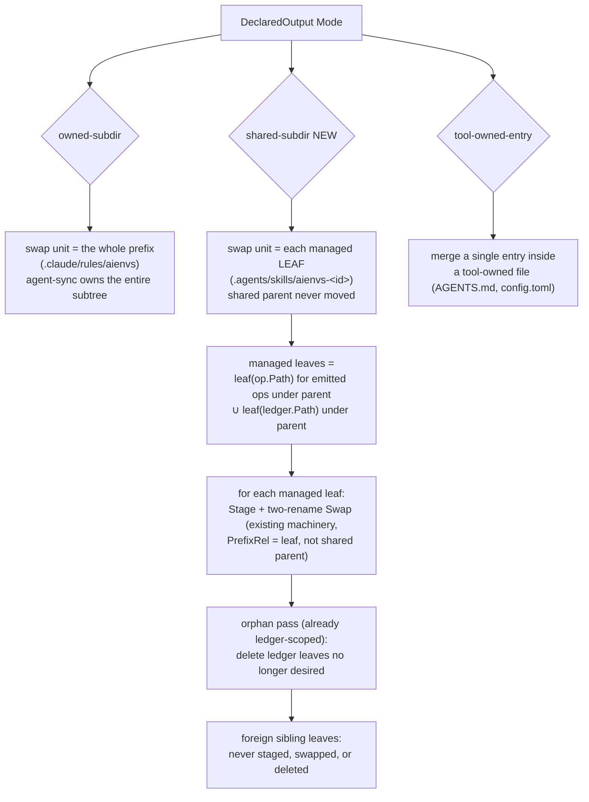

# fix: shared-subdir ownership mode (no wholesale swap of shared trees)

## Summary

Syncing an adapter that declares a **shared** directory as an `owned-subdir`
destroys non–agent-sync sibling content. The codex adapter declares
`.agents/skills` (the cross-tool shared skills tree) as `owned-subdir` and the
engine applies owned-subdirs via a **wholesale two-rename swap** that replaces
the entire prefix directory with only agent-sync content — so a user's or
another tool's `.agents/skills/<non-aienvs>/` skills are deleted on the next
codex sync. claude's `.claude/skills` has the same latent bug.

This plan introduces a third declared-output mode, **`shared-subdir`**, where the
engine applies the existing atomic two-rename swap **per managed leaf entry**
(e.g. each `.agents/skills/aienvs-<id>/`) instead of at the shared parent. The
shared parent is ensured-to-exist but never moved; sibling entries the ledger
never recorded are never touched. Removal of an agent-sync entry still flows
through the existing ledger-scoped orphan pass. Atomicity (AGENTS invariant #6)
and ledger authority (#7) are preserved at leaf granularity.

This unblocks PR #24 (the codex adapter is unsafe to merge until this lands).

---

## Problem Frame

**Confirmed P1 data loss.** Verified end-to-end and by code trace:

- `internal/sync/staging.go` `Stage()` creates a **fresh empty** staging dir
  (`MkdirAll`; it does not copy existing content).
- `internal/engine/target.go` (stage+swap loop) writes **only** the
  adapter-emitted agent-sync paths into that staging dir.
- `internal/sync/swap.go` `Swap()` performs the two-rename keyed on `PrefixRel`:
  `<prefix>` → `<prefix>.old`; `<staging-leaf>` → `<prefix>`; `RemoveAll
  <prefix>.old`.

The swap operates at the **declared-prefix** granularity. For `.agents/skills`
that means the whole shared tree is replaced by agent-sync's leaf dirs alone.
Codex (and pi) discover skills as **direct children** (`.agents/skills/<name>/
SKILL.md`), so agent-sync skills must be siblings of user skills in the shared
tree — nesting them under `.agents/skills/aienvs/` to make the prefix exclusive
would break discovery. The mismatch is structural: a single shared tree holds
both agent-sync-owned leaf dirs and foreign leaf dirs, but the owned-subdir swap
assumes the whole prefix is agent-sync's.

The orphan-deletion path already does the right, ledger-scoped thing (AGENTS
invariant #7: orphan set = `previous_ledger − current_desired_outputs`, never
"any file under the prefix") — the bug is specifically in the **swap**, which is
prefix-wholesale rather than ledger-scoped.

---

## Requirements Trace

- **R-SS1** — A pre-existing non–agent-sync entry under a shared parent
  (`.agents/skills/user-thing/SKILL.md`) survives a sync that adds, updates, or
  removes agent-sync entries in the same parent. → U2, U4
- **R-SS2** — An agent-sync entry dropped from the manifest is removed (orphan
  pass), while foreign siblings are untouched. → U2, U4
- **R-SS3** — Each managed leaf is updated atomically (two-rename swap) and
  crash recovery leaves the leaf — and the shared parent — in a clean state
  (AGENTS invariants #6, #7). → U2, U4
- **R-SS4** — codex `.agents/skills` and claude `.claude/skills` use the new
  mode; the wholesale-swap data loss no longer occurs for either. → U3, U4
- **R-SS5** — The new mode is an additive, backward-compatible extension to the
  declared-output contract (no break to `owned-subdir` / `tool-owned-entry`). → U1

Success criteria: the R-SS1 survival test passes; codex/cursor/claude sync
behavior is unchanged except that shared trees no longer clobber siblings;
`go test -race ./...`, `golangci-lint`, and the coverage floor stay green.

---

## High-Level Technical Design

The change is a new ownership granularity for the swap. Today the swap unit is
the declared prefix; for `shared-subdir` it becomes each managed leaf.

**Key insight:** the existing `Stage`/`Swap`/`Recover`/`Sentinel` machinery is
already parameterized by `PrefixRel` + `StagingLeafRel`. Pointing `PrefixRel` at
a *leaf* (`.agents/skills/aienvs-<id>`) instead of the shared parent
(`.agents/skills`) reuses all of it — including per-leaf crash recovery — with no
change to the swap primitive itself. The engine's job is to (a) ensure the shared
parent exists, (b) enumerate managed leaves from emitted ops ∪ ledger, and (c)
drive the existing per-prefix stage+swap once per leaf.

---

## Key Technical Decisions

- **New mode `shared-subdir`, not a flag on `owned-subdir`.** A distinct
  `OutputMode` keeps the contract explicit and the engine branch obvious; adapters
  opt in per declared output. Additive to the frozen wire protocol (new enum
  value, `omitempty`, backward-compat test) — no version bump (per the
  "freeze the frame, grow capabilities" policy).
- **Swap unit = managed leaf, identified by the ledger + this run's ops, not by
  name prefix.** "Managed" means agent-sync recorded it (prior ledger) or is
  emitting it now. The `aienvs-` name prefix is a convention, not the authority —
  the **ledger is the authority** (invariant #7), extended from orphan-deletion to
  the swap granularity. A foreign leaf is, by definition, not in the ledger and
  not emitted, so it is never a swap target.
- **Reuse `Stage`/`Swap`/`Recover` per leaf.** No new swap primitive; no change
  to the two-rename or sentinel state machine. The leaf's parent (`.agents/
  skills`) is the staging parent for recovery keying. The shared parent is
  `MkdirAll`-ensured, never renamed.
- **Orphan deletion is already correct — reuse as-is.** The ledger-scoped
  deletable set (target.go) already excludes foreign paths; it needs no change
  beyond operating under the shared-subdir prefixes too.
- **claude `.claude/skills` migrates to `shared-subdir` as well.** It has the
  identical latent bug; fixing only codex would leave a known data-loss path in a
  shipped adapter. cursor has no skills and is unaffected.
- **`owned-subdir` semantics are unchanged.** Exclusive trees agent-sync fully
  owns (`.claude/rules/aienvs`, `.cursor/rules/aienvs`, `.claude/commands/aienvs`)
  keep the wholesale-prefix swap — correct because there are no foreign siblings
  inside an `aienvs`-suffixed exclusive dir.

---

## Implementation Units

### U1. Add the `shared-subdir` declared-output mode to the contract

**Goal:** Introduce `OutputModeSharedSubdir` across the SDK type, the wire
contract mirror, and the JSON schema, as an additive backward-compatible change.

**Requirements:** R-SS5.

**Dependencies:** none.

**Files:**
- `pkg/adapterkit/types.go` (add `OutputModeSharedSubdir OutputMode = "shared-subdir"`)
- `internal/adapter/contract/protocol.go` (mirror the constant + doc comment)
- `internal/adapter/contract/schema/initialize.json` (or the declared-output
  schema) — add the enum value if declared outputs are schema-validated
- Test: `pkg/adapterkit/types_test.go`, `internal/adapter/contract/*_test.go`,
  `pkg/adapterkit/schema_parity_test.go` / `internal/adapter/contract/schema_parity_test.go`

**Approach:** Add the enum value alongside `owned-subdir` / `tool-owned-entry`,
updating the OutputMode doc comment to describe the three modes. Confirm the
schema-parity tests (SDK ↔ contract ↔ JSON schema) still pass with the new value.

**Patterns to follow:** the existing `OutputModeOwnedSubdir` definition and its
schema-parity coverage.

**Test scenarios:**
- A `DeclaredOutput{Mode: "shared-subdir"}` round-trips through JSON marshal/
  unmarshal and validates against the schema.
- Schema parity: the SDK enum, contract enum, and JSON schema enum agree
  (existing parity test extended to include the new value).
- An unknown mode value still fails validation (no accidental loosening).

**Verification:** parity tests pass; the constant exists in all three places.

### U2. Engine: per-leaf stage+swap for `shared-subdir` prefixes

**Goal:** Apply the atomic swap per managed leaf for shared-subdir outputs;
never move the shared parent; keep orphan deletion ledger-scoped.

**Requirements:** R-SS1, R-SS2, R-SS3.

**Dependencies:** U1.

**Files:**
- `internal/adapter/bundled/.../` — none here (engine only)
- `internal/engine/target.go` (the stage+swap loop, `ownedSubdirs`/`ownerOf`,
  the deletable/orphan computation)
- Possibly `internal/engine/plan.go` (dry-run/`status` must report shared-subdir
  changes the same way, per-leaf)
- Test: `internal/engine/target_test.go` (or the engine test that drives
  applyTarget against a real `fsroot` + ledger)

**Approach:** Classify declared outputs into owned-subdir, shared-subdir, and
tool-owned. For shared-subdir prefixes:
- Ensure the shared parent exists (`MkdirAll`), never stage/swap it.
- Enumerate **managed leaves** under the parent = the set of immediate child
  paths derived from (this run's emitted op paths under the parent) ∪ (prior
  ledger entry paths under the parent). The leaf is the first path segment below
  the shared parent.
- For each managed leaf, drive the existing `Recover` (keyed on the leaf's
  parent) → `Stage` → write ops into staging → `Swap` (with `PrefixRel` = the
  leaf), exactly as owned-subdir does today but at leaf granularity.
- Orphan deletion: the existing ledger-scoped deletable computation already
  excludes foreign paths; ensure it runs for shared-subdir prefixes so a leaf
  dropped from the manifest is removed while foreign leaves are not.
- The `--expect-deletions` guard must compute over the same ledger-scoped set
  before any mutation (unchanged ordering: guard, then mutate).

**Execution note:** Start with a failing characterization test that seeds a
foreign sibling skill and asserts it survives a shared-subdir sync — this is the
bug being fixed and the regression guard.

**Technical design (directional):** managed-leaf derivation —
`leaf(parent, p) = parent + "/" + firstSegment(p[len(parent)+1:])`; the swap set
is `{leaf(parent,p) | p ∈ emittedUnder(parent) ∪ ledgerUnder(parent)} minus
orphan-deleted leaves`. Foreign leaves never enter this set because they are
neither emitted nor in the ledger.

**Patterns to follow:** the current owned-subdir stage+swap loop in target.go
(reused verbatim per leaf); the existing ledger-scoped deletable computation;
`internal/sync` `Stage`/`Swap`/`Recover`/`Sentinel`.

**Test scenarios:**
- Covers R-SS1. Seed `.agents/skills/user-thing/SKILL.md` (not in ledger); sync a
  manifest with one agent-sync skill; assert the agent-sync leaf is written AND
  `user-thing/SKILL.md` is byte-identical afterward.
- Covers R-SS2. Sync skill A; then sync a manifest without A but with a foreign
  sibling present; assert A's leaf is orphan-removed and the foreign sibling
  survives.
- Update path: re-syncing a changed agent-sync skill replaces only that leaf;
  sibling agent-sync and foreign leaves untouched.
- Multi-file skill atomicity: a skill with SKILL.md + assets is swapped as one
  leaf (no half-updated leaf observable).
- Crash recovery: simulate a sentinel left at step1_done for one leaf; the next
  run's `Recover` completes it without disturbing other leaves or the shared
  parent. (Mirror the existing swap-recovery tests, scoped to a leaf.)
- `--expect-deletions` mismatch aborts before any leaf is swapped (every leaf and
  the foreign siblings byte-intact).
- Empty shared parent (no agent-sync skills emitted, none in ledger): no swap, no
  parent creation churn, foreign content untouched.

**Verification:** the survival test (R-SS1) passes; `status`/dry-run reports
per-leaf changes; `go test -race ./internal/engine/... ./internal/sync/...`
green.

### U3. Migrate codex and claude skill outputs to `shared-subdir`

**Goal:** Flip the two skill-emitting adapters' declared outputs to the new mode.

**Requirements:** R-SS4.

**Dependencies:** U1, U2.

**Files:**
- `internal/adapter/bundled/codex/capabilities.go` (`.agents/skills` →
  `OutputModeSharedSubdir`)
- `internal/adapter/bundled/claude/capabilities.go` (`.claude/skills` →
  `OutputModeSharedSubdir`)
- Test: `internal/adapter/bundled/codex/capabilities_test.go`,
  `internal/adapter/bundled/claude/capabilities_test.go` (update declared-output
  shape assertions)

**Approach:** Change only the `Mode` on the skills declared output for each
adapter. Claude's other owned-subdirs (`.claude/rules/aienvs`,
`.claude/commands/aienvs`) and its `.claude/skills` were all `owned-subdir`;
only `.claude/skills` moves to shared-subdir (rules/commands are exclusive
`aienvs`-suffixed dirs, correctly wholesale-swapped). Codex's `.agents/skills`
moves to shared-subdir; its `.codex/config.toml` and `AGENTS.md` stay
tool-owned-entry.

**Patterns to follow:** the existing `declaredOutputs()` in each adapter.

**Test scenarios:**
- codex `declaredOutputs()` reports `.agents/skills` with mode `shared-subdir`.
- claude `declaredOutputs()` reports `.claude/skills` with mode `shared-subdir`
  and leaves `.claude/rules/aienvs` / `.claude/commands/aienvs` as `owned-subdir`.
- Capability/init round-trip still succeeds with the new mode echoed.

**Verification:** adapter capability tests pass; the two declared outputs carry
the new mode.

### U4. End-to-end survival + recovery coverage

**Goal:** Prove the fix at the real sync seam for both adapters and lock it
against regression.

**Requirements:** R-SS1, R-SS2, R-SS3, R-SS4.

**Dependencies:** U2, U3.

**Files:**
- Test: an end-to-end test in `internal/cli` (mirroring `cmd_sync_test.go`'s real
  git + real fs harness) that seeds a foreign skill and runs `sync` for codex.

**Approach:** Build a canonical repo with one skill, init a workspace targeting
codex, seed a foreign `.agents/skills/user-thing/SKILL.md` in the workspace, run
`sync`, and assert: the agent-sync skill landed under `.agents/skills/aienvs-…/`,
the foreign skill is byte-identical, exit 0. Then remove the skill from the
canonical source and re-sync; assert the agent-sync leaf is gone and the foreign
skill still survives.

**Patterns to follow:** `internal/cli/cmd_sync_test.go` (`makeCanonicalRepo`,
`writeWorkspace`, `runSync`); the IR decoder's skill-discovery layout (use a
SKILL.md whose frontmatter the IR decoder accepts).

**Test scenarios:**
- Covers R-SS1/R-SS4. Foreign skill survives a codex `sync` that adds an
  agent-sync skill (end-to-end, real fs).
- Covers R-SS2. Foreign skill survives a re-sync that orphan-removes the
  agent-sync skill.
- Idempotent re-sync reports unchanged and does not disturb the foreign skill.

**Verification:** end-to-end test passes; full `go test -race ./...` green;
coverage floor (80%) holds.

---

## Risks & Dependencies

- **Risk: per-leaf recovery keying.** Multiple leaves share one staging parent
  (the shared `.agents/skills`); the sentinel/recovery is keyed on the staging
  parent. Driving `Recover` once per parent before staging any leaf (as the
  current loop already does per parent) must be preserved so concurrent
  half-finished leaf swaps reconcile correctly. Mitigation: U2's crash-recovery
  scenario + reuse of the existing Recover-before-stage ordering.
- **Risk: status/dry-run drift.** `plan.go` must report shared-subdir changes
  per-leaf, or `validate`/`status` will misreport drift. Mitigation: U2 includes
  the plan path; a dry-run scenario asserts per-leaf change reporting.
- **Risk: leaf identification edge cases.** A ledger entry whose path equals the
  shared parent exactly, or a single-file output directly under the parent, must
  not be mistaken for a leaf dir. Mitigation: reuse the existing file-type/owner
  detection; test a degenerate entry.
- **Dependency:** blocks PR #24 (codex adapter). Sequencing options: land this on
  its own branch and rebase #24 onto it, or stack #24 on this. Either way #24
  must not merge with `.agents/skills` as plain `owned-subdir`.

---

## Scope Boundaries

### Deferred to Follow-Up Work
- pi adapter (Unit 11.5) — will also use `shared-subdir` for `.agents/skills`;
  extend the coexistence/survival tests to the pi case when it lands.

### Out of scope
- The extension-SDK CLI (Unit 20), `rollback`/`unmanage` commands.
- Any change to `owned-subdir` or `tool-owned-entry` semantics.
