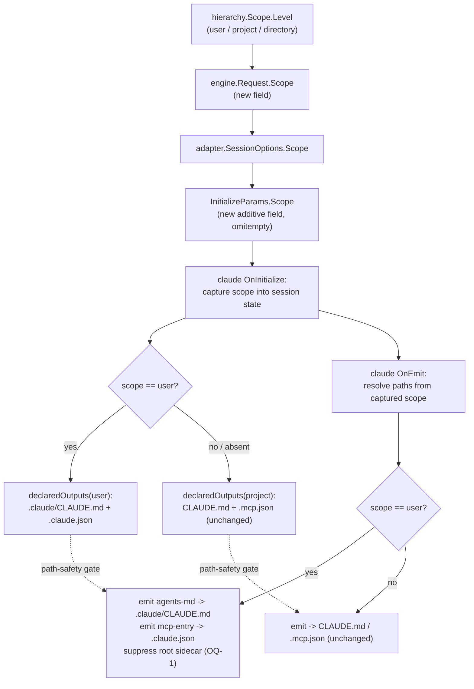

# fix: scope-aware Claude adapter output paths (sync --user targets ~/.claude)

## Summary

`sync --user` writes two Claude outputs to paths Claude Code never reads.
The Claude adapter declares and emits **workspace-relative** paths
(`CLAUDE.md`, `.mcp.json`) that are correct at project scope but wrong at
user scope: at `--user` the scope root is the home directory
(`internal/hierarchy/discover.go:108`, `Root = home`), so they resolve to
`~/CLAUDE.md` and `~/.mcp.json`. Claude Code reads user-global config from
`~/.claude/CLAUDE.md` and `~/.claude.json`. The files agent-sync writes at
user scope are inert.

The asymmetry is the tell: the adapter's other outputs
(`.claude/rules/agent-sync`, `.claude/commands/agent-sync`, `.claude/skills`)
already live under `.claude/`, so they land correctly at `~/.claude/...`.
Only the two **root-level tool-owned-entry** outputs are misplaced — and
`.mcp.json → ~/.claude.json` is a *filename* change, not a directory-prefix
swap, so no generic prefix rewrite fixes it.

This plan makes the Claude adapter **scope-aware**: the adapter learns the
scope level (user / project / directory) at `initialize`, and at user scope
declares + emits `.claude/CLAUDE.md` and `.claude.json` instead of the
project-scope paths. The scope signal is threaded as an additive field
through the existing handshake. Project and directory scope behavior is
unchanged.

---

## Problem Frame

**Confirmed dead-end write at user scope.** Verified by code trace
(2026-06-18):

- `internal/adapter/bundled/claude/capabilities.go:73` `declaredOutputs()`
  returns static workspace-relative paths, including
  `{Path: "CLAUDE.md", Mode: ToolOwnedEntry, SectionID: "agent-sync"}` and
  `{Path: ".mcp.json", Mode: ToolOwnedEntry, JSONPointer: "/mcpServers"}`.
- `internal/adapter/bundled/claude/emit_tool_owned.go:12-15` hardcodes the
  same constants (`mcpJSONPath = ".mcp.json"`, `claudeMDPath = "CLAUDE.md"`,
  `claudeMDSidecar = ".agent-sync-managed"`); `emitMCPServerEntry` and
  `emitAgentsMD` emit ops at those literals.
- `internal/adapter/bundled/claude/bundled.go` `OnInitialize` **discards**
  its `InitializeParams` (`func(_, _ adapterkit.InitializeParams)`) and
  returns the static `declaredOutputs()` — so even though the handshake
  already carries `WorkspaceRoot`, the adapter ignores it.
- `internal/cli/setup.go:107-116` builds one `engine.Request` per scope with
  `WorkspacePath: scopeRoot`; at user scope `scopeRoot = home`
  (`internal/hierarchy/discover.go:108`). `internal/engine/target.go:46`
  passes that straight into `adapter.SessionOptions.WorkspaceRoot`.
- Claude Code reads user-global instructions from `~/.claude/CLAUDE.md` and
  user-scope MCP servers from `~/.claude.json` — neither of which the
  adapter targets.

Net effect: `sync --user` succeeds, reports success, and writes
`~/CLAUDE.md` + `~/.mcp.json` that Claude never loads.

The path-safety gate already enforces the link that makes this fixable as a
single coordinated change: `internal/adapter/runtime.go:500`
`pathInDeclaredOutputs` accepts an emitted op only if its path is contained
in a declared output. So declared outputs and emitted paths must move
together — change one without the other and the gate rejects the emit. The
existing in-code/YAML mirror invariant in `capabilities.go:34-36` is the same
discipline.

---

## Requirements Trace

- **R-US1** — At user scope, the Claude adapter declares and emits the
  agents-md overlay at `.claude/CLAUDE.md` (relative to the home root), and a
  `sync --user` writes the managed section there. → U2, U3, U4
- **R-US2** — At user scope, the Claude adapter declares and emits the
  mcp-server-entry at `.claude.json` (relative to the home root), merging into
  the `/mcpServers/agentsync_<id>` pointer and preserving all unrelated keys
  in that file. → U2, U3, U4
- **R-US3** — At **project** and **directory** scope, declared outputs and
  emitted paths are byte-for-byte unchanged (`CLAUDE.md`, `.mcp.json`); no
  regression to today's behavior. → U2, U3, U4
- **R-US4** — The scope signal is an **additive, backward-compatible**
  extension to the initialize handshake: an adapter that ignores it defaults
  to project-scope paths; an absent signal is treated as project scope. → U1
- **R-US5** — The `.claude/...` owned-subdir / shared-subdir outputs
  (rules, commands, skills) are unchanged at every scope (they already land
  correctly under `~/.claude/`). → U2
- **R-US6** — The `.agent-sync-managed` strict-JSON sidecar behaves
  coherently at user scope (see Open Question OQ-1): it is **not** written
  next to `~/.claude.json` as if agent-sync owned that shared file. → U3

Success criteria: a `sync --user` for Claude writes `~/.claude/CLAUDE.md` and
merges into `~/.claude.json` (preserving foreign keys); project/directory
syncs are unchanged; `go test -race ./...`, `golangci-lint run`, and the 80%
coverage floor stay green.

---

## High-Level Technical Design

The adapter is the sole owner of Claude's on-disk path knowledge (the
architecture's gateway/adapter boundary: core never encodes per-tool paths).
So the fix lives in the adapter — the engine must only **tell the adapter
which scope it is emitting for**. Today the handshake gives the adapter
`WorkspaceRoot` but not the scope *level*; inferring "is this home?" from the
root is fragile (symlinked homes, `--home` override in tests, nested repos at
`$HOME`). We pass the level explicitly.

**Key insight:** the bundled adapter's `run()` constructs a fresh
`adapterkit.Server` per session, so `OnInitialize` and `OnEmit` can close over
a single per-session `scope` variable. `declaredOutputs` and the emit helpers
become functions of scope; everything else (tool-owned-entry merge machinery,
JSON-pointer merge, markdown-section merge, the path-safety gate) is reused
unchanged — only the *paths* the adapter chooses differ.

---

## Key Technical Decisions

- **Scope is carried by an additive `Scope` field on the initialize
  handshake, not inferred from `WorkspaceRoot`.** Inference is unreliable
  (symlinked/overridden homes, a repo whose `.git` sits at `$HOME`). A
  first-class string enum (`"user"` | `"project"` | `"directory"`) on
  `InitializeParams` (contract + adapterkit, `omitempty`) is explicit,
  schema-parity-testable, and backward compatible: absent ⇒ project scope.
  This follows the project's "freeze the frame, grow capabilities" policy —
  the same additive shape used when `shared-subdir` was added (no version
  bump). *Alternative considered:* ride through the existing
  `InitializeParams.Meta` (`_meta`) raw field with no typed surface — rejected
  as less discoverable and untestable via schema parity. (See OQ-2.)
- **The fix is in the adapter, not an engine-side path rewrite.** Having the
  engine remap `.mcp.json → .claude.json` / `CLAUDE.md → .claude/CLAUDE.md`
  for user scope would push per-tool, per-scope filename knowledge into core,
  violating the adapter-owns-its-tool's-paths boundary. The `.mcp.json →
  .claude.json` *filename* change (not a prefix move) makes a generic rewrite
  impossible anyway.
- **`.claude.json` is merged surgically, never owned wholesale.** At user
  scope the MCP target is Claude's live combined config (`~/.claude.json` holds
  projects, history, auth, MRU state — far more than `mcpServers`). The
  existing `tool-owned-entry` JSON-pointer merge writes only
  `/mcpServers/agentsync_<id>` and preserves every other key — exactly the
  right primitive. The risk is higher than `.mcp.json` (a bug corrupts a
  load-bearing file), so U4 includes a foreign-key-preservation test against a
  realistic `.claude.json` fixture.
- **Default-to-project keeps all existing call sites correct.** The
  single-scope path (`prepareEngine`, used by `validate` and explicit
  `--workspace` sync) passes `LevelProject`; an absent wire field also means
  project. No existing test or behavior shifts unless `--user` is in play.
- **Scope-awareness is a general adapter capability, applied here only to
  Claude.** The wire field is adapter-agnostic, but this plan changes only the
  Claude adapter. Cursor (`.cursor/...`) and Codex are out of scope (see
  Scope Boundaries — Codex's `AGENTS.md` at user scope is a separate question).

---

## Implementation Units

### U1. Thread a `Scope` signal through the initialize handshake

**Goal:** Add an additive `Scope` field to the initialize params across the
SDK type, the wire-contract mirror, and the JSON schema, and plumb it from the
hierarchy scope level down to the adapter session.

**Requirements:** R-US4.

**Dependencies:** none.

**Files:**
- `pkg/adapterkit/types.go` — add `Scope string` to `InitializeParams`
  (`json:"scope,omitempty"`), with a doc comment enumerating
  `user`/`project`/`directory` and "absent ⇒ project".
- `internal/adapter/contract/protocol.go` — mirror the field on the contract
  `InitializeParams` (after `IRVersion`, before `Meta`).
- `internal/adapter/contract/schema/initialize.json` — add the optional `scope`
  property with the enum. This is **mandatory, not conditional**: initialize
  params *are* schema-validated, and the strict bidirectional parity test
  (`internal/adapter/contract/schema_parity_test.go`) fails CI if the contract
  struct gains `scope` without the schema gaining it (and vice versa). Note the
  two `InitializeParams` structs (adapterkit + contract) share this **single**
  schema, but only the contract struct's parity is strict-enforced — the
  adapterkit struct is checked by a sample-value validator that skips unknown
  keys. Update both structs and the schema together; `runtime.go` marshals the
  *contract* struct onto the wire, so a round-trip test must assert the contract
  struct carries `scope`.
- `internal/adapter/adapter.go` (`SessionOptions`) — add a `Scope` field.
- `internal/adapter/runtime.go` `Initialize` — set `params.Scope` from
  `s.options.Scope` (default `"project"` when empty).
- `internal/engine/request.go` — add `Scope string` (the wire value, e.g.
  `hierarchy.Level.String()`) to `Request`; `internal/engine/target.go:46` and
  `internal/engine/capability.go:45` pass it into `SessionOptions`. Carry the
  field as a **string** end-to-end (empty ⇒ project). Do **not** type it as
  `hierarchy.Level`: `LevelUser` is the zero value (`iota` = 0), so a `Request`
  built without setting `Scope` would default to `"user"` and silently route a
  project sync to the user-scope paths — inverting the documented default.
- `internal/cli/setup.go` — `prepareScope` gains a scope-level parameter; the
  hierarchy orchestrator passes each `Scope.Level`, and `prepareEngine` passes
  `LevelProject`. Map `hierarchy.Level.String()` → the wire value.
- Tests: `pkg/adapterkit/types_test.go`,
  `internal/adapter/contract/*_test.go`, the schema-parity test, and
  `internal/adapter/runtime_test.go`.

**Approach:** Purely additive. The level already has a stable lowercase
`String()` (`internal/hierarchy/hierarchy.go`: `user`/`project`/`directory`),
so reuse it as the wire value rather than inventing a parallel enum. Confirm
schema-parity (SDK ↔ contract ↔ JSON schema) holds with the new optional
field, and that an initialize payload omitting `scope` still validates.

**Patterns to follow:** the existing `IRVersion` / `ReservedPrefix` fields on
`InitializeParams` and their round-trip + parity coverage; the `shared-subdir`
additive-enum precedent in `docs/plans/2026-06-09-003-...`.

**Test scenarios:**
- `InitializeParams{Scope: "user"}` round-trips through marshal/unmarshal and
  validates against the schema.
- An initialize payload with no `scope` key validates and decodes to `""`
  (runtime treats it as project).
- Schema parity: SDK, contract, and JSON-schema agree on the field + enum.
- `runtime.Initialize` sends `scope: "project"` when `SessionOptions.Scope`
  is empty (backward-compat default).
- The schema enum lists all three values (`user`/`project`/`directory`) so a
  `directory`-scope payload validates rather than failing the enum — the adapter
  maps `directory`→project paths via its default branch, but the wire value is
  still emitted.
- An adapter that ignores the field (does not read `params.Scope` in
  `OnInitialize`) still declares/emits project-scope paths — proves the
  default is honored adapter-side, not just at the wire layer (R-US4).
- Both session call sites send scope: a runtime/engine test asserts the
  capability-report session (`capability.go`) sends the same scope as the sync
  session (`target.go`), so the capability report can't silently diverge.

**Verification:** parity + round-trip tests pass; the field exists in all
three layers and is populated by the engine per scope.

### U2. Make the Claude adapter's declared outputs scope-aware

**Goal:** `declaredOutputs` returns `.claude/CLAUDE.md` + `.claude.json` at
user scope and the current `CLAUDE.md` + `.mcp.json` at project/directory
scope; capture the scope in `OnInitialize`.

**Requirements:** R-US1, R-US2, R-US3, R-US5.

**Dependencies:** U1.

**Files:**
- `internal/adapter/bundled/claude/bundled.go` — `OnInitialize` reads
  `params.Scope` and stores it in a per-session variable closed over by both
  handlers; pass scope into `declaredOutputs(scope)`.
- `internal/adapter/bundled/claude/capabilities.go` — `declaredOutputs` takes
  the scope and selects the two tool-owned-entry paths accordingly. The
  `.claude/rules/agent-sync`, `.claude/commands/agent-sync`, `.claude/skills`,
  and sidecar entries are unaffected at project scope; sidecar handling at
  user scope per U3/OQ-1.
- Tests: `internal/adapter/bundled/claude/capabilities_test.go`.

**Approach:** Introduce a small `scope` type (or reuse the wire string) and a
`pathSet` helper that resolves the two tool-owned paths from scope. Keep the
JSON pointer (`/mcpServers`) and section id (`agent-sync`) identical across
scopes — only `Path` changes. Default/unknown scope ⇒ project paths.

**Patterns to follow:** the current `declaredOutputs()` shape. (Do **not** reach
for the `capabilities.go:34` in-code/YAML mirror — that mirror governs per-IR-kind
*concept support*, not output paths; `declaredOutputs()` has no YAML counterpart.
The load-bearing invariant for the path change is the declared-equals-emitted
path-safety gate, enforced in U3.)

**Test scenarios:**
- `declaredOutputs("user")` lists `.claude/CLAUDE.md` and `.claude.json`,
  still lists the unchanged `.claude/rules|commands|skills` outputs, and
  **omits** the `.agent-sync-managed` sidecar entry (per OQ-1 — pin this so the
  user-scope declared set is explicit, not implied).
- `declaredOutputs("project")` and `declaredOutputs("")` both list `CLAUDE.md`,
  `.mcp.json`, and the `.agent-sync-managed` sidecar (identical to today).
- The JSON pointer and section id are scope-invariant.

**Verification:** capability tests pass for all three scope values.

### U3. Make the Claude adapter's emit paths scope-aware

**Goal:** `emitAgentsMD` and `emitMCPServerEntry` emit at the scope-resolved
paths so emitted ops stay inside the declared outputs (path-safety gate), and
resolve the sidecar coherently at user scope.

**Requirements:** R-US1, R-US2, R-US3, R-US6.

**Dependencies:** U1, U2.

**Files:**
- `internal/adapter/bundled/claude/emit_tool_owned.go` — replace the
  package-level `mcpJSONPath` / `claudeMDPath` / `claudeMDSidecar` literals
  with scope-resolved values threaded from the captured scope (via `emitState`
  or a path-resolver passed into `handleEmit`).
- `internal/adapter/bundled/claude/emit.go` — `handleEmit` / `emitState` carry
  the scope (or a resolved `paths` struct) so dispatch reaches the emitters.
- `internal/adapter/bundled/claude/bundled.go` — `OnEmit` closure supplies the
  captured scope.
- Update the package doc comment in `bundled.go:10-11` to note the
  scope-dependent destinations.
- Tests: `internal/adapter/bundled/claude/emit_test.go`,
  `emit_opcontent_test.go`.

**Approach:** Thread a resolved `paths{claudeMD, mcpJSON, sidecar}` struct
(computed once from scope) into `emitState`. The op *content*, JSON-pointer
locator, and markdown section markers are unchanged — only `Op.Path` differs.
Emitted paths must equal the U2 declared outputs so
`pathInDeclaredOutputs` passes. Sidecar at user scope: per OQ-1 (decided),
**suppress** the root `.agent-sync-managed` sidecar at user scope (do not write
`~/.agent-sync-managed`); it is advisory-only and read by nothing.

**Execution note:** Start with a characterization test asserting that at user
scope the emitted op paths are exactly the U2 declared outputs (this is the
gate-coupling invariant and the regression guard).

**Patterns to follow:** the current `emitMCPServerEntry` / `emitAgentsMD`
op construction; the cursor/codex adapters' single-path emit shape.

**Test scenarios:**
- At user scope: agents-md op path = `.claude/CLAUDE.md`; mcp op path =
  `.claude.json`; both pass `pathInDeclaredOutputs` against U2's user-scope
  declared outputs.
- At project scope: op paths are exactly `CLAUDE.md` / `.mcp.json` (unchanged),
  sidecar still emitted at `.agent-sync-managed`.
- Body-validation guards (non-object MCP body, marker-injection in agents-md
  body) still fire identically at both scopes.
- Sidecar: not emitted at root at user scope (per OQ-1 default).

**Verification:** emit tests green at both scopes; the emitted-equals-declared
invariant holds; `go test -race ./internal/adapter/...`.

### U4. End-to-end `sync --user` coverage for Claude

**Goal:** Prove the fix at the real sync seam and lock it against regression.

**Requirements:** R-US1, R-US2, R-US3, R-US6.

**Dependencies:** U2, U3.

**Files:**
- Tests: `internal/cli/cmd_sync_test.go` (or a sibling) — a `--user` end-to-end
  run using the hierarchy harness with an injected `Home` (the discovery
  `Options.Home` override and `fsroot.OpenWorkspaceRoot` on that home).

**Approach:** Build a canonical source with one agents-md overlay node and one
mcp-server-entry, a user-home manifest with `targets: [claude]`, seed
`~/.claude.json` with a foreign top-level key and a foreign
`/mcpServers/other` entry, run `sync --user`, and assert: `~/.claude/CLAUDE.md`
contains the managed section; `~/.claude.json` gained
`/mcpServers/agentsync_<id>` while the foreign key and `/mcpServers/other`
are byte-intact; no `~/CLAUDE.md`, no `~/.mcp.json`, and (per OQ-1) no
`~/.agent-sync-managed` were written. Then re-run and assert idempotence.
Add a project-scope control asserting the legacy paths are still produced.

**Fixture hygiene (required):** construct the `.claude.json` fixture **inline in
test code** (marshal a struct with only the keys the test exercises) — never copy
a real `~/.claude.json`, which holds `oauthAccount` and other credential state.
The injected `Home` must point at a `t.TempDir()`, never the real home. Consider
a CI guard rejecting any `testdata/*.json` containing an `oauthAccount` key.

**Patterns to follow:** `internal/cli/cmd_sync_test.go` harness
(`makeCanonicalRepo`, the hierarchy/`--user` discovery override); the
tool-owned-entry merge tests in `internal/merge`.

**Test scenarios:**
- R-US1/R-US2: user-scope sync lands `.claude/CLAUDE.md` + `.claude.json`
  merge; foreign `.claude.json` keys preserved.
- R-US3: a project-scope sync in the same test package still writes
  `CLAUDE.md` / `.mcp.json`.
- Idempotent re-run reports unchanged and disturbs no foreign content.

**Verification:** end-to-end `--user` test passes; full `go test -race ./...`
green; coverage floor (80%) holds; `golangci-lint run` clean.

---

## Risks & Dependencies

- **Risk: corrupting `~/.claude.json` (elevated — confirmed against a real
  file).** It is ~425 KB of whole-program Claude Code state: `oauthAccount`,
  `projects`, history, ~95 top-level keys, and ~11 **pre-existing user MCP
  servers** under `mcpServers` (none agent-sync's). `mcpServers` is one key
  among many. A merge bug here corrupts the user's entire Claude Code config,
  not a small workspace file. Mitigations: reuse the surgical JSON-pointer
  tool-owned merge writing only `/mcpServers/agentsync_<id>` (never a wholesale
  write); U4 seeds a fixture with foreign top-level keys **and** foreign
  sibling `mcpServers` entries and asserts all survive byte-intact; the
  existing merge-layer tests. Strongly consider a pre-write size/parse sanity
  check and never truncating on partial failure (atomic swap already covers
  this — verify it holds for the user-scope target).
- **Risk: concurrent-writer race against a live Claude Code (P1).** agent-sync's
  `FileLockRegistry` flock serializes only *agent-sync* processes; Claude Code
  writes `~/.claude.json` on its own schedule with no knowledge of that lock. A
  Claude write landing between agent-sync's read and its atomic rename is
  silently clobbered (agent-sync rewrites the file from a snapshot that predates
  the Claude write). Atomicity protects against crashes and agent-sync-vs-itself,
  not against Claude-vs-agent-sync. This is the operational face of OQ-0.
  Mitigation: resolve OQ-0 first; if `~/.claude.json` stays the target, either
  (a) document `sync --user` as a "run while Claude Code is closed" operation, or
  (b) add a re-read-and-compare-before-rename retry loop (verify the pre-read
  bytes are still current; retry on mismatch).
- **Risk: `~/.claude.json` is a symlink (dotfiles managers).** At `$HOME` scope,
  users commonly manage `~/.claude.json` with chezmoi / Mackup / GNU stow, where
  it is a symlink into a dotfiles or cloud-synced tree. The atomic temp+rename
  replaces the *symlink* with a regular file, silently breaking the managed link.
  Mitigation: `Lstat` the target before merge; if it is a symlink, either refuse
  with a clear error or resolve to the real target and write there. Document the
  chosen behavior. (Newly relevant because this plan opens `$HOME` as a root.)
- **Risk: `~/.agent-sync/state/` written into `$HOME`.** User-scope sync runs
  the same lock/ledger machinery as project sync, which creates
  `~/.agent-sync/state/` (target lock, filelocks, ledger) in the home root —
  a footprint beyond the intended `~/.claude/` outputs that the plan otherwise
  implies. Decide whether that is acceptable or whether user-scope state should
  live under `~/.claude/agent-sync/state/` to keep the home footprint confined.
- **Risk: declared/emitted path drift.** If U2 and U3 disagree on the
  user-scope paths, the path-safety gate (`runtime.go:500`) rejects the emit at
  sync time. Mitigation: U3's emitted-equals-declared characterization test;
  resolve both from one shared path-resolver.
- **Risk: scope not plumbed on every session path.** `capability.go` and
  `target.go` both open sessions; missing the field on one yields silent
  project-scope fallback at user scope. Mitigation: U1 updates both call sites;
  a runtime test asserts the field is sent.
- **Dependency:** builds on multi-scope sync
  (`docs/plans/2026-06-17-002-...`), which is what makes `--user` reach the
  home root in the first place. No external dependency.

---

## Open Questions

- **OQ-0 [BLOCKING — validate before building the MCP path]: is `~/.claude.json`
  a safe, durable MCP target, or does Claude Code own and regenerate it?** OQ-3
  confirmed only the *shape* of the `mcpServers` key. Two things the fix actually
  depends on are still **unverified**: (a) that Claude Code *reads* user-scope
  MCP servers from `~/.claude.json`'s `mcpServers` key (vs. it being a cache
  Claude rewrites from an internal source of truth), and (b) that an
  agent-sync-written `agentsync_<id>` entry *survives* a Claude Code session,
  which mutates that same ~425 KB file (oauth refresh, history, MRU) on its own
  schedule with no knowledge of agent-sync's lock. If Claude Code owns the file
  as regenerable state, agent-sync becomes a competing writer and its entry can
  be dropped or clobbered — a concurrent-writer race no agent-sync-side
  atomicity fixes (see the concurrent-writer risk below). **Validation step (do
  before U2/U3/U4 touch the MCP path):** write an `agentsync_<id>` entry into a
  real `~/.claude.json`, launch Claude Code, confirm the server loads **and** the
  entry is still present after a session that changes other keys. **If it does
  not survive, do not write `~/.claude.json` — pivot to a separate user-scope MCP
  file or Claude Code's own `claude mcp add --scope user` path.** The
  `.claude/CLAUDE.md` overlay half of the fix is unaffected and can proceed.
- **OQ-1 [RESOLVED 2026-06-18]: suppress the sidecar at user scope.** The
  `.agent-sync-managed` strict-JSON sidecar exists to advertise agent-sync
  ownership next to an agent-sync-managed strict-JSON file (`.mcp.json`). At
  user scope the MCP target is `~/.claude.json` — Claude's *own* shared config,
  not an agent-sync-owned file — so writing `~/.agent-sync-managed` would
  over-claim. **Decision: at user scope the Claude adapter does not declare or
  emit the `.agent-sync-managed` sidecar.** U2 omits it from user-scope declared
  outputs; U3 suppresses the emit; U4 asserts no `~/.agent-sync-managed`.
- **OQ-2 [RESOLVED 2026-06-18]: typed `Scope` field on `InitializeParams`.**
  Carried as `Scope string` (`json:"scope,omitempty"`) across SDK + contract +
  JSON schema, mirroring the existing `IRVersion`/`ReservedPrefix` fields.
  Schema-parity-testable, discoverable, additive (absent ⇒ project; no version
  bump). The `_meta` alternative is rejected.
- **OQ-3 [shape confirmed; load+persist lifecycle UNVERIFIED — gated by OQ-0]:
  `.claude.json` uses the same `mcpServers` key/shape as project `.mcp.json`.**
  Verified against a real `~/.claude.json`: it has a top-level `mcpServers`
  object keyed by server name, each entry `{command, args, type}` — identical to
  the project `.mcp.json` shape. So *if* writing `~/.claude.json` is the right
  target, user scope is a filename-only change (`.mcp.json` → `.claude.json`;
  the JSON pointer stays `/mcpServers/agentsync_<id>`, U2/U3 vary only
  `Op.Path`). **This confirms the write would be structurally valid — not that
  Claude Code reads or preserves it. Whether the entry survives is OQ-0, which
  gates the MCP path.** (See the corruption + concurrent-writer risks below —
  the real file is ~425 KB of whole-program state with ~11 pre-existing user MCP
  servers.)

---

## Scope Boundaries

### Deferred to follow-up work
- **Codex user scope.** Codex emits `AGENTS.md` at workspace root; at user
  scope `~/AGENTS.md` may have the same class of problem. Out of scope here;
  evaluate separately with the same scope-aware mechanism (U1 is reusable).
  **Note:** the quick trace in OQ-2 that decides U1's wire-field surface also
  answers whether Codex is a second confirmed consumer — do it before U1.
- **Cursor user scope.** Cursor outputs already live under `.cursor/`; confirm
  no equivalent gap, but not part of this fix.
- **Tool-owned entry removal is unimplemented at every scope.** Code trace
  confirms: nothing reads `.agent-sync-managed` back, orphan deletion excludes
  tool-owned files, no adapter emits a Remove op, and there is no `unmanage`
  command (only header prose advertises one). So a dropped
  `/mcpServers/agentsync_<id>` is never cleaned up today — at project *or* user
  scope. This plan does not worsen that gap, but user scope (`~/.claude.json`)
  makes it more consequential. Track as its own plan.

### Out of scope
- Any change to `owned-subdir` / `shared-subdir` / `tool-owned-entry` merge
  semantics.
- The user-scope memory's "use project scope until fixed" workaround guidance
  (remove once this ships).
- A wire protocol version bump (the change is additive).
