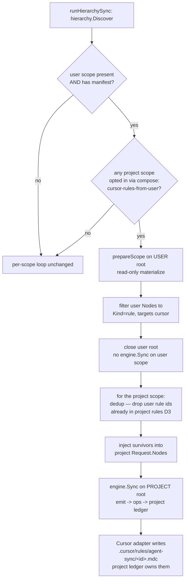

# feat: hierarchy composition — merge user-scope Cursor rules into project `.cursor/rules/`

## Summary

Cursor has **no file-addressable user-global rules location**, so agent-sync's
Cursor adapter can only sync MCP at user scope; `rule` and `agents-md` are
skipped there (declared unsupported) with a coverage warning (PR #31 behavior).
The way to make a globally-defined Cursor rule actually take effect is Cursor's
own recommended pattern: **write it into each project's `.cursor/rules/`.**

This plan implements that as **composition**: when a project sync runs and the
project manifest **opts in**, fold the user-scope `rule` layer into the
project's emitted node set so the effective `.cursor/rules/agent-sync/` =
project rules ∪ user rules. It is deliberately **narrow** — Cursor `rule` only —
and lives entirely in the **CLI orchestration layer** (`runHierarchySync`); the
engine, the swap/ledger machinery, and the Cursor adapter's emit logic are
untouched. Composed rules are owned by the **project** ledger, so removal falls
out of the existing orphan-reclaim path with no cross-scope ledger coordination.

### Go/no-go gate — RESOLVED: proceed with composition

A recency-weighted research pass (2026-07-01; official Cursor docs + Cursor
staff forum posts Nov 2025 / Jan 2026 + the June 2026 changelog) confirms there
is **still no native user-global file-addressable rules path**:

- User Rules are **cloud/UI-only** (Cursor staff, Nov–Dec 2025 & Jan 2026).
  `~/.cursor/rules/` exists on disk but Cursor does **not** reliably read it
  ("not supported yet" — staff). The v3.9 "Customize" surface (June 22 2026) is
  a **UI consolidation**, not a new on-disk read path.
- Project `.cursor/rules/*.mdc` **is** read natively (the composition
  destination is valid). `.mdc` extension required; frontmatter carries
  `alwaysApply` / `globs` / `description`.
- Precedence is **Team → Project → User** ("earlier sources take precedence when
  guidance conflicts") ⇒ **project rules shadow user rules on id collision**.

So the feature does **not** collapse to a one-line adapter remap (as it would
have if Cursor had shipped a native path). Composition is required. See
**Sources & Research**.

---

## Design

The core move is a **CLI-layer node injection**: `runHierarchySync` already
discovers every scope (user / project / directory) via `hierarchy.Discover`,
including the user scope even when it is not an emit scope (`Emit=false`). Today
each scope is a silo — `prepareScope` + `engine.Sync` run against that scope's
own root/manifest/ledger and nothing crosses. Composition reads the **user
scope's** `rule` nodes and injects them into the **project scope's**
`engine.Request.Nodes` before that scope's `engine.Sync` runs. To the engine,
the injected nodes are indistinguishable from project-authored nodes, so emit →
ops → ledger → orphan-reclaim all behave normally.

### Decisions (one per open fork)

**D1 — Narrow scope: Cursor `rule` only.** Not `agents-md`, not other adapters.
Rationale: `rule` is the sole motivating case with a verified native
project-level read path and no user-global home. `agents-md` at user scope is a
separate question (Cursor reads project/nested `AGENTS.md`, but folding a user
`AGENTS.md` into a project raises different merge semantics — one file, not a
per-id directory). Claude/Codex/Pi read their user configs from `$HOME` natively
(no gap to compose around). Generalizing now would over-fit a one-case need;
defer until a second concrete case appears (Rule of Three). Recorded as a
follow-up in Scope Boundaries.

**D2 — Opt-in via manifest, not automatic.** Composition fires only when the
**project** manifest declares it. Rationale: automatic composition would make a
plain `agent-sync sync` silently write the user's global rules into *every*
synced repo's working tree (and possibly into git), a surprising side effect at
odds with agent-sync's explicit-scope, no-surprise-writes posture (cf. `--user`
gating home writes). Opt-in keeps the blast radius author-controlled. New
manifest key on the **project** manifest:

```yaml
# .agent-sync.yaml (project)
targets: [cursor, claude]
compose:
  cursor-rules-from-user: true   # opt-in; default false / absent
```

The manifest schema is **strict** (unknown keys rejected except `x-`), so this
requires a real schema addition (see U2). Absent/false ⇒ current behavior.

**D3 — Precedence: project rules shadow user rules on id collision, *with a
warning*.** Before injecting, drop any user `rule` node whose `id` already
exists among the project's `rule` nodes. This matches Cursor's Team > Project >
User order (project wins) and — critically — is enforced **by agent-sync at
injection time**, because once user rules are written into the project's
`.cursor/rules/` they are all project-level files to Cursor and its native
User<Project precedence no longer distinguishes them. Dedup is by
`(Kind=rule, id)`.

**Caveat — the id namespace is flat (no cross-scope namespacing).** A user rule
`security` and an *independently authored, unrelated* project rule `security`
collide **by coincidence**, and the drop silently discards a global rule the
author expected to apply everywhere. Precedence resolution assumes "same rule
seen at two scopes"; a flat namespace can't tell that apart from an accidental
name clash. So the drop must be **observable**: emit a warning per shadowed id
(e.g. `user rule "security" shadowed by project rule of the same id`) via the
run's warning channel, and cover it with a U4 test. Silent-project-wins alone is
a data-visibility loss, not just precedence.

**D4 — Provenance may point outside the project root; verify no coupling.**
Injected nodes carry the **user** manifest's `Provenance{Path, BlobSHA}` — a
blob SHA from a *different* fsroot/commit than the project's canonical source.
This is the single biggest correctness risk. If any engine/ledger/swap code
assumes a node's provenance path/SHA resolves within the project root (e.g.
re-reads the file via the project root, or cross-checks the blob against the
project's `git cat-file`), composition would break or corrupt. U1 is a
**de-risk-first spike** that traces every consumer of `Node.Provenance`
downstream of `engine.Request.Nodes` and confirms the ledger records provenance
as **opaque metadata** (not a re-read handle). The plan's later units assume U1
comes back clean; if it does not, U1's findings reshape the injection approach
(candidate fallback: re-stamp injected nodes' provenance, or thread the user
root through — decided only if U1 forces it).

**D5 — Coverage warning becomes conditional.** `coverage.nonNativeAtUser` flags
Cursor `rule` as inert at user scope. Once composition is active for a project
in the hierarchy, that user-scope `rule` warning is misleading (the rule *does*
take effect, via the project). Change: suppress the Cursor **`rule`** user-scope
warning when composition is active for the run; keep the **`agents-md`** warning
(not composed under D1). The `rule` warning still fires when composition is off.

**D6 — User-scope emit and the capability-lie gate are untouched.** Composition
changes *only* what the project scope emits. The user scope's Cursor emit still
skips `rule`/`agents-md` and still declares them **unsupported** at user scope
(`capabilitiesForWire` in `capabilities.go`, the user-scope check ~line 69), so the capability-lie gate
(`internal/adapter/runtime.go`) is unaffected — the user rules take effect via
the **project** sync, never the user sync. No adapter code changes.

**D7 — No project scope ⇒ no-op.** If discovery finds no project scope (e.g.
`sync --user` alone, or cwd is not under a git repo), there is nothing to
compose into; user rules remain inert exactly as today. Composition also no-ops
when: no user manifest exists, the user manifest has no `rule` nodes, `cursor`
is not a project target, or the project manifest did not opt in.

**D8 — Project sync stays hermetic: composition never fetches or fails the run.**
Materializing the user manifest for its rules runs through the same
`materialize()` path a normal sync uses, which — for a **URL-canonical** user
source — would `git.Materialize` (network fetch) and pass the TOFU **trust
gate** (exit 3/4/5), and would honor `--offline`. It would be a surprising
regression for a plain `agent-sync sync` in an opted-in project to suddenly hit
the network, block on a trust prompt, or fail offline **because of the *user's*
remote manifest**, which the author never asked to sync. Rule: **composition is
best-effort and must not compromise the project sync.**
- If the user manifest's canonical is a URL that is **not already resolved in
  cache**, or `--offline` is set, **skip composition with a warning** — do not
  fetch. (Local `local_dir`/`local_path` user canonicals materialize from the
  filesystem and are fine.)
- If user-scope `prepareScope`/`materialize` fails for **any** reason (trust,
  network, decode), treat composition as a **soft no-op + warning** — never
  propagate the failure into the project sync's exit code.
This keeps the project sync's outcome independent of the reachability/trust
state of the user's global source. Enumerated alongside D7's no-op conditions;
tested in U4.

### Reading the user IR without emitting the user scope

Composition must **read** the user manifest's IR (materialize its `rule` nodes)
even when `--user` is not passed and the user scope is `Emit=false`. This opens
a user-home fsroot **read-only** for IR materialization; the project root
remains the only write target. This is consistent with the existing invariant
(every write still goes through `fsroot.OpenWorkspaceRoot`; hierarchy sync
already opens scope roots outside the repo under `--user`). Implementation reuses
the existing `prepareScope` machinery against the user scope but consumes only
`Request.Nodes` (filtered to `rule`) and then closes the root without calling
`engine.Sync` on it. The gate for doing this work at all is D2's opt-in flag, so
the read only happens when a project has explicitly asked for it. Because
`prepareScope` also runs `materialize()` and `DiscoverAdapters` on the user
manifest, D8 governs its failure/network behavior (best-effort; never fetch a
remote user source; never fail the project sync), and U4 must confirm the
read-only user prepare does **not** launch adapter subprocesses — only `rule`
nodes are consumed and no emit happens.

---

## High-Level Technical Design

Composition is a pre-`engine.Sync` transform on the project scope's request.
The user scope is materialized read-only for its rules; the project scope is the
sole write target.



**Ownership / orphan-reclaim (why no cross-scope ledger work is needed).**
Composed rules are written by the project `engine.Sync`, so the project ledger
records them like any project rule. On a later sync where the user drops the
rule (or removes the opt-in), the composed node set no longer contains that id →
the project's node set shrinks → the engine's normal orphan detection reclaims
the now-unowned `.cursor/rules/agent-sync/<id>.mdc`. No union-aware co-ownership
(the ADV-1 machinery in `internal/engine/target.go`) is involved, because a
single ledger (the project's) owns these files end to end. This holds **only if**
injected nodes are indistinguishable from project nodes to the engine — the
invariant U1 verifies (D4).

**Reclaim requires a subsequent sync — it is not automatic.** Orphan detection
is a ledger diff computed *during* `engine.Sync`. Turning off the opt-in (or
dropping a user rule) reclaims the composed files only on the **next**
composed-context sync; if the author opts out and never re-syncs (or the repo is
checked out on another machine, or agent-sync is removed), the previously-written
`.mdc` files persist in the working tree — and, if committed (R3), in git — with
nothing declaring them. Documented in U6 and covered by a dedicated
opt-in→sync→opt-out→sync reclaim test in U4 (distinct from the drop-a-rule test).

---

## Implementation Units

### U1. De-risk spike: prove `Node.Provenance` is opaque downstream

**Goal:** Confirm (or refute) that injecting a node whose `Provenance{Path,
BlobSHA}` points outside the project root is safe — that no engine/ledger/swap
consumer re-reads the file via the project root or cross-checks the blob SHA
against the project's git object store. This gates the whole design (D4).

**Dependencies:** none (must run first).

**Files (read/trace only; may add a characterization test):**
- `internal/engine/engine.go`, `internal/engine/target.go` — trace `Request.Nodes` → emit → ledger write.
- `internal/sync/staging.go`, `internal/sync/swap.go`, `internal/sync/drift.go`, `internal/sync/orphans.go` — any provenance reads.
- ledger read/write (`internal/engine/target.go` `loadSiblingLedgerEntries`, ledger `Load`) — how `Provenance` is persisted and re-consumed.
- `internal/ir/` — how provenance is produced/attached (for the re-stamp fallback).
- Test (if characterization added): `internal/cli/hierarchy_sync_compose_test.go` (a focused test injecting a foreign-provenance rule node into a project request and asserting a clean sync + correct ledger entry).

**Approach:** Grep every read of `.Provenance` (and `BlobSHA`) reachable from
`engine.Sync`. Classify each as *opaque metadata* (recorded, never used to
locate/verify content against the project root) or *coupling* (would break with
foreign provenance). Write findings into this plan (update, don't just report).
If all opaque: proceed as designed. If coupling found: document the minimal
fix (most likely re-stamping injected nodes' provenance to a synthetic
project-relative value, or `Provenance{}`), and update U4's approach before
implementing.

**Execution note:** Characterization-first — if any coupling is ambiguous from
reading, write the failing/ passing characterization test before concluding.

**Test scenarios:**
- (If characterization test added) A project sync given one injected rule node whose provenance path is `../user-home/rules/x.md` and blob SHA is a non-project SHA completes without error and writes a project ledger entry for `.cursor/rules/agent-sync/x.mdc`.
- Re-running the same sync is idempotent (no false drift from the foreign provenance).

**Verification:** A written determination in the plan: "provenance is opaque
downstream" (proceed) or an enumerated coupling list with the chosen mitigation.

---

### U2. Manifest `compose` schema + strict-load acceptance

**Goal:** Add the opt-in `compose.cursor-rules-from-user` manifest field (D2)
to the strict schema so it loads without being rejected as an unknown key.

**Dependencies:** none (can parallel U1).

**Files:**
- `internal/manifest/schema.go` — add a `Compose` struct field + type.
- `internal/manifest/load_test.go` — schema acceptance/rejection tests.

**Approach:** Add `Compose ComposeConfig` (`yaml:"compose,omitempty"`) with a
single bool `CursorRulesFromUser` (`yaml:"cursor-rules-from-user,omitempty"`).
Absent ⇒ zero value (false) ⇒ current behavior. Keep the field name namespaced
by adapter+source so future compose modes (D1 follow-ups) extend the same block
without a breaking rename. No validation coupling beyond "boolean".

**Patterns to follow:** existing optional blocks in `schema.go` (`Cache`,
`Trust`) and their `load_test.go` coverage of strict-unknown-key rejection.
Note: the loader's `goccy/go-yaml` `DisallowUnknownField` applies **recursively**
into nested structs (verified against `internal/manifest/load.go`), so the
"unknown key inside `compose:`" test below is meaningful, not vacuous — a bogus
sub-key is genuinely rejected.

**Test scenarios:**
- A manifest with `compose:\n  cursor-rules-from-user: true` loads; the field is `true`.
- A manifest without a `compose:` block loads; the field is `false` (zero value).
- `compose:` present but empty loads; field `false`.
- An unknown key **inside** `compose:` (e.g. `bogus: true`) is rejected by strict load (confirms the sub-map is also strict, matching the top level).

**Verification:** Manifest load tests pass; a project manifest can express the opt-in.

---

### U3. `hierarchy` exposes the user scope's manifest for read-only load

**Goal:** Ensure `runHierarchySync` can locate the user scope's manifest path
and root even when `IncludeUser` is false, without emitting it.

**Dependencies:** none (can parallel U1/U2).

**Files:**
- `internal/hierarchy/discover_test.go` — assert the user scope is returned with its `ManifestPath` when a home manifest exists and `IncludeUser=false`.

**Approach:** No production change is needed — `Discover` already returns the
user scope (`Emit=false`) carrying `Scope{Root, ManifestPath, Level:LevelUser}`,
which is everything U4 needs. **Do not add a `userScopeOf` helper**: it would be
a single-consumer abstraction (Rule of Three — CLAUDE.md). U4 selects the user
scope inline with a one-line range over the discovered slice
(`if sc.Level == hierarchy.LevelUser && sc.ManifestPath != ""`). This unit is
therefore a **test-only** confirmation of the existing behavior, so a regression
in `Discover` (dropping the user scope, or emptying its `ManifestPath`) is
caught before it silently disables composition.

**Test scenarios:**
- With a home manifest and `IncludeUser=false`, `Discover` returns a `LevelUser` scope with a non-empty `ManifestPath` and `Emit=false`.
- With no home manifest, no user scope is returned (helper reports `false`).

**Verification:** Orchestrator has a clean way to obtain the user scope's manifest path without triggering a user emit.

---

### U4. Compose user `rule` nodes into the project request

**Goal:** The core injection. When a project scope opted in (D2), a user scope
with a manifest exists (D7), and `cursor` is a project target, materialize the
user IR read-only, filter to `rule` nodes targeting cursor, dedup against
project rule ids (D3), and inject the survivors into the project scope's
`engine.Request.Nodes` before `engine.Sync`.

**Dependencies:** U1 (provenance determination — **design gate**, not just
ordering: if U1 finds provenance coupling, revise this unit's Approach and Files
per U1's chosen mitigation *before* implementing), U2 (opt-in flag), U3 (user
scope access).

**Files:**
- `internal/cli/hierarchy_sync.go` — the composition step inside `runHierarchySync` (before `engine.Sync` for the project scope) **and** the `composeUserRules` unexported helper alongside `kindsOf`. Keep it in this file, not a new `compose.go`: it has one call site and one mode today, so a separate file would be premature extraction (Rule of Three). Move it out only when a second compose mode lands.
- `internal/cli/setup.go` — reuse `prepareScope` for the user root; ensure the user root is closed after node extraction (no `engine.Sync`).
- Tests: `internal/cli/hierarchy_sync_test.go` (orchestration wiring + `composeUserRules` unit cases).

**Approach:** In `runHierarchySync`, after discovery: if any emit scope is the
project scope AND its manifest has `Compose.CursorRulesFromUser` AND `cursor ∈
targets` AND a user scope with a manifest exists → call `composeUserRules(user
scope, project nodes)`. `composeUserRules` uses `prepareScope` against the user
root purely to obtain `Request.Nodes`, filters to `Kind==rule` with
`nodeTargetsCursor` semantics, drops ids already present in the project's rule
nodes **and warns per dropped id** (D3), closes the user root, and returns the
survivors. Per D8 it is best-effort: a user-scope prepare/materialize failure
(or an unresolved-URL/offline user canonical) yields an empty result + warning,
never an error. The orchestrator appends the survivors to the project scope's
`req.Nodes`. Everything downstream (`coverage.Analyze`, `engine.Sync`) sees the
augmented set. **Determinism:** sort the *composed (injected) subset* by
`(kind, id)` and append it after the project's existing nodes — the project's
own node ordering is left unchanged. This keeps op/ledger output and the
`coverage.Analyze` kind set stable across runs (the Cursor adapter re-sorts
too, but a stable CLI-side order keeps fixtures and idempotency deterministic).

**Implementation note (as shipped — the seam grew during review):**
- Composition is a single shared entry point, `applyCursorComposition`, called
  from **both** `runHierarchySync` (hierarchy path) **and** `prepareEngine`
  (single-scope path). This is required so `validate`, `watch`, and `sync
  --workspace` see the same composed desired state — otherwise a composed
  project reports false `WouldDelete` drift under `validate` and loses composed
  rules under `watch`/`--workspace` (owned-subdir swap). Surfaced by the PR's
  code review (Codex P1/P2).
- `composeUserRules` deliberately does **not** reuse `prepareScope`: it hand-rolls
  the minimal `LoadFile` + `OpenWorkspaceRoot` + `materialize` read so it never
  runs `DiscoverAdapters` (no adapter subprocess) on the read-only user scope.
- On a user-source read failure the whole Cursor sync is **deferred** (cursor
  dropped from `req.Targets` for that run), not synced with project-only rules —
  because the owned-subdir swap would otherwise wipe previously-composed rules
  (D8 transient-failure guard).

**Patterns to follow:** `prepareScope` lifecycle + `defer prep.Close()` in the
existing per-scope closure; `kindsOf` for kind extraction; the Cursor adapter's
`nodeTargetsCursor` for target filtering (mirror the predicate, don't import the
adapter).

**Execution note:** Test-first — write the injection contract test before the helper.

**Test scenarios:**
- **Happy path:** project opts in, user has rules `a`,`b`; project has rule `c`. After composition the project request's rule ids are `{a,b,c}`; a full sync writes `.cursor/rules/agent-sync/{a,b,c}.mdc`, all in the project ledger.
- **Precedence/collision + warning (D3):** user has rule `shared`; project also has rule `shared` (different body). The project's `shared` is kept; the user's is dropped; only one `shared.mdc` is written, with the project body; **and a warning naming the shadowed id `shared` is emitted** (assert the warning fires — the drop must be observable, not silent).
- **Opt-out default:** project does **not** set the flag → no user rules injected; behavior identical to today.
- **No user manifest (D7):** opt-in set but no home manifest → no-op, no error.
- **Cursor not a target:** opt-in set, user has rules, but project `targets:` excludes cursor → no injection (nothing would emit them natively anyway).
- **No project scope (D7):** `sync --user` alone / no git repo → composition step is skipped, no error.
- **User root is read-only:** after `composeUserRules`, no writes occurred under the user root (assert via a spy/fake root or by checking the user scope produced no ops).
- **User-scope materialize failure is a soft no-op (D8):** opt-in set, but the user manifest fails to materialize (simulate a decode/trust/network error) → composition yields no injected rules + a warning; the **project sync still succeeds** (exit unchanged), writing only the project's own rules.
- **Offline / unresolved-URL user canonical (D8):** opt-in set, user manifest canonical is a URL not in cache and/or `--offline` → composition skips with a warning and does **not** fetch; project sync unaffected.
- **Orphan-reclaim, drop a rule (integration):** sync with user rule `a` (written into project); then remove `a` from the user manifest and re-sync → `.cursor/rules/agent-sync/a.mdc` is reclaimed by the project ledger. Covers the ownership reasoning in HTD.
- **Orphan-reclaim, opt out (integration):** opt in with user rule `a` → sync (writes `a.mdc`) → set `cursor-rules-from-user: false` → re-sync → `a.mdc` is reclaimed. Distinct from the drop-a-rule case; proves toggling the flag off cleans up (given a subsequent sync).
- **Idempotency:** two consecutive composed syncs produce no drift and no re-writes.

**Verification:** A composed project sync writes user+project rules into the
project's `.cursor/rules/agent-sync/`, project ledger owns them, collisions
resolve to the project rule, and dropping a user rule reclaims its file.

---

### U5. Conditional coverage warning for composed Cursor rules

**Goal:** Suppress the user-scope Cursor **`rule`** coverage warning when
composition is active for the run; keep the `agents-md` warning (D5).

**Dependencies:** U2 (opt-in flag), U4 (composition wiring establishes "active").

**Files:**
- `internal/coverage/coverage.go` — allow the analyzer (or its caller) to treat Cursor `rule` as covered-at-user when composition is active.
- `internal/cli/hierarchy_sync.go` — pass the "composition active" signal into the user-scope `coverage.Analyze` call (the user scope is where the `rule`/`agents-md` user warnings originate).
- Tests: `internal/coverage/coverage_test.go`, plus a hierarchy-level assertion in `internal/cli/hierarchy_sync_test.go`.

**Approach:** Prefer a caller-side filter over baking policy into the static
table: the orchestrator knows whether composition ran, so drop the
`{cursor, rule, user}` warning from the user scope's `Warnings` when composition
was active; leave `{cursor, agents-md, user}` intact. If the analyzer needs to
know, thread a small `ComposeActive` option into `coverage.Analyze` rather than
mutating the package-level `nonNativeAtUser` map. Keep the table honest for the
non-composed case.

**Test scenarios:**
- Composition active: user-scope Cursor `rule` warning is **absent**; `agents-md` warning still present.
- Composition inactive (opt-out): both `rule` and `agents-md` user-scope warnings present (unchanged from today).
- Non-cursor targets: no change to their (absent) warnings.

**Verification:** Users who opted in no longer see the misleading "rule is inert
at user scope" warning; those who did not still see it.

---

### U6. Docs: AGENTS.md invariant note + manifest reference + examples

**Goal:** Document the new composition behavior and the opt-in field so the
non-obvious cross-scope write is discoverable and the AGENTS.md single-write-path
invariant stays accurate.

**Dependencies:** U2, U4, U5.

**Files:**
- `AGENTS.md` — note that composition folds user `rule` nodes into the project write set (still via `fsroot.OpenWorkspaceRoot`, project root is the only write target; user root opened read-only, best-effort per D8).
- `docs/` manifest/reference doc (wherever the manifest schema is documented) — the `compose.cursor-rules-from-user` field, default, and effect.
- `examples/canonical/` or the quickstart — a short worked example (user manifest with a rule + project opt-in → project `.cursor/rules/`).

**Approach:** Prose only; mirror the dating/citation style of existing docs.
Cross-link this plan. The docs **must** cover three operator gotchas surfaced in
review, or the feature is a foot-gun:
1. **Composed files are per-developer, per-machine artifacts** — their content is
   *this machine's* user rules. Committing `.cursor/rules/agent-sync/*.mdc`
   pushes one developer's global rules to teammates and causes churn/spurious
   diffs when another developer (or machine) re-syncs. Recommend **gitignoring
   the composed output** (or treating it as local-only), and state plainly that
   composed files are not shared source.
2. **Opting out requires one more sync to clean up** — composed files are
   reclaimed only on the next composed-context sync (orphan diff); a bare opt-out
   with no re-sync leaves stale files (and committed ones persist regardless).
3. **`--workspace` single-scope sync does not compose** (see Scope Boundaries).

**Test scenarios:** `Test expectation: none — documentation only.`

**Verification:** A reader can discover the opt-in and understand that composed
rules are project-owned.

---

## Scope Boundaries

**In scope:** Cursor `rule` composition from the user scope into the project
scope, opt-in via the project manifest, project-wins precedence, coverage-warning
update, provenance de-risk, docs.

### Deferred to Follow-Up Work
- **Generalized composition** (D1): user→project folding for other kinds
  (`agents-md`) or a general "user layer merges down" mechanism. Revisit on the
  second concrete case (Rule of Three).
- **Directory-scope composition:** folding user *and* intermediate-directory
  layers, or composing across more than two levels. This plan handles user→project only.
- **Ledger GC / `unmanage`** (master-plan Unit 24): unrelated, but the orphan
  path this plan relies on is the same one GC would formalize.

### Known limitation
- **`--workspace` single-scope sync does not compose.** An explicit
  `sync --workspace <project>` routes to `runSingleScopeSync` (via
  `prepareEngine`), which never enters `runHierarchySync`, so the opt-in is a
  silent no-op on that path. Acceptable for v1 (composition targets the
  hierarchy-discovery flow, the common case). U6 documents it; if a warning is
  cheap, `runSingleScopeSync` may log "compose opt-in ignored on --workspace"
  when the flag is set — but wiring composition into the single-scope path is
  out of scope here.

### Out of scope
- Any change to the Cursor adapter's emit or capability declarations (D6).
- Any change to the engine or swap/ledger machinery (unless U1 forces a
  provenance re-stamp, which would be the minimal exception, documented there).
- Composition for Claude/Codex/Pi (they read user configs from `$HOME`
  natively; no gap to compose around).
- Wiring composition into the `--workspace` single-scope path (see Known
  limitation).

---

## Risks & Dependencies

- **R1 — Provenance coupling (highest, now downgraded by evidence).** If U1 finds
  the ledger/swap path treats provenance as a re-read handle rooted at the
  project, the clean "inject and forget" design breaks. Mitigation: U1 runs first
  and gates the design (D4); fallback is provenance re-stamping on injected
  nodes. **Review de-risked this:** read-only tracing found zero `.Provenance`/
  `.BlobSHA` references in `internal/engine/{engine,target}.go` or
  `internal/sync/*.go`; the ledger `Entry` records `{Path, SHA256-of-written-
  bytes}`, not the git blob SHA. U1 remains a spike to confirm and to guard
  against future re-coupling, but the risk is now assessed **low**.
- **R2 — Silent cross-repo writes.** Mitigated by D2 (opt-in) — no project gains
  composed rules without an explicit manifest key.
- **R3 — Committed global rules leak into git / cross-machine divergence.**
  Composed files land in the project tree and may be committed — and their
  content is the *syncing machine's* user rules, which differ per developer and
  per machine. Committing them pushes one developer's personal global rules onto
  teammates and produces churn/spurious diffs when others re-sync. Documented
  (U6) with a gitignore recommendation; the opt-in makes writing them a conscious
  choice, but the commit/divergence blast radius is a docs-and-gitignore concern,
  not gated by the flag. A default gitignore-hint for the composed subtree is a
  possible follow-up, not in scope.
- **R4 — Coverage-warning regression.** U5 must not suppress the warning for
  non-composed runs. Covered by the inactive-case test.
- **R5 — Non-hermetic project sync (D8).** Without care, composing a URL-canonical
  user manifest would drag network/trust/offline behavior of the *user's* source
  into a plain project sync. Mitigated by D8 (best-effort: never fetch a remote
  user source, never fail the project sync) and its U4 soft-no-op/offline tests.
- **R6 — Silent shadow of a coincidentally-named user rule (D3).** The flat id
  namespace means an unrelated same-id project rule silently drops a user's
  global rule. Mitigated by the per-id shadow **warning** (D3) and its U4 test.

---

## Verification Gate

Run before declaring done (per AGENTS.md / CLAUDE.md):

```bash
go vet ./... && go test -race ./... && golangci-lint run
```

This change touches the node set feeding the ledger/orphan/swap path
(data-loss-adjacent). Run **`ce-code-review`** before opening the PR, with
attention to U1's provenance determination and U4's injection/dedup logic.
Merge posture: squash + `--admin` if the chronic `test (darwin/amd64)` macOS
runner stalls; all other CI (lint, coverage, linux/windows/darwin-arm64,
CodeRabbit) must be green first.

---

## Sources & Research

Recency-weighted Cursor rules-layout pass, 2026-07-01 (go/no-go gate):

- [Rules | Cursor Docs](https://cursor.com/docs/rules) — User Rules "managed through Customize → Rules"; no filesystem path. Precedence Team → Project → User. Fetched July 2026.
- Cursor staff (deanrie), forum, Nov 30 – Dec 1 2025: *"Global loading of `.mdc` from `~/.cursor/rules` is not supported yet."*
- Cursor staff (deanrie), forum, Jan 13 2026: User Rules are *"stored in the cloud and synced across devices"* — not a local file.
- [Customize | Cursor Changelog](https://cursor.com/changelog/customize) — v3.9, June 22 2026: UI consolidation, no new on-disk rules path.
- Project `.cursor/rules/*.mdc` + nested `AGENTS.md` confirmed natively read (docs + May 26 2026 comparison article).

Prior art / house context:
- `docs/plans/2026-06-30-001-fix-cursor-codex-scope-paths-plan.md` — the earlier Cursor research pass and the user-scope skip this plan builds on.
- `docs/handoffs/2026-07-01-001-hierarchy-composition-handoff.md` — origin framing and code map.
