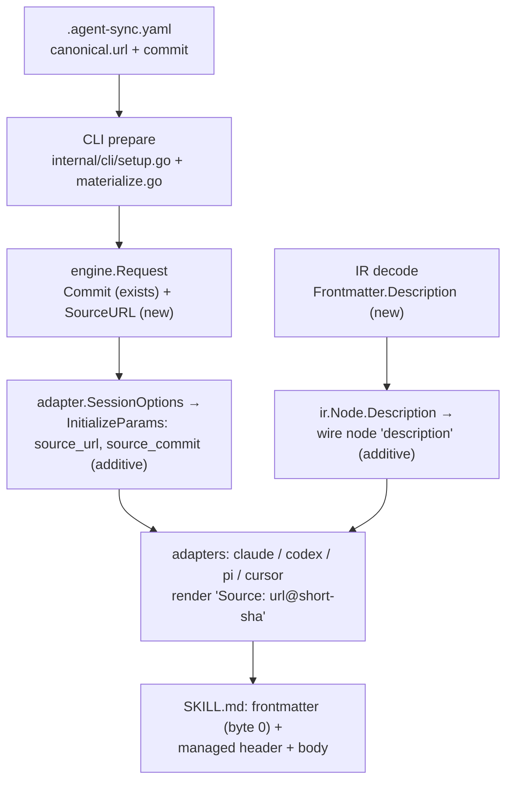

# feat: skill descriptions + upstream update flow

## Summary

Make every synced skill surface a real description to its target tool (fix the uninterpolated managed-header placeholders, emit YAML frontmatter on SKILL.md, warn on description-less canonical skills), and add a first-class `agent-sync update` command that fetches new upstream commits and re-pins `commit` + `trusted_sha` through the existing trust and sync machinery.

---

## Problem Frame

Two user-visible defects and one missing capability, all confirmed against the live v0.4.0 binary:

1. **Skills surface garbage descriptions.** The claude adapter emits `.claude/skills/agent-sync-<id>/SKILL.md` with no YAML frontmatter, so Claude Code falls back to the file's first line as the skill description — which is the injected managed-header comment. Worse, that header ships literal template placeholders: `Source: {source-url}@{short-sha}`. The placeholder plumbing was designed (claude `header.go` doc comment: "filled in by the sync engine once it plumbs IR-decode context through EmitParams._meta") but never built — the wire protocol carries neither the source URL nor the commit.
2. **Canonical skills cannot even author a description.** IR frontmatter is strict (`DisallowUnknownField` + `x-` escape, `internal/ir/kinds.go`): the recognized schema is exactly `{required, targets, version}`, so a SKILL.md carrying a standard `description:` key fails decode hard with `ErrUnknownFrontmatterField`.
3. **No update flow.** The canonical source is pinned by `commit` + `trusted_sha` (TOFU). Picking up upstream changes means hand-editing two 40-hex hashes in `.agent-sync.yaml` and re-running sync. A pinned sync never even learns a newer upstream SHA exists (`git.Materialize` returns the pin), and the `trust pending`/`promote --pin-manifest` review flow has no feeder.

---

## Requirements

**Skill descriptions (W1)**

- R1. A canonical `skills/<id>/SKILL.md` can author `description:` in its frontmatter and decode cleanly; the value survives to the IR node. Existing description-less skills keep decoding exactly as today.
- R2. Emitted SKILL.md for the claude target starts with valid YAML frontmatter at byte 0 (`name: agent-sync-<id>`, plus `description:` when authored); the managed-header comment moves below the frontmatter block. Claude Code lists the authored description.
- R3. codex and pi emit byte-identical SKILL.md for the same node (frontmatter included) — the ADV-1 co-emission invariant (`internal/engine/target.go` fail-closed guard) holds.
- R4. The managed header renders a real provenance line — `Source: <url>@<short-sha>` for git-backed sources, and a sensible fallback for `local_dir` sources (workspace-relative path, no `@sha`). No emitted file contains `{source-url}` or `{short-sha}` literals.
- R5. A skill without a description still emits (never warning-only — the capability-lie gate fails sessions where a supported kind yields zero non-warning ops) and produces a per-node degraded `OpWarning` that lands in `report.Counts.Warnings`.

**Upstream update (W2)**

- R6. `agent-sync update` fetches the canonical remote, resolves the manifest's `ref`, and compares it to the pin. Already-current yields a clean "up to date" outcome, exit 0. When the manifest has no `ref`, update resolves the remote's HEAD but never blindly: the resolved ref *name* is rendered in the confirmation gate (a server-side HEAD repoint must be visible, not silent) and, on acceptance, written back into the manifest as `canonical.ref` so subsequent syncs regain the ref-based reachability defense.
- R7. A newer commit re-pins atomically: interactive runs confirm before writing, showing the old→new SHA pair *plus a change summary between the two commits from the local mirror* (shortlog/diff-stat shape — a human cannot evaluate 40 hex characters, so the gate must show what actually changed); non-interactive runs fail fast with the exact acceptance flag named (mirroring the `--accept-new-source` gating pattern) unless that flag was passed. `commit` and `trusted_sha` are written together via `manifest.WriteResolvedSHA` — the load-time `commit == trusted_sha` invariant is never violated. Any failure *before the gate passes* leaves the manifest byte-identical; for failures after the re-pin, see R8b.
- R8. After a successful re-pin, update runs the normal sync for the affected scope so files land in the same invocation. Scope selection matches sync's conventions (nearest workspace by default, `--user` for the home manifest, `--workspace` override).
- R8b. The re-pin and the sync phase are covered by one per-workspace run lock, acquired *before* the manifest write (refusing up front if held), so a concurrent sync can never interleave. If the sync phase still fails after a successful re-pin, the outcome is loud and defined: a distinct exit code (not the gate-failure family) and a message stating the pin moved but files did not land, with `re-run 'agent-sync sync'` as the remediation. Never silent.
- R9. Non-git sources degrade cleanly: `local_dir` explains there is no pin to update; `local_path` resolves the ref locally from the pinned local repository (no network), mirroring init's local `resolvePin` path. `--offline` refuses with a clear error naming the network requirement.
- R10. Trust-anchor advancement is fast-forward-only: before anything is written, the *old pin* must be an ancestor of the *newly resolved SHA* on the fetched mirror (`git.IsAncestor(oldPin, newSHA)`). A non-fast-forward resolution (history rewritten upstream) refuses with `ErrReachabilityCheckFailed` and an explicit rewritten-history warning rendering both SHAs; proceeding requires a *distinct* override flag, not the routine acceptance flag. (The sync-side check `IsAncestor(targetSHA, refTip)` is vacuous here — the target SHA *is* the resolved ref tip — so update's guard points the other way.)

---

## Key Technical Decisions

- **Description is a first-class IR field, not an `x-` escape.** `Frontmatter.Description` → `ir.Node.Description` → additive `description` field on the wire node (`internal/engine/irwire.go` + each adapter's local `irNode` mirror), with `docs/spec/ir-v1.md` updated in the same change. Rationale: `x-description` parses but is discarded today, and descriptions are load-bearing for the primary consumer (Claude Code skill discovery). Additive under "freeze the frame, grow capabilities" — no protocol version bump.
- **Source metadata rides `InitializeParams` as additive named fields (`source_url`, `source_commit`), not the `_meta` blob.** One canonical source per session makes this session-level data; the 0.4.0 `scope` field is the exact precedent. The engine already has the commit (`engine.Request.Commit`); the URL is plumbed from the manifest at the CLI layer (`internal/cli/setup.go`) via a new `engine.Request` field into `adapter.SessionOptions`.
- **Header interpolation happens in the adapters from session fields; the rendered line must be identical across codex/pi.** Both adapters receive the same session values, so byte-identity holds by construction — pinned by a cross-adapter byte-equality test rather than trust. `local_dir` sessions have no commit (zero-SHA placeholder today): the header falls back to the source path without `@<short-sha>`.
- **Frontmatter-first layout for emitted skills.** YAML frontmatter must sit at byte 0 for Claude Code (and Agent Skills-convention consumers) to parse it, so for `skill` emission the managed header moves below the frontmatter block. Rules/commands/agents-md keep header-first. Owned-subdir drift detection is ledger-SHA based, not marker-position based, so the layout change is safe; every skill file rewrites once on the next sync (expected churn, no migration).
- **Missing description = warning-plus-emit, never skip, never hard error.** A per-node `OpWarning{status: degraded}` from each skill-emitting adapter mirrors the existing `paths:` frontmatter warning precedent and is counted in the report. A decode-time hard error would break every existing canonical repo; adapter-level skip trips the capability-lie gate.
- **Update is an explicit command, not implicit in `sync` and not a watch poller.** `sync` stays offline-capable and hermetic for pinned+cached sources; TOFU stays meaningful because moving the trust anchor is always a deliberate act with the old→new SHA visible. A remote-poll mode in `watch` is deferred. The command reuses init's resolve shape (`cache.Canonicalize` → `git.Fetch`/`git.ResolveRef`) and `trust pin`'s manifest-edit precedent (URL-match safety gate, post-write reload check).

---

## High-Level Technical Design

Source-metadata plumbing (W1) — today the wire carries neither URL nor commit; the new path threads both from the manifest/materialize layer to the rendered header:



`agent-sync update` sequence (W2):

```mermaid
sequenceDiagram
  participant U as update command
  participant C as cache/git
  participant T as gate (interactive confirm / flag)
  participant M as manifest
  participant E as engine.Sync
  U->>C: Canonicalize + Fetch + ResolveRef(ref, or HEAD with ref-name surfaced)
  C-->>U: resolved SHA
  U->>C: fast-forward guard: IsAncestor(oldPin, newSHA)
  alt resolved == pin
    U-->>U: "up to date", exit 0
  else non-fast-forward (history rewritten)
    U-->>U: refuse; distinct override flag required
  else newer commit (fast-forward)
    Note over U: run lock acquired before any write
    U->>T: old→new SHA + resolved ref name + change summary (shortlog/diff-stat)
    T-->>U: confirmed (or fail-fast non-interactive)
    U->>M: WriteResolvedSHA(commit + trusted_sha, atomic)
    U->>E: normal sync for the scope (same lock)
  end
```

---

## Implementation Units

### U1. IR: authorable skill description

**Goal:** A canonical SKILL.md can carry `description:` frontmatter; the value lands on the IR node.

**Requirements:** R1

**Dependencies:** none

**Files:** `internal/ir/kinds.go`, `internal/ir/types.go`, `internal/ir/decode.go` (only if node construction needs it), `internal/ir/decode_test.go`, `internal/ir/kinds_test.go`, `docs/spec/ir-v1.md`

**Approach:** Add `Description` to the strict `Frontmatter` struct and `ir.Node`. Frontmatter stays strict for everything else. Decide in-code whether description is meaningful for non-skill kinds (rules/commands also flow through `extractFrontmatter`); simplest consistent posture: parse it wherever frontmatter parses, document it as skill-relevant in the spec.

**Test scenarios:**
- Skill with `description: foo` decodes; node carries `foo`; body has frontmatter stripped as today.
- Skill without description decodes with empty Description (guards R1 backward-compat).
- Unknown frontmatter key still fails with `ErrUnknownFrontmatterField` (strictness preserved around the new field).
- `x-description:` continues to parse-and-discard (no accidental aliasing).

**Verification:** `go test -race ./internal/ir/` green; spec section for frontmatter lists the new field.

### U2. Wire + session plumbing: description and source metadata

**Goal:** Adapters can see the node description and the session's source URL + commit.

**Requirements:** R1, R4 (enabling), R2/R3 (enabling)

**Dependencies:** U1

**Files:** `internal/engine/irwire.go`, `internal/engine/request.go`, `internal/engine/target.go`, `internal/adapter/runtime.go`, `internal/adapter/contract/protocol.go`, `internal/adapter/contract/schema/initialize.json` (schema parity with the struct's JSON tags is test-enforced), `internal/cli/setup.go`, `internal/cli/materialize.go`, adapter-side mirrors (`internal/adapter/bundled/*/emit.go` `irNode`), `pkg/adapterkit/types.go` (mirrors InitializeParams; its own schema-parity test pins the new fields), plus the contract/conformance tests that pin the wire shape

**Approach:** Additive `description` on the wire node; additive `source_url` + `source_commit` on `InitializeParams` via `adapter.SessionOptions`, populated from a new `engine.Request.SourceURL` and the existing `Request.Commit`. `SourceURL` MUST carry the already-canonicalized URL — the value the materialize path computes via `cache.Canonicalize`, which strips userinfo/query/fragment and is the only URL form documented safe for audit surfaces — never the raw manifest field, so a token-bearing URL can never reach an emitted header. For `local_dir`/`local_path` sources: path string; commit empty/zero for `local_dir`. Follow the `scope` field's backward-compat pattern: an adapter that ignores the new fields behaves exactly as before.

**Test scenarios:**
- Wire round-trip test: node description survives irwire marshal → adapter-side decode.
- InitializeParams JSON with the new fields is accepted by an adapter built before the change (additive/omitempty backward-compat test, matching the scope-field precedent).
- Session for a `local_dir` source carries empty commit + path-shaped source_url (guards U3's fallback input).
- A manifest URL carrying userinfo or a query-string token produces a session `source_url` with both stripped (canonicalized form) — the credential never reaches any adapter.

**Verification:** contract + conformance suites green with no corpus changes required (additive fields only).

### U3. Managed-header interpolation

**Goal:** Emitted managed headers show real provenance; the placeholder literals disappear.

**Requirements:** R4, R3

**Dependencies:** U2

**Files:** `internal/adapter/bundled/claude/header.go`, `internal/adapter/bundled/codex/header.go`, `internal/adapter/bundled/pi/header.go`, `internal/adapter/bundled/cursor/header.go`, their `header_test.go` files, emit-path call sites (`emit_reserved.go` per adapter)

**Approach:** Header rendering takes the session source fields. Git-backed: `Source: <url>@<short-sha>` (short = 7–12 chars, pick one and pin it in tests). `local_dir`: `Source: <path>` with no `@`. The codex and pi rendered bytes must be identical — add a cross-adapter byte-equality test on a rendered SKILL.md fixture rather than relying on parallel edits.

**Test scenarios:**
- Header test per adapter: rendered header contains `Source: https://…@abc1234` for a git session (flips the current literal-placeholder assertions).
- `local_dir` session renders path-only Source line.
- codex vs pi: identical bytes for the same node + session (pins the engine's co-emission invariant at the adapter layer).
- Existing emit tests asserting the `"<!-- Managed by agent-sync"` prefix still pass for header-first kinds.

**Verification:** grep of a real sync output tree finds no `{source-url}` / `{short-sha}`; `internal/engine/shared_subdir_test.go` co-ownership scenarios stay green.

### U4. Skill frontmatter emission (frontmatter-first layout)

**Goal:** Emitted SKILL.md parses as a described skill in Claude Code; codex/pi stay byte-identical.

**Requirements:** R2, R3

**Dependencies:** U1, U2 (description on the wire), U3 (header renderer)

**Files:** `internal/adapter/bundled/claude/emit_reserved.go`, `internal/adapter/bundled/codex/emit_reserved.go`, `internal/adapter/bundled/pi/emit_reserved.go`, their emit tests, `internal/engine/shared_subdir_test.go` (content-prefix assertions)

**Approach:** For `skill` nodes only: emit `---\nname: agent-sync-<id>\ndescription: <value>\n---\n` at byte 0, then the managed header comment, then the body. Description absent → emit `name` only — BUT this is an unverified bet that must be checked before the layout is locked: the Agent Skills convention documents `description` as required, and if Claude Code refuses to list a name-only skill, description-less skills would vanish entirely (a regression versus today's loads-with-garbage-description state, hitting exactly the population R1/R5 protect). Verify first: emit a name-only SKILL.md and confirm Claude Code lists and loads it. If it does not, fall back to a deterministic static provenance description (e.g. "Synced by agent-sync from <source> (no description authored)") — static text derived only from session fields, never body-derived, so codex/pi byte-identity holds and it does not collide with the deferred auto-derivation item. YAML-escape the description value with one shared escaping helper used by all three adapters (single-line fold or quoted scalar — quotes, colons, newlines, and control characters must not corrupt the block or smuggle extra frontmatter keys). Rules/commands/agents-md emission unchanged.

**Test scenarios:**
- Skill with description: emitted file starts with `---`, frontmatter parses (name matches the emitted dir name), header comment present after the block, body intact.
- Skill without description: frontmatter has `name` only (or the static fallback description, per the verified branch); no `description:` key with empty value.
- Escaping-vector table, asserted byte-identical across codex and pi through the shared helper: quotes, `: `, `#`, leading `-`/`>`/`|`/`&`, embedded newlines, control characters, unicode, 500+ char strings, empty-after-trim. A value with an embedded newline must not introduce a new frontmatter key (injection guard).
- codex/pi byte-identity holds for the new layout (extends U3's cross-adapter test).
- Idempotency: re-sync of an unchanged node reports unchanged (layout change is deterministic).

**Verification:** a real `sync --user` followed by Claude Code listing shows the authored description, AND a description-less skill still lists and loads (manual checks, both noted in PR); engine co-emission guard green.

### U5. Missing-description warning

**Goal:** Description-less skills are visible without breaking emission.

**Requirements:** R5

**Dependencies:** U4

**Files:** `internal/adapter/bundled/claude/emit_reserved.go`, `internal/adapter/bundled/codex/emit_reserved.go`, `internal/adapter/bundled/pi/emit_reserved.go`, emit tests

**Approach:** Alongside the write ops (never instead of them), emit `OpWarning{ConceptID: <skill-id>, Status: degraded, Note: …}` following the claude `paths:` warning precedent. Warnings count in `report.Counts.Warnings` via existing plumbing; no new channels.

**Test scenarios:**
- Description-less skill: ops include the writes AND the warning; capability-lie gate does not trip (session succeeds).
- Described skill: no warning.
- Warning appears in the sync report's warning count (engine-level test or existing fixture extension).

**Verification:** `go test -race ./internal/adapter/... ./internal/engine/` green.

### U6. `agent-sync update` command

**Goal:** One command moves the pin forward safely and syncs.

**Requirements:** R6–R10

**Dependencies:** none (parallel to W1; ships against existing sync machinery)

**Files:** `internal/cli/cmd_update.go` (new), `internal/cli/cmd_update_test.go` (new), `internal/cli/root.go`, reuse of `internal/git/{materialize,resolve}.go`, `internal/cache`, `internal/manifest/write.go`; README + `docs/quickstart.md` touched in U7

**Approach:** Resolve the workspace manifest (same selection semantics as sync: nearest workspace, `--workspace`, `--user`). Acquire the per-workspace run lock *first* — it covers the manifest write AND the sync phase as one critical section; refuse up front if held. For `url` sources: `cache.Canonicalize` → fetch → `ResolveRef` (manifest `ref` when set; else remote HEAD, with the resolved ref name surfaced in the gate and written back to `canonical.ref` on acceptance, per R6) → fast-forward guard `IsAncestor(oldPin, newSHA)` per R10 → compare to pin. Gate: interactive confirm rendering `old → new` SHAs, the resolved ref name, and a change summary between the two commits from the local mirror (shortlog/diff-stat shape, per R7); non-interactive requires an explicit acceptance flag (decide exact name during implementation; mirror the `--accept-new-source` remediation-message pattern from `internal/trust/policy.go`; the non-fast-forward override is a separate, scarier flag). Write via `manifest.WriteResolvedSHA` (atomic, comment-preserving, both keys). Then invoke the same engine path sync uses for that scope, under the already-held lock. A sync failure after the re-pin follows R8b: distinct exit code, "pin moved, files did not land — re-run `agent-sync sync`" message. `--offline` refuses up front. `local_dir` reports "nothing to pin" cleanly. `local_path` resolves the ref locally from the pinned local repository (no network), mirroring init's local `resolvePin` path (`git.ResolveLocalRef`).

**Execution note:** test-first with `internal/gittest` (hermetic real-git remotes); the manifest-mutation path is fail-closed — assert byte-identical manifest on every refusal path before asserting the happy path.

**Test scenarios:**
- Up-to-date pin: exit 0, "up to date" outcome, manifest byte-identical, no sync ran.
- Newer commit, interactive confirm: gate renders old→new SHAs, ref name, and a change summary; manifest carries new SHA in both keys, comments/key order preserved, sync ran, emitted files updated.
- Newer commit, `--non-interactive` without acceptance flag: fail-fast, exact flag named, manifest untouched, exit code matches the trust-gate convention (exit 4 family).
- Newer commit, non-interactive with acceptance flag: proceeds.
- Non-fast-forward (history rewritten upstream: old pin orphaned by a force-push): refused with the rewritten-history warning, manifest untouched; the routine acceptance flag does NOT override; the distinct override flag does.
- Sync phase fails after a successful re-pin (force an engine failure): manifest shows the new pin, distinct exit code, remediation message printed (guards R8b).
- Concurrent sync holds the run lock: update refuses up front, manifest untouched.
- `--offline`: refused with a clear message before any network call.
- `local_dir` manifest: clean explanatory outcome, exit 0.
- `local_path` manifest: ref resolved locally with no network, update + sync proceed (or clean up-to-date), guards R9.
- `--user`: updates the home manifest and syncs the user scope.
- Manifest missing `ref`: resolves remote HEAD, gate shows the resolved ref name, `canonical.ref` written back on acceptance (gittest remote's default branch).

**Verification:** full gate green; a manual end-to-end against a real GitHub repo (the dogfood `agent-config` source) confirms the printed old→new confirmation and post-update sync.

### U7. Docs and changelog

**Goal:** The new capabilities are discoverable.

**Requirements:** all (documentation)

**Dependencies:** U4, U6

**Files:** `README.md`, `docs/quickstart.md`, `CHANGELOG.md`, `docs/spec/ir-v1.md` (cross-check U1's edit), `docs/spec/adapter-protocol-v1.md` (additive fields noted)

**Approach:** README command table gains `update`; quickstart shows the author-a-description flow and the update loop (`agent-sync update --user`); CHANGELOG Unreleased entries for both workstreams. Note the compatibility line: canonical repos that author `description:` require agent-sync ≥ this release (older binaries reject unknown frontmatter keys).

**Test scenarios:** Test expectation: none — documentation-only unit.

**Verification:** docs build/lint (markdown renders), CHANGELOG follows Keep a Changelog shape.

---

## Scope Boundaries

### Deferred to Follow-Up Work

- Remote polling in `watch` (auto-update without an explicit command) — needs its own trust-posture design; the explicit command ships first.
- Auto-deriving a description from the skill body when none is authored — risks wrong text in tool UIs; warning-only for now.
- `agent-sync unmanage` (separately scoped; previously drafted synthesis stands) and `rollback`.
- Feeding `trust pending` from sync (the unfed promote flow noted in research) — adjacent trust-machinery gap, not required for update.

### Out of scope

- Changing TOFU semantics or the pin-by-default policy (the threat model's supply-chain stance is preserved deliberately).
- New adapters or non-skill description surfaces (rule/command descriptions may parse but no adapter renders them yet).

---

## Risks & Dependencies

- **Every skill file rewrites once.** The frontmatter-first layout changes emitted bytes; the first sync after upgrade rewrites all managed skills and updates ledgers. Expected and safe (ledger-authoritative), but the CHANGELOG should say so to preempt "why did everything change" reports.
- **Forward-compat of authored descriptions.** Old binaries hard-fail decoding canonical repos that adopt `description:` (strict frontmatter). Documented in U7; acceptable pre-1.0.
- **Wire additions must stay additive.** `description`, `source_url`, `source_commit` all `omitempty` with backward-compat tests, per the protocol's freeze-the-frame policy (AGENTS.md PR checklist).
- **Data-loss-critical surface.** U3/U4 touch shared-subdir co-emission; U6 mutates the manifest and moves the trust anchor. Run `ce-code-review` before the PR (every prior P1 in this area was caught by adversarial review, not the local gate), and read `docs/spec/trust-store-v1.md` + `docs/threat-model.md` before finalizing U6's gate wording.
- **Windows:** U6 does path/cache work — follow the existing `_unix.go`/`_windows.go` conventions; CI runs windows/amd64.

---

## Deferred / Open Questions

### From 2026-07-02 review

- **Composed Cursor rules carry the wrong source header (per-node vs session provenance).** The KTD's "one canonical source per session" premise is false since PR #35: `applyCursorComposition` (`internal/cli/hierarchy_sync.go`) folds user-manifest rule nodes into the project scope's request, so a session can carry nodes from two canonical sources — and session-level `source_url`/`source_commit` would stamp composed user rules in `.cursor/rules/` with the *project's* provenance line. Options with real tradeoffs: per-node provenance override on composed nodes (accurate, but grows the wire node), or accept session-level as a documented approximation for composed nodes (simple, but the header lies for that subset). Decide before or during U2; U3's header rendering inherits the choice. (feasibility review, P1)

---

## Sources & Research

- Defect evidence: emitted `~/.claude/skills/agent-sync-loop-compound-capture/SKILL.md` (header-as-description + literal placeholders), confirmed 2026-07-02.
- Placeholder plumbing debt: `internal/adapter/bundled/claude/header.go` doc comment (planned via `EmitParams._meta`, never built); wire gap confirmed in `internal/engine/irwire.go` (provenance = path + blob_sha only).
- Strict frontmatter rejection: `internal/ir/kinds.go` (`DisallowUnknownField`, `x-` prefix escape), `ErrUnknownFrontmatterField` in `internal/ir/types.go`.
- Co-emission invariant: `internal/engine/target.go` ("INVARIANT (identical co-emission)", fail-closed divergence guard).
- Manifest write path: `internal/manifest/write.go` (`WriteResolvedSHA`, comment-preserving AST edit); in-place edit precedent `internal/cli/cmd_trust.go` (`writePinToManifest`, URL-match gate).
- Trust gating patterns: `internal/trust/policy.go` (`--accept-new-source`, exit codes 3/4/5); non-interactive fail-fast `internal/cli/nonint.go`.
- Capability-lie gate constraint: `internal/adapter/runtime.go` gate + `docs/handoffs/2026-07-01-001-hierarchy-composition-handoff.md` learnings.
- Additive-field precedent: adapter-protocol `scope` field (CHANGELOG 0.4.0, "freeze the frame, grow capabilities").
