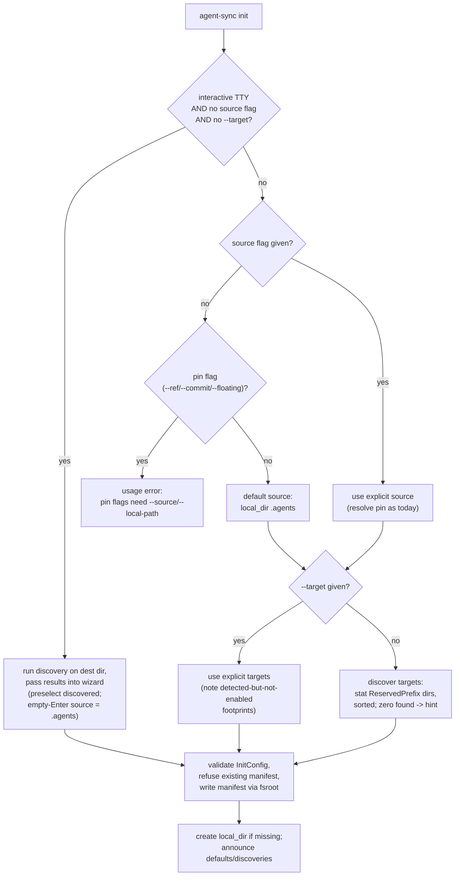

# feat: Default init source to `.agents` and auto-discover targets

## Summary

Make `agent-sync init` work with zero flags: when no source flag is given the canonical source defaults to `local_dir: .agents`, and when no `--target` is given the target list is discovered by probing the destination workspace for each bundled adapter's reserved-prefix directory (`.claude`, `.cursor`, `.codex`, `.pi`, `.agent`) and snapshotted into the manifest. Explicit flags override everything; the wizard keeps running for bare `init` on a TTY and gains discovery-informed defaults. Same update: plain `agent-sync sync` on a TTY offers to include the user-level (`~`) manifest instead of silently skipping it, and every run that skips the user scope says so — no more remembering `--user`.

---

## Problem Frame

Today `agent-sync init` requires the user to name a source (`--source`/`--local-path`/`--local-dir`) and repeat `--target` for every tool, even though the common case is fully inferable: per-repo skills live in `.agents` (the documented convention, named in AGENTS.md invariant #4), and the tools in use are visible as workspace directories that exactly match each bundled adapter's `ReservedPrefix`. The v0.7.0 zero-emit hint funnels new users toward `agent-sync init`; this feature makes the command they land on succeed without ceremony.

---

## Requirements

**Source default**

- R1. `init` with no source flag defaults the canonical source to `local_dir: .agents`, in both the non-interactive flag path and the wizard. Bare `agent-sync init --non-interactive` becomes a working happy path.
- R2. When the manifest's `local_dir` directory does not exist at init time, init creates it (empty), so the first `sync` degrades to the zero-emit hint instead of hard-failing with a missing-source error.
- R3. A pin flag (`--ref`, `--commit`, `--floating`) with no source flag fails with a purpose-built usage error ("--ref requires --source or --local-path; the default .agents source is unpinned"), not the generic local-dir validation error.

**Target discovery**

- R4. With no `--target`, init discovers targets by probing the destination directory for each bundled adapter's `ReservedPrefix` directory and writes the discovered names, sorted, into the manifest's existing `targets:` list. No manifest schema change.
- R5. Explicit `--target` flags skip discovery entirely (no merge).
- R6. Zero footprints discovered and no `--target` still succeeds: init writes the manifest with an empty `targets:` list (spec-valid, "not yet configured") and prints a hint naming `--target`, mentioning that PATH adapters (`agent-sync-adapter-<name>`) are never auto-discovered. `init --source <url>` with no `--target` keeps succeeding as it does today.
- R7. Probes are read-only, exact-name, directory-only (`os.Stat` + `IsDir()`). A NotExist result means not discovered; any other stat error is treated as not discovered and surfaced as a warning, never a fatal error.
- R8. A nonexistent destination directory (`--dir`/`--workspace` pointing nowhere) fails with a clear "no such directory" error before any discovery or zero-match messaging can mask it.

**Wizard**

- R9. The wizard target screen preselects the discovered targets when discovery found any; with zero discovered it preserves today's behavior (all targets preselected).
- R10. The wizard source screen accepts empty-Enter as "use the `.agents` local-dir default"; choosing the local-dir source skips the ref phase (ref + local_dir is invalid), and the confirm screen renders the local-dir source correctly.
- R11. The wizard stays free of filesystem/network I/O: discovery runs in the command layer and results are passed into `wizard.Run`.

**Mode gating and output**

- R12. `--target` alone on a TTY no longer launches the wizard — with the defaulted source the invocation is fully specified. (Behavior change; today it launches the wizard.)
- R13. Non-interactive and accessible modes never prompt; both apply the source default and discovery, and follow R6 on zero-match.
- R14. Success output announces what was inferred, e.g. `wrote .agent-sync.yaml (source: .agents [default]; targets: claude, cursor [discovered])`, and when explicit `--target` overrides discovery, notes detected-but-not-enabled footprints ("also detected .cursor (not enabled)").

**User-scope sync ergonomics**

- R16. Interactive plain `sync` (TTY, no `--non-interactive`, no `--workspace`, no `--post-merge`, no `--user`) that discovers a user-level manifest offers to include it: "Also sync the user-level manifest at ~/.agent-sync.yaml? [Y/n]". Enter/`y` includes the user scope in the same run; `n` declines for this run. Non-interactive, accessible, piped, watch, and git-hook paths never prompt (AGENTS.md invariant #3 unchanged).
- R17. Any sync that discovers a user-level manifest but does not emit it (non-interactive run, or the prompt was unavailable) ends with a persistent notice — "user-level manifest at ~/.agent-sync.yaml was not synced; pass --user to include it" — in text output and in the existing additive `notice` JSON field, even when project scopes synced successfully (today the hint fires only on zero-emit runs). A user who explicitly declined the R16 prompt is not nagged with the notice in the same run.
- R18. Hierarchy sync output remains one clearly labeled block per scope (`== <level>: <root> ==`) with a regression test pinning header count, and the duplicated per-adapter `started` lines are eliminated: they are the adapterkit session banner (`pkg/adapterkit/server.go`, `<name>: started`) — subprocess proof-of-life for the runtime's stderr ring — leaking to the CLI's stderr because bundled in-process adapters default `Stderr` to `os.Stderr`, once per adapter session (two sessions per target per sync). Bundled adapters set `Stderr: io.Discard`; the subprocess SDK behavior is unchanged.

**Docs**

- R15. `README.md`, `docs/quickstart.md`, and `CHANGELOG.md` reflect the new defaults; the master plan's Unit 17 is annotated in the same PR per the plan-first rule (this lands in Unit 17's wizard territory with a simpler design than its full branching spec).

---

## Key Technical Decisions

- **Snapshot at init, not auto-resolve at sync.** Discovered targets are written into the existing `targets:` list; `sync` behavior is untouched and manifests stay deterministic per machine. Staleness (a `.cursor/` appearing later) is deferred to follow-up work.
- **Discovery signal = bundled `ReservedPrefix` dirs in the destination directory only.** The probe list derives from `bundledAdapters()[i].Manifest.ReservedPrefix` (already validated, present on all five adapters) — no hardcoded map, so future bundled adapters get discovery for free. No user-home probing (init has no scope concept; probing `--dir ~` naturally covers the home case, with the documented caveat that antigravity's user-scope footprint `.gemini` is not its reserved prefix and won't be discovered there). No PATH-adapter discovery: reading an external adapter's `reserved_prefix` requires subprocess execution, which init should not do.
- **Zero-match writes an empty-targets manifest plus a hint, rather than failing.** Empty `targets:` is explicitly spec-valid (docs/spec/manifest-v1.md), and `init --source <url>` with no `--target` succeeds today — a `MissingFlagError` here would be a regression and would contradict the bare-init happy path in a fresh repo. `engine.ErrAdapterNotFound` and the v0.5.0 zero-emit hint already backstop sync.
- **Discovery is a third populator of `InitConfig`.** Precedence: explicit flags > discovery/defaults > wizard. This preserves the repo's KTD-4 (wizard and flag path converge on one struct) and keeps manifest-write logic TTY-free and testable.
- **Init creates a missing `local_dir` via `fsroot.OpenWorkspaceRoot`.** One code path for defaulted and explicit local-dir; reads may use bare `os.Stat` (established precedent in `internal/cli` and `internal/hierarchy`), but this write goes through fsroot per AGENTS.md invariant #1.
- **Exact-name, stat-based probing — never substring or glob matching.** This sidesteps the repo's documented `.agent`/`.agents` substring-prefix trap (docs/solutions/best-practices/large-mechanical-rename-of-load-bearing-identifiers.md): a `.agents` skills dir must not discover antigravity (`.agent`), and a test pins that.
- **The user-scope offer is a per-run prompt, default yes, gated on the centralized `tui.Interactive` check.** Pressing Enter at an explicit "sync the user scope too?" question is explicit consent, so the "plain sync never writes home" invariant becomes "never writes home without explicit consent (`--user` or an answered prompt)". The prompt is injected into the hierarchy orchestrator as a callback (`nil` = never ask), so `runHierarchySync` stays TTY-free and testable — the same seam pattern as `InitConfig`. No persistence of the answer (YAGNI; `--user` remains the scriptable path).
- **The skipped-user notice reuses the existing additive `notice` plumbing.** `runHierarchySync` already threads a notice string into both renderers and the JSON schema tolerates it (`omitempty`); extending it from "zero-emit only" to "user scope present but not emitted" is a message-level change, not a schema change.

---

## High-Level Technical Design

Decision flow after the change (directional guidance, not implementation specification):

The destination-dir existence check and the existing-manifest refusal both move ahead of wizard/discovery so the user gets the real error first.

---

## Implementation Units

### U1. Footprint discovery helper

- **Goal:** A small, pure discovery function the flag path and wizard call-site both use.
- **Requirements:** R4, R7
- **Dependencies:** none
- **Files:** `internal/cli/footprint.go` (new), `internal/cli/footprint_test.go` (new)
- **Approach:** `discoverTargets(dir, bundled)` stats `filepath.Join(dir, ReservedPrefix)` for each bundled adapter, requires `IsDir()`, returns sorted target names plus non-fatal warnings for non-NotExist stat errors. Read-only — no fsroot (mirrors `internal/hierarchy/discover.go`'s pure-probe shape). Normalize any path comparisons with `filepath.ToSlash` per the Windows-pitfalls learning.
- **Execution note:** Implement test-first.
- **Test scenarios:**
  - Dir containing `.claude` and `.cursor` → returns `[claude, cursor]` sorted, regardless of adapter iteration order.
  - Empty dir → empty result, no error.
  - A *file* named `.pi` → pi not discovered.
  - `.agents` directory present → antigravity (`.agent`) NOT discovered (substring-trap pin).
  - Symlink to a real dir → discovered; dangling symlink → not discovered.
  - Unreadable subdir (permission error) → not discovered, warning returned; test in a `//go:build !windows` helper file, not behind runtime `t.Skip`.
- **Verification:** table-driven tests pass under `go test -race`; `GOOS=windows go vet ./...` clean.

### U2. Flag-path source default, pin-flag guard, dir creation, wizard gate

- **Goal:** Bare non-interactive `init` succeeds with `local_dir: .agents`; pin-flag misuse gets a purpose-built error; missing local-dir is created; `--target` alone skips the wizard.
- **Requirements:** R1, R2, R3, R8, R12, R13
- **Dependencies:** none
- **Files:** `internal/cli/cmd_init.go`, `internal/cli/cmd_init_test.go`
- **Approach:** When no source flag is set, populate `InitConfig.LocalDir = ".agents"` and record that it was defaulted (drives R14 output and the wizard gate). Guard pin flags before defaulting. Stat the destination dir up front (R8) and move the existing-manifest refusal ahead of wizard/discovery. After a successful manifest write, create the manifest's `local_dir` when missing via `fsroot.OpenWorkspaceRoot`. Update the wizard gate to also skip when `--target` is present. Accessible mode needs no special casing — it follows the non-wizard path and now succeeds where it previously died on the generic validation error.
- **Execution note:** Test-first for the new gating and error paths.
- **Test scenarios:**
  - Bare `init --non-interactive` in a temp dir → manifest with `canonical.local_dir: .agents`, exit 0; `.agents/` created.
  - `--ref main` (also `--commit`, `--floating`) with no source flag → new usage error naming the pin flag; manifest not written.
  - `--local-dir custom` where `custom/` doesn't exist → created.
  - `--dir does-not-exist --non-interactive` → "no such directory" error, not a targets hint.
  - Existing `.agent-sync.yaml` → still refused, now before any discovery.
  - `--offline` + bare init → succeeds (local_dir short-circuits pin resolution).
  - Accessible mode (via the `resolveAccess` seam): bare init succeeds without prompting.
  - `--target claude` with stdin a TTY (simulated via the access seam) → no wizard; manifest written with defaulted source.
- **Verification:** `runInit`-style CLI tests re-load the written manifest with `manifest.LoadFile` and assert fields; all existing init tests still pass.

### U3. Target discovery wiring, zero-match hint, announce output

- **Goal:** Discovery feeds the flag path; zero-match is friendly; init tells the user what it inferred.
- **Requirements:** R4, R5, R6, R14
- **Dependencies:** U1, U2
- **Files:** `internal/cli/cmd_init.go`, `internal/cli/cmd_init_test.go`
- **Approach:** No `--target` → call `discoverTargets` on the destination dir and snapshot the result into `InitConfig.Targets`. Zero discovered → still write, print the R6 hint to stderr. Explicit `--target` → skip discovery but still probe to report detected-but-not-enabled footprints in the success line. Keep output additive if `--output json` is in play (mirror the zero-emit `notice` field precedent).
- **Test scenarios:**
  - Temp workspace with `.claude/` and `.codex/` → `targets: [claude, codex]` in the manifest, sorted.
  - No footprints, no `--target`, `--source <local git url>` → manifest written with no `targets:` key (empty), hint on stderr mentioning `--target` and PATH adapters; exit 0 (regression pin for today's behavior).
  - Bare `init --non-interactive` in a repo with zero footprints → succeeds with `.agents` source, empty targets, hint (R1+R6 compose).
  - `--target claude` in a workspace that also has `.cursor/` → `targets: [claude]`, success line notes `.cursor` detected but not enabled.
  - Init→sync integration (pattern of `TestInit_ThenSync`): bare init in a workspace with `.claude/` and a populated `.agents/skills/<id>/SKILL.md` → subsequent `sync` emits Claude skill output.
- **Verification:** manifest re-load assertions plus stderr/stdout content assertions; `go test -race ./internal/cli`.

### U4. Wizard: local-dir default and discovery-informed preselection

- **Goal:** Bare `init` on a TTY keeps its wizard, now with smart defaults.
- **Requirements:** R9, R10, R11
- **Dependencies:** U1
- **Files:** `internal/tui/wizard/init.go`, `internal/tui/wizard/initconfig.go`, `internal/tui/wizard/wizard_test.go`, `internal/cli/cmd_init.go` (call site)
- **Approach:** Extend `wizard.Run` (parameter or small options struct) to accept discovered target names; `newInitModel` preselects those when non-empty, else preserves select-all. Source phase: empty-Enter accepts `LocalDir: .agents` (today empty input is rejected) and skips `phaseRef`; `sourceDisplay` and the confirm screen render the local-dir source; confirm renders `targets: (none)` when nothing is selected. Typed input keeps the existing URL/local-path heuristics — typed custom local-dirs remain flag-only (deferred to Unit 17's full source-type chooser). Discovery runs in `cmd_init.go` before `wizard.Run`, keeping the wizard I/O-free.
- **Test scenarios:**
  - Model-driven (`tea.KeyMsg`) flow: empty-Enter on source → config with `LocalDir: .agents`, ref phase skipped, confirm screen shows the local-dir source; committed config validates.
  - Discovered `[claude]` passed in → only claude preselected on the target screen; zero discovered → all preselected (today's behavior pinned).
  - Typed git URL still routes through the ref phase unchanged.
  - Esc aborts unchanged; deselecting everything then confirming yields a valid empty-targets config and the confirm screen renders "(none)".
- **Verification:** existing wizard model tests pass plus the new flows; no PTY needed (model-level tests per current convention).

### U6. Interactive user-scope offer in `sync`

- **Goal:** Plain `sync` on a TTY asks whether to include the user-level manifest instead of silently skipping it.
- **Requirements:** R16
- **Dependencies:** none
- **Files:** `internal/cli/cmd_sync.go`, `internal/cli/hierarchy_sync.go`, `internal/cli/hierarchy_sync_test.go`, `internal/cli/cmd_sync_test.go`
- **Approach:** `hierarchySyncOptions` gains `OfferUser func(manifestPath string) bool` (nil = never ask). Inside `runHierarchySync`, when discovery returns a user scope with `Emit == false` and the callback is non-nil, invoke it once before the scope loop; on `true`, re-discover with `IncludeUser: true` (cheap — a couple of stats). `cmd_sync` wires the callback only when `tui.Interactive(...)` and none of `--user`/`--workspace`/`--post-merge` are in play; the prompt itself reads a `[Y/n]` line from stdin and writes to stderr (data/stdout stays clean for `--output json` piping, which is non-interactive anyway).
- **Execution note:** Test-first via the callback seam; no PTY needed.
- **Test scenarios:**
  - User manifest present, callback returns true → user scope emitted in the same run (outcomes include a `user` level scope).
  - Callback returns false → user scope not emitted, and no skipped-user notice for this run (declined ≠ forgotten).
  - Callback nil (non-interactive) → never invoked, user scope not emitted.
  - No user manifest → callback never invoked.
  - `--user` set → callback never invoked (already included).
  - `--post-merge` → callback never invoked.
- **Verification:** `go test -race ./internal/cli`; manual TTY check of the prompt copy.

### U7. Persistent skipped-user-scope notice

- **Goal:** Every sync that skips an existing user-level manifest says so — text and JSON — not just zero-emit runs.
- **Requirements:** R17, R18
- **Dependencies:** U6
- **Files:** `internal/cli/hierarchy_sync.go`, `internal/cli/hierarchy_sync_test.go`
- **Approach:** Generalize the notice computation: after the scope loop, if discovery saw a user scope that was not emitted and the R16 prompt did not decline it this run, set the notice ("user-level manifest at <path> was not synced; pass --user to include it"). Zero-emit runs keep their existing messages. `renderHierarchyText` prints the notice after the scope blocks when outcomes exist (prefix `note:`), keeping the `nothing to sync:` prefix for zero-emit; JSON reuses the additive `notice` field unchanged.
- **Test scenarios:**
  - Project scope syncs, user manifest exists, non-interactive → text output ends with the notice; JSON carries `notice`.
  - Same but user declined the prompt → no notice.
  - Same but `--user` set → no notice, two labeled scope blocks (pins R18: exactly one `== level: root ==` header per scope, one status-line set per scope).
  - No user manifest → no notice.
  - Zero-emit run → existing `nothing to sync:` message unchanged.
- **Verification:** `go test -race ./internal/cli`; JSON output remains schema_version 1 additive.

### U5. Docs, changelog, and master-plan annotation

- **Goal:** The new defaults are documented where users actually look, and the master plan doesn't silently drift.
- **Requirements:** R15
- **Dependencies:** U2, U3, U4, U6, U7
- **Files:** `README.md`, `docs/quickstart.md`, `CHANGELOG.md`, `docs/plans/2026-04-21-001-feat-aienvs-workspace-cli-plan.md`
- **Approach:** Quickstart's init section leads with bare `agent-sync init`; document the `--target`-skips-wizard behavior change, the home-dir discovery caveat (antigravity's user footprint is `.gemini`, not its reserved prefix), and the new user-scope sync prompt/notice. Annotate master-plan Unit 17 with what this plan ships (linear wizard + defaults) vs. what remains (full branching states, `docs/wizard/init-states.md`). No `docs/spec/manifest-v1.md` change — the schema is untouched and empty-targets semantics are unchanged.
- **Test expectation:** none — documentation only.
- **Verification:** docs build/lint (markdown lint if configured); reviewer pass.

---

## Scope Boundaries

### Deferred to Follow-Up Work

- Sync-time staleness hint ("footprint `.cursor` present but cursor not in `targets:`") and/or `agent-sync update` rediscovery.
- PATH-adapter participation in discovery (needs subprocess exec at init to read `reserved_prefix`).
- Warning at init when an explicit `--target` name is neither bundled nor a PATH adapter (stays non-fatal at sync via `ErrAdapterNotFound`).
- Wizard source-type chooser with typed custom local-dirs (Unit 17's full branching design).
- An `init --user` scope flag.

### Non-goals

- No changes to `sync`, `validate`, or `update` semantics, adapter behavior, or the manifest schema.
- No user-home probing during project init, and no attempt to fight case-insensitive filesystems (`.CLAUDE` satisfying a `.claude` stat on APFS is accepted).

---

## Risks

- **Behavior changes:** `--target` alone on a TTY skips the wizard (R12), and bare `init --non-interactive` now succeeds where it previously failed — any script relying on the old failure sees a new manifest instead. Both are called out in the CHANGELOG.
- **Discovered targets at odd scopes:** a footprint's existence doesn't guarantee the adapter supports every kind at every scope; the scope-aware capability-lie gate and the zero-emit hint already handle this at sync time, and U3's init→sync integration test exercises the pipeline end-to-end.
- **Windows CI:** filesystem probing is exactly the surface that has bitten before; U1 carries the `ToSlash`, build-tag, and `GOOS=windows go vet` mitigations from the cross-platform learning. The darwin/amd64 CI job's runner-scarcity stalls are known infra noise, not a signal.

---

## Sources & Research

- `internal/cli/cmd_init.go` (`newInitCommand`, `resolvePin`, `bundledTargetNames`), `internal/cli/nonint.go` (`requireFlag`/`MissingFlagError`), `internal/cli/access.go` (KTD-5 centralized TTY detection), `internal/tui/wizard/` (`InitConfig` convergence, model-driven tests), `internal/cli/setup.go` (`bundledAdapters`), per-adapter `reservedPrefix` constants in `internal/adapter/bundled/*/bundled.go`.
- `docs/spec/manifest-v1.md` — empty `targets:` is a valid "not yet configured" state.
- `docs/plans/2026-06-08-007-feat-cli-tui-sync-engine-plan.md` (KTD-4/KTD-5 init architecture), `docs/plans/2026-06-17-001-feat-hierarchy-discovery-plan.md` (pure read-only probe package precedent), master plan Unit 17 (wizard scope).
- `docs/solutions/best-practices/go-windows-cross-platform-pitfalls-2026-04-24.md`, `docs/solutions/best-practices/large-mechanical-rename-of-load-bearing-identifiers.md` (`.agent`/`.agents` trap), `docs/solutions/workflow-issues/spec-impl-drift-at-pr-review-2026-04-25.md`.
