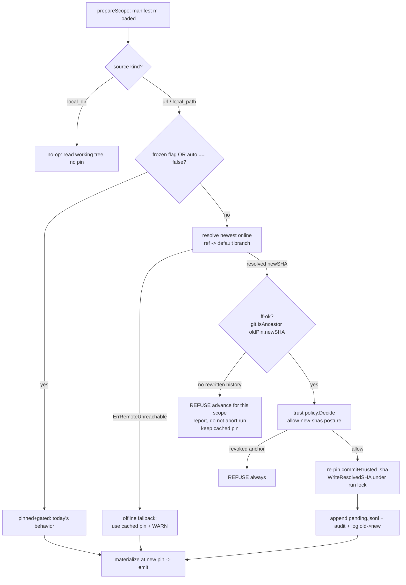

# feat: Inline auto-update — `sync` advances the pin by default

## Summary

Make `agent-sync sync` advance the canonical pin to the newest upstream commit **by default** and apply it, auto-accepting the trust decision **through the existing trust policy engine** (not by bypassing it). Workspaces opt back into today's pinned + gated behavior via `--frozen` (flag) and `canonical.auto: false` (manifest). Four safety rails hold: fast-forward-only advancement, offline falls back to the cached pin, every advance is recorded (structured log + cache audit file), and the escape hatch restores deterministic behavior. Ships as **semver-major** with threat-model and CHANGELOG updates in the same change.

This reverses the core decision of the shipped `update` command ("moving the trust anchor is always a deliberate act" — see origin and `docs/plans/2026-07-02-001-feat-skill-descriptions-upstream-update-plan.md`). The reversal is intentional and gated by the rails below.

---

## Problem Frame

Today `sync` materializes the canonical source at the **pinned** `commit` and never advances it; moving to newer upstream is a separate human-gated `agent-sync update` (`--accept-update=<sha>` required non-interactively). There is no way for a workspace to track upstream automatically. We want `sync` itself to stay current — while keeping supply-chain defense intact, since removing human review from the default path makes the remaining rails load-bearing.

Two research corrections shape this plan (both diverge from the origin doc's assumptions):

1. **`Floating` mode is NOT the offline-fallback building block.** `internal/git/materialize.go:105-106` hard-refuses `Floating && Offline`, and `cmd_update.go` refuses `--offline` outright. Offline-fallback requires a **new** materialize path ("resolve online; on network failure fall back to cached pin + warn"), not a reuse of `Floating`. (Corrects origin "Dependencies / Assumptions".)
2. **Auto-accept routes through the trust policy engine, not around it.** The trust spec already defines an `allow-new-shas` posture with cooldown and a `pending.jsonl` append-and-warn queue (`docs/spec/trust-store-v1.md`). Auto-update is modeled as an `allow-new-shas` posture through `internal/trust/policy.go::Decide`, preserving one trust model, the always-refuse on a revoked anchor, and a meaningful CI `trust verify`. (User-confirmed fork.)

---

## Requirements Traceability

Carried from origin (`docs/brainstorms/2026-07-08-inline-auto-update-requirements.md`):

- **R1** `sync` advances the pin to newest upstream by default, auto-accepting trust — via trust policy (U4, U5).
- **R2** Opt-out: `--frozen` flag (U6) and `canonical.auto: false` manifest field (U1).
- **R3** Rail — fast-forward only; refuse to cross rewritten history on the auto path (U3, U5).
- **R4** Rail — offline falls back to cached pin and warns; never errors the sync (U2, U5).
- **R5** Rail — record old→new SHA for every advance (U7).
- **R6** `canonical.commit` + `trusted_sha` rewritten to the new SHA on advance (U3, U5).
- **R7** Resolution follows `canonical.ref`, falling back to the remote default branch (U2, U3).
- **R8** Semver-major: threat model + CHANGELOG + spec updated in the same change (U1, U8).

---

## Key Technical Decisions

- **KTD1 — Trust via policy engine.** Auto-accept is an `allow-new-shas` posture evaluated by `internal/trust/policy.go::Decide`, not a short-circuit in the sync path. A revoked/blocked anchor always refuses even under auto; observed advances append to `pending.jsonl` for audit. Rationale: one trust model, CI `trust verify` stays meaningful (see `docs/spec/trust-store-v1.md`; user-confirmed).
- **KTD2 — New "resolve-or-fallback" materialize mode.** Add a mode to `internal/git/materialize.go` that attempts online ref resolution and, on `git.ErrRemoteUnreachable`, falls back to the cached pin with a warning. Distinct from pinned-strict and from `Floating` (which forbids offline). Rationale: rail R4 cannot be built on `Floating` (materialize.go:105-106).
- **KTD3 — Extract shared advance core.** Factor "resolve newest → ff-check (`git.IsAncestor`) → re-pin (`manifest.WriteResolvedSHA`)" out of `runUpdate` into a shared helper used by both `update` and sync auto-advance. Rationale: reuse the tested ff-guard and re-pin write; avoid divergence.
- **KTD4 — Per-scope decision at the prepare seam.** The advance decision lives in/adjacent to `prepareScope` (`internal/cli/setup.go`) where the loaded manifest is in hand, so single-scope and hierarchy sync behave identically. Gate: advance when `!frozen && auto != false && source is URL/local_path && online-or-ff && ff-ok`. `local_dir` scopes are no-ops (nothing to pin). Rationale: sync is multi-scope (`docs/brainstorms/2026-06-17-hierarchy-aware-manifests-design.md`); rails apply per scope.
- **KTD5 — `canonical.auto` is `*bool`.** Plain `bool`+`omitempty` cannot express default-true (zero value collides with unset). Use `Auto *bool` (nil ⇒ auto-on). First deliberate pointer tri-state in the schema. Rationale: matches the literal `canonical.auto: false` opt-out.
- **KTD6 — Reconcile the floating-with-pin prohibition.** The loader currently rejects "trusted_sha set but commit empty" and requires `commit == trusted_sha` (`internal/manifest/load.go:181`). Auto-update keeps a concrete pin as the offline fallback *and* advances it — it stays pinned, just moved. Confirm this satisfies existing invariants (it re-pins to a concrete SHA each run, so `commit == trusted_sha` holds) and update the spec's `floating` "reserved" section to describe `auto` instead. Rationale: avoid spec/impl drift (`docs/solutions/workflow-issues/spec-impl-drift-at-pr-review-2026-04-25.md`).
- **KTD7 — Record via log + cache audit, not headers (v1).** Old→new SHA goes to the structured log and the existing per-materialization audit file (`cache.WriteAudit`, `materialize.go:206`). Annotating the `Source:` managed-file header is a cross-cutting wire-frame change across five adapters (`internal/adapter/bundled/*/header.go`) — deferred to follow-up. Rationale: lowest blast radius for R5.
- **KTD8 — Run-lock discipline from `update`.** Re-pin-then-sync must be atomic under one per-workspace run lock acquired before the manifest write, with a distinct exit code if the pin moved but emit failed (`exitUpdatePinMoved = 6`). Hierarchy sync has no CLI-level lock today — resolve lock ownership so auto-advance is atomic per scope. Rationale: manifest-mutating + data-loss-critical (origin R8b lineage).

---

## High-Level Technical Design

Per-scope decision flow inside the sync prepare path:

Directional guidance, not implementation specification. Prose KTDs are authoritative where they disagree.

---

## Implementation Units

### U1. Manifest schema: `canonical.auto` + loader/spec reconciliation

- **Goal:** Add the opt-out field and reconcile the loader's floating-with-pin handling so an auto (advancing) manifest is valid.
- **Requirements:** R2, R6, R8, KTD5, KTD6.
- **Dependencies:** none.
- **Files:** `internal/manifest/schema.go` (add `Auto *bool` to `CanonicalSource`), `internal/manifest/load.go` (validation around lines 113-114 strict-field and 181 hybrid rejection), `docs/spec/manifest-v1.md` (replace `floating` "reserved" section with `auto`, update validation table), `internal/manifest/load_test.go`, `internal/manifest/schema_test.go`.
- **Approach:** `Auto *bool yaml:"auto,omitempty"`; nil ⇒ auto-on. Confirm strict-load (`DisallowUnknownField`) accepts the new field and old manifests without `auto` still load (backward-compat). Verify the `commit == trusted_sha` invariant and the "trusted_sha set but commit empty" rejection remain satisfied for an auto manifest (it always re-pins to a concrete SHA, so both keys stay present and equal).
- **Patterns to follow:** existing `omitempty` fields in `CanonicalSource`; the additive-schema PR checklist in AGENTS.md.
- **Test scenarios:**
  - Manifest with `canonical.auto: false` loads; `Auto` is non-nil false.
  - Manifest without `auto` loads; `Auto` is nil (interpreted as on).
  - Manifest with `auto: true` loads; round-trips through marshal unchanged.
  - Old manifest (pre-`auto`) still validates — backward-compat.
  - `trusted_sha` present with `commit` present and equal still passes; the empty-commit hybrid still rejected.
  - Unknown sibling field under `canonical` still rejected (strict load intact).
- **Verification:** loader accepts auto manifests, rejects malformed ones, old fixtures unaffected; spec table matches loader behavior.

### U2. Materialize: resolve-or-fallback mode

- **Goal:** Add a materialize path that resolves newest online and falls back to the cached pin on network failure.
- **Requirements:** R4, R7, KTD2.
- **Dependencies:** none.
- **Files:** `internal/git/materialize.go` (new mode on `Input`; branch logic near the Floating/Offline guards lines 102-173), `internal/git/materialize_test.go`.
- **Approach:** Add an input mode (e.g. `ResolveOrFallback bool`) mutually exclusive with `Floating`/pinned-strict. When set with a `PinnedSHA` present: attempt `ResolveRef`; on `ErrRemoteUnreachable` return the cached pin result with a `FromCache`/warning signal instead of erroring. Preserve the existing reachability defense (`IsAncestor` force-push guard) on the resolved SHA. Do not relax the offline hard-refuse for the existing `Floating` mode — this is a new mode.
- **Patterns to follow:** existing zero-network fast path (materialize.go:123-137); `ErrRemoteUnreachable` handling in `internal/git/shell.go`; best-effort offline model in `composeUserRules` (`hierarchy_sync.go:297,319`).
- **Test scenarios:**
  - Online + newer ref → resolves to new SHA (not the pin).
  - Network unreachable (`ErrRemoteUnreachable`) + cached pin present → returns cached pin, signals fallback, no error. `Covers R4.`
  - Network unreachable + no cache → returns a clear error (cannot fall back).
  - Resolved SHA fails reachability (force-push) → surfaces `ErrReachabilityCheckFailed`.
  - Mode rejected if combined with `Floating` or with `Offline` strict-pin inputs (guard intact).
- **Verification:** offline auto sync succeeds against a populated cache; online sync advances; guards still fire.

### U3. Extract shared advance core from `update`

- **Goal:** Factor "resolve newest → ff-check → re-pin" into a shared helper both `update` and sync auto-advance call.
- **Requirements:** R3, R6, R7, KTD3.
- **Dependencies:** U2.
- **Files:** `internal/cli/cmd_update.go` (extract from `resolveUpdate`/ff-guard lines 161-200), a new shared helper (e.g. `internal/cli/advance.go`), `internal/cli/advance_test.go`, `internal/cli/cmd_update_test.go` (ensure update still green).
- **Approach:** Helper input: manifest, mirror/cache, old pin, ref; output: resolution + ff verdict, or a typed refusal. Reuse `git.IsAncestor(ctx, mirror, oldPin, newSHA)` for ff. Re-pin via `manifest.WriteResolvedSHA(orig, newSHA, newSHA)` + `manifest.WriteFile` (fsroot). Keep `update`'s behavior byte-identical after refactor (characterization).
- **Execution note:** Characterization-first — capture current `update` behavior in tests before extracting, then refactor under green.
- **Patterns to follow:** `cmd_update.go` ff-guard and re-pin write; `WriteResolvedSHA` `ErrKeyMissing` contract (both keys must pre-exist).
- **Test scenarios:**
  - Fast-forward advance → helper returns new SHA, ff=true. `Covers R3.`
  - Rewritten history (new SHA not descendant of pin) → helper returns ff=false refusal; no re-pin.
  - Missing ref → follows default branch (mirror of `TestUpdate_MissingRefFollowsHead`).
  - Re-pin writes both `commit` and `trusted_sha`; manifest comments/order preserved.
  - `update` command regression suite still passes unchanged.
- **Verification:** `update` behaves identically; helper is independently unit-tested.

### U4. Trust policy integration (`allow-new-shas` posture)

- **Goal:** Auto-accept the new SHA through the trust policy engine, preserving revoked-anchor refusal and audit.
- **Requirements:** R1, KTD1.
- **Dependencies:** U3.
- **Files:** `internal/trust/policy.go` (extend `Decide` for the auto/allow-new-shas posture), `internal/trust/*` (pending.jsonl append path), `internal/trust/policy_test.go`, `docs/spec/trust-store-v1.md` (document how `auto` maps to `allow-new-shas`).
- **Approach:** Map `canonical.auto` (on) to an `allow-new-shas` posture routed through `Decide`. `Decide` returns allow for a new, ff-ok SHA on a non-revoked anchor; always refuses on a revoked/blocked anchor even under auto. On allow, append the observed advance to `pending.jsonl`. Keep `Decide` a pure, exhaustively tested function.
- **Patterns to follow:** existing `Decide` cases and `pending.jsonl` writer in `internal/trust`; the two-tier trust model in `docs/spec/trust-store-v1.md`.
- **Test scenarios:**
  - New ff-ok SHA + healthy anchor + auto on → allow. `Covers R1.`
  - Revoked/blocked anchor + auto on → refuse (auto does not override revocation).
  - Auto off (frozen / `auto:false`) → falls back to today's gated decision (needs accept).
  - Allowed advance appends exactly one `pending.jsonl` entry with old→new SHA.
  - `Decide` table covers all posture × anchor-state combinations.
- **Verification:** CI `trust verify` semantics unchanged; revoked anchors still hard-fail under auto.

### U5. Wire auto-advance into the sync prepare path (per scope)

- **Goal:** Make `sync` advance-by-default per scope using U2–U4, atomic under a run lock, with hierarchy continue-and-report.
- **Requirements:** R1, R3, R4, R6, KTD4, KTD8.
- **Dependencies:** U1, U2, U3, U4, U6.
- **Files:** `internal/cli/setup.go` (`prepareScope` ~lines 90-104), `internal/cli/cmd_sync.go` (single-scope path), `internal/cli/hierarchy_sync.go` (per-scope loop lines 101-137; ff-refused reporting), `internal/cli/materialize.go` (mode selection), `internal/locks` usage, `internal/cli/cmd_sync_test.go`, `internal/cli/hierarchy_sync_test.go`.
- **Approach:** In the prepare seam, decide per scope: `local_dir` → no-op; `url`/`local_path` with `!frozen && auto != false` → run shared advance helper (U3) using the resolve-or-fallback materialize (U2) and trust policy (U4), acquire the per-workspace run lock before the manifest write, re-pin, then materialize at the new pin. Offline/unreachable → cached pin + warn (best-effort, no error). ff-refused → report scope outcome, continue the run. Resolve run-lock ownership: adopt `update`'s "CLI holds lock across re-pin + sync with `RunLockHeld: true`" for the single-scope path; extend the hierarchy loop to hold the lock per scope during its advance+emit. Emit `exitUpdatePinMoved`-style distinct signal if pin advances but emit fails.
- **Patterns to follow:** `syncAfterRepin` + run-lock discipline (`cmd_update.go:309-325`); continue-and-report `scopeOutcome` model (`hierarchy_sync.go:30`); best-effort offline in `composeUserRules`.
- **Test scenarios:**
  - Single-scope URL manifest, upstream advanced → second `sync` lands newer content with no `--accept-update`, no prompt. `Covers R1.`
  - `--frozen` and `canonical.auto: false` → byte-identical to today's pinned output. `Covers R2.`
  - Upstream force-push → auto-advance refuses (ff-only), reports why, keeps cached pin. `Covers R3.`
  - Offline against a floating manifest → succeeds on cached pin, warns, no error. `Covers R4.`
  - Hierarchy run with one frozen + one auto scope → auto advances, frozen stays; mixed state handled.
  - Hierarchy run where one scope's ff-guard refuses → that scope reports, others still sync.
  - `local_dir` scope → no pin write, clean no-op.
  - Pin advances but emit fails → distinct exit code; re-run recovers.
  - Non-interactive path never prompts/hangs (AGENTS.md invariant #3), including `--post-merge`.
- **Verification:** end-to-end auto-advance works single-scope and hierarchy; all rails observable; no hangs in non-interactive/hook mode.

### U6. `--frozen` flag on `sync`

- **Goal:** Add the per-invocation opt-out flag.
- **Requirements:** R2.
- **Dependencies:** none (consumed by U5).
- **Files:** `internal/cli/cmd_sync.go` (declare near line 32, register near line 138), `internal/cli/cmd_sync_test.go`.
- **Approach:** `BoolVar` `frozen`; thread into the prepare-path decision (U5). Composes with `--best-effort`, `--expect-deletions`, `--post-merge`, `--target`, `--user`.
- **Patterns to follow:** existing bool flags in `newSyncCommand`.
- **Test scenarios:**
  - `sync --frozen` → no advance even when upstream is newer. `Covers R2.`
  - `--frozen` composes with `--best-effort` and `--post-merge` without conflict.
  - Flag help text present and accurate.
- **Verification:** flag registered, documented, and honored by the prepare path.

### U7. Record old→new SHA (log + cache audit)

- **Goal:** Make every auto-advance auditable after the fact.
- **Requirements:** R5, KTD7.
- **Dependencies:** U5.
- **Files:** `internal/cli/setup.go` or the shared advance helper (log emit), `internal/cache` audit write (`WriteAudit`, referenced at `materialize.go:206`), `internal/cli/advance_test.go`.
- **Approach:** On a successful advance, emit a structured log line (`old`, `new`, `ref`, `scope`) and write/extend the cache audit record. No adapter/header changes in v1 (deferred).
- **Patterns to follow:** existing structured logging; `cache.WriteAudit`; the human-facing `"updated: %s → %s"` line in `cmd_update.go:209`.
- **Test scenarios:**
  - Advance emits exactly one structured record with old and new SHA. `Covers R5.`
  - No advance (frozen/offline-fallback/ff-refused) emits no advance record (offline emits a warning, not an advance).
- **Verification:** audit/log shows the transition for auto-advances only.

### U8. Docs: threat model, CHANGELOG, migration note

- **Goal:** Keep security docs and release notes consistent with the shipped posture flip.
- **Requirements:** R8.
- **Dependencies:** U1–U7.
- **Files:** `docs/threat-model.md` (T1: pinning-is-default no longer the default; ff-only + trust policy are the remaining rails; note no signature verification), `CHANGELOG.md` (semver-major entry + migration note: existing workspaces begin floating on upgrade; use `--frozen`/`auto:false` for reproducibility/CI), `README.md` / adapter docs if they describe sync behavior.
- **Approach:** Revise T1 mitigations to reflect auto-advance; add a prominent migration callout. No code.
- **Test scenarios:** `Test expectation: none — documentation only.`
- **Verification:** threat model no longer contradicts behavior; CHANGELOG has the major-bump migration note.

---

## Scope Boundaries

**In scope:** everything in origin R1–R8, plus the two research-driven reconciliations (new materialize mode; trust-policy integration) and the schema/spec/threat-model updates required to ship it honestly.

**Deferred to follow-up work:**
- Annotating the `Source:` managed-file header with "auto-advanced from <oldsha>" across the five adapters (cross-cutting wire-frame change; log + audit cover R5 for v1).
- Scheduled PR-bot and hook-driven re-sync (the other two "auto-sync" shapes from the brainstorm).

**Outside this feature:**
- Signature / provenance verification beyond ff-only reachability (origin explicitly excludes; threat model records the residual risk).
- Any background daemon or long-lived watcher (forbidden by `CLAUDE.md`/AGENTS.md).

---

## Risks & Dependencies

- **Removing human review from the default path** makes ff-only + trust policy the sole T1 supply-chain defenses. Keep ff-only non-overridable on the routine auto path; revoked anchors must always refuse (U4). Re-read `docs/threat-model.md` + `docs/spec/trust-store-v1.md` before finalizing gate wording; run `ce-code-review` (this area's prior P1s were caught by adversarial review).
- **Run-lock ownership gap:** hierarchy sync holds no CLI-level lock today; re-pin-then-sync must be atomic per scope (U5, KTD8). Resolve before implementing U5.
- **Spec/impl drift:** schema, loader, and `manifest-v1.md` must change together with a spec-locked fixture (`docs/solutions/workflow-issues/spec-impl-drift-at-pr-review-2026-04-25.md`).
- **Loss of default reproducibility** is accepted (origin); `--frozen`/`auto:false` is the reproducibility/CI path — document loudly (U8).

---

## Verification Strategy

Per AGENTS.md/CLAUDE.md gates: `go vet ./...`, `go test -race ./...`, `golangci-lint run`. Real-FS + shelled-`git` fixtures via `internal/gittest` (`RequireGit`, `MustGit`) and the `cmd_update_test.go` / `materialize_test.go` helper patterns for ff and offline-fallback. Note: CI `test (darwin/amd64)` routinely stalls on runner scarcity — infra, not a code gate.
